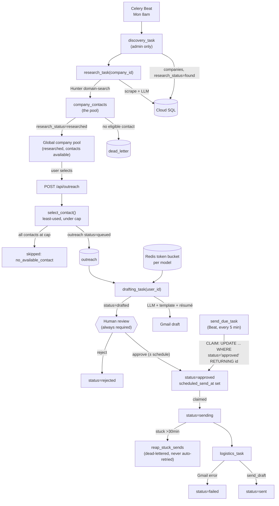
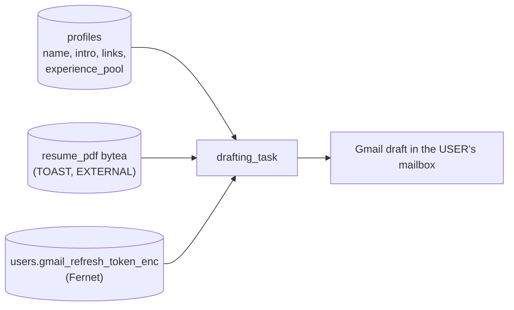
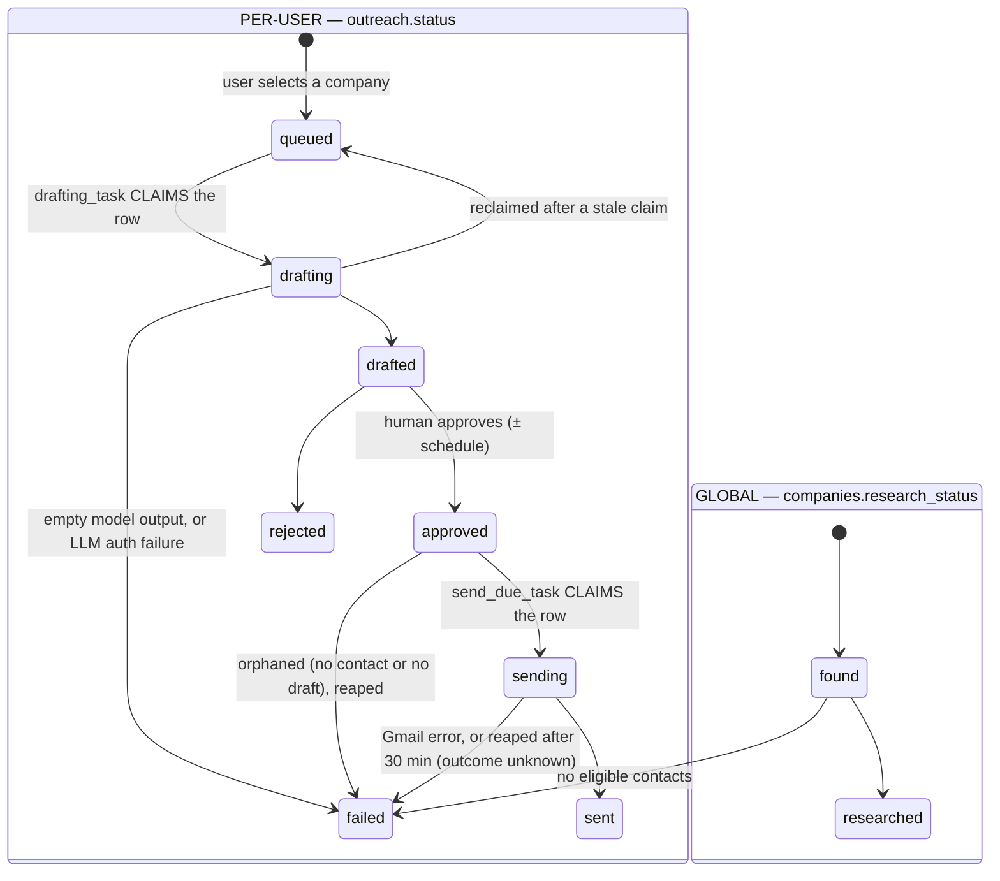

# Cold Email Agent — End-to-End Flow

> Verified against live GCP (`cold-email-490016`) and the current codebase on 2026-08-15.
> Diagrams are [Mermaid](https://mermaid.js.org/) — they render natively on GitHub.
> Hand-authored SVG cannot be diffed in a pull request; Mermaid makes diagram
> changes reviewable like any other text file.

---

## 1. The two-level model

Stack 1b split the single `leads` table into a GLOBAL half and a PER-USER half:

- **Global, admin-populated.** `companies` and `research` are facts true for
  everyone — discovered once, researched once, reused by every user. A
  `company_contacts` pool (from Hunter Domain Search) replaces the old single
  `founder_email`, so the same company can have several emailable people.
- **Per-user.** `outreach` (and its `drafts`) record ONE user's attempt to
  reach ONE company through ONE contact. Two different users can target the
  same company — that's expected — but a shared company pool does not mean
  one founder receives an email from every user: **contact spreading**
  (picking a different eligible contact per outreach where possible) exists
  specifically so the pool doesn't collapse into everyone emailing the same
  inbox.

`POST /api/outreach` is PARTIAL SUCCESS, not all-or-nothing: each requested
company independently ends up `created` or `skipped` (`no_available_contact`,
`already_targeted`, `not_researched`, or `quota_exceeded` — see
`cold_email/quota.py`). One dispatch of `drafting_task(user_id)` then drafts
every row that user just queued; an hourly `drafting_recovery_task` Beat job
re-dispatches it for anyone whose original dispatch appears to have been
lost, rather than running the sweep on a timer as the primary path.

`drafting_task` also depends on three per-user inputs it loads once per
dispatch (`load_sender_context`, `cold_email/workers/drafting/drafting.py`) —
a missing profile or a disconnected Gmail account aborts the whole batch
before any row is touched (leaving rows `queued`, no dead-letter row) rather
than failing row-by-row:

## 2. Status lifecycle (state machine)

Two independent status vocabularies, one per level:

`approved → sending` is a conditional `UPDATE outreach SET status = 'sending'
... WHERE status = 'approved' ... RETURNING id`, not a plain write — the
`WHERE status = 'approved'` is what makes it a CLAIM: two overlapping
`send_due_task` scans (or Celery redelivering the same dispatch) issue that
same conditional `UPDATE`, and only the first one's `WHERE` clause still
matches, so the second affects zero rows and dispatches nothing. Without it,
Celery's at-least-once *task* delivery guarantee becomes at-least-once
**email** delivery, and a cold email a founder receives twice cannot be
un-sent. See `cold_email/cadence.py` and the **Scheduling & Cadence** section
of `CLAUDE.md` for how `scheduled_send_at` (the thing that makes a row
"approved" become "due") gets set in the first place.

---

## Notes on the real system (not obvious from prose)

- **Push vs. pull boundary.** Discovery→Research is a _push_ (`research_task.delay` per company). Research→Pool is a _pull_: research only sets `research_status=researched`; a company only leaves the pool once a user's `POST /api/outreach` reads it. Selection→Drafting is a _push_ again (`drafting_task.delay(user_id)`, on-demand, right after the row is queued), with an hourly `drafting_recovery_task` pull directly over the `outreach` table (not the `pending_drafts` view, which has no notion of "how long queued") as a safety net for a lost dispatch. Approve→Send is a pull via `pending_sends`, on a 5-minute Beat schedule (`send_due_task`) rather than event-driven off the approve click itself — this is what lets scheduling and cadence exist at all: approve only ever sets `scheduled_send_at`, and whether that instant is "now" or three days out, the same scan is what eventually notices it's due.
- **Scheduling reuses the approve/send boundary, not a new one.** `outreach.scheduled_send_at` (NULL = due immediately) and `users.send_cadence` (a per-user daily rhythm — see `cold_email/cadence.py` and `CLAUDE.md`'s **Scheduling & Cadence** section) both just set where a row lands on the `approved` side of that pull. `POST /api/outreach/{id}/approve` computes the instant at approve time; `send_due_task` doesn't know or care whether a row got there via an explicit timestamp, a cadence slot, or neither.
- **The stuck-`sending` reaper never auto-retries — the stale-`drafting` reclaim does, and that asymmetry is deliberate, not an oversight.** A row stranded mid-`drafting` (a hard worker crash between the claim and finishing) has no Gmail draft yet, so reclaiming it back to `queued` for another attempt costs nothing but LLM quota. A row stranded mid-`sending` may already have called `send_draft` — its outcome is unknown, and retrying blind is exactly how a duplicate send happens. So `reap_stuck_sends` dead-letters it for a human to check the mailbox first, instead of silently requeuing.
- **Scheduling is Celery Beat in-container**, not Cloud Scheduler (that API isn't enabled on the project).
- **DB views are self-healing work queues** — a worker crash mid-sweep is retried on the next tick because the view still lists the unprocessed outreach row.
- **`POST /api/pipeline/research` is a recovery trigger** — it requeues companies stuck in `found` and re-dispatches `research_task` for each. Fills the gap left by discovery's insert-only dedupe, which never retries existing companies. Terminally `failed` companies are recovered separately via the dead-letter queue.
- **Research is where a company becomes emailable.** The directory sources carry no address; research resolves a pool of contacts via Hunter Domain Search, classifies each (`is_founder`, `eligible`), and **fails fast** (`fail_company`, `ERR_NO_ELIGIBLE_CONTACTS`) if none is eligible — the company is dead-lettered at research and never reaches drafting, so no email-less company wastes the drafting stage. Ineligible contacts are stored too, so loosening the eligibility filter later can re-classify stored rows instead of re-spending Hunter credits.
- **LLM calls are provider-agnostic** (`generate_json`): a name-routed fallback chain (Groq `llama*` → Gemini `gemini*`) skips any model that 429s/404s. Swapping models is editing `MODEL_FALLBACK_CHAIN`.
- **Terminal failures land in a DLQ** (`dead_letter` table) via two entry points at the single `handle_terminal_failure` choke point — `fail_company` for research (nobody can email this company) and `fail_outreach` for drafting/logistics (this user's draft or send broke). `POST /api/dlq/retry` resets each row to its stage's input state (`research` → `companies.research_status='found'`, `drafting` → `outreach.status='queued'`, `logistics` → `outreach.status='approved'`) and re-dispatches; the row is cleared and only re-written if it fails again (self-cleaning).
