# Cold Email Agent — End-to-End Flow

> Verified against live GCP (`cold-email-490016`) and the current codebase on 2026-08-12.
> Diagrams are [Mermaid](https://mermaid.js.org/) — they render natively on GitHub.

---

## 1. Deployment & Infrastructure

---

## 2. Pipeline: task flow & lead status transitions

---

## 3. Status lifecycle (state machine)

---

## Notes on the real system (not obvious from prose)

- **Push vs. pull boundary.** Discovery→Research is a _push_ (`research_task.delay` per lead). Research→Drafting is a _pull_: research only sets `researched`; the 15-min Beat sweep reads the `pending_drafts` view. Same for Approve→Send via `pending_sends`.
- **Scheduling is Celery Beat in-container**, not Cloud Scheduler (that API isn't enabled on the project).
- **DB views are self-healing work queues** — a worker crash mid-sweep is retried on the next tick because the view still lists the unprocessed lead.
- **`POST /api/pipeline/research` is a recovery trigger** — it requeues leads stuck in `found`/`failed` (resetting `failed` back to a clean `found`) and re-dispatches `research_task` for each. Fills the gap left by discovery's insert-only dedupe, which never retries existing leads.
- **Research is where a lead becomes emailable.** The directory sources carry no address; research resolves the founder email via Hunter.io (`find_email`) and **fails fast** if none clears `MIN_EMAIL_SCORE` — the lead is dead-lettered at research and never reaches drafting, so no email-less lead wastes the drafting stage.
- **LLM calls are provider-agnostic** (`generate_json`): a name-routed fallback chain (Groq `llama*` → Gemini `gemini*`) skips any model that 429s/404s. Swapping models is editing `MODEL_FALLBACK_CHAIN`.
- **Terminal failures land in a DLQ** (`dead_letter` table) via the single `handle_terminal_failure` choke point. `POST /api/dlq/retry` resets each lead to its stage's input state and re-dispatches; the row is cleared and only re-written if it fails again (self-cleaning).
