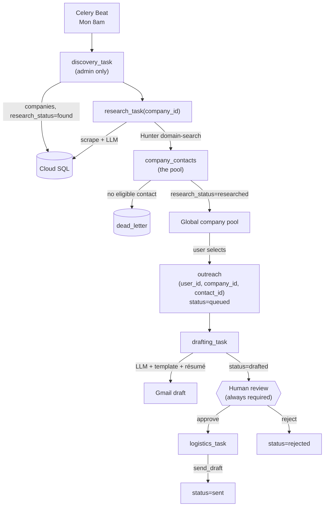
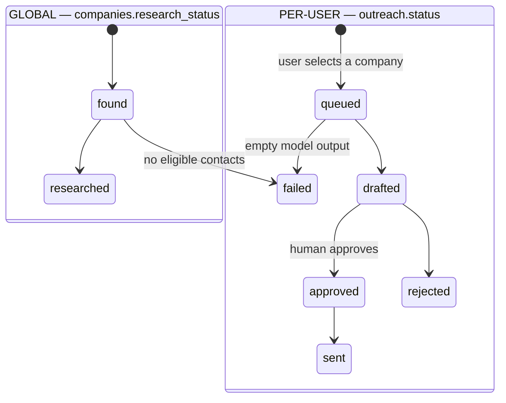

# Cold Email Agent — End-to-End Flow

> Verified against live GCP (`cold-email-490016`) and the current codebase on 2026-08-15.
> Diagrams are [Mermaid](https://mermaid.js.org/) — they render natively on GitHub.
> Hand-authored SVG cannot be diffed in a pull request; Mermaid makes diagram
> changes reviewable like any other text file.

---

## 1. The two-level model

Stack 1b split the single `leads` table into a GLOBAL half and a PER-USER half:

- **Global, admin-populated.** `companies` and `research` are facts true for
  everyone — discovered once, researched once, reused by every user. A
  `company_contacts` pool (from Hunter Domain Search) replaces the old single
  `founder_email`, so the same company can have several emailable people.
- **Per-user.** `outreach` (and its `drafts`) record ONE user's attempt to
  reach ONE company through ONE contact. Two different users can target the
  same company — that's expected — but a shared company pool does not mean
  one founder receives an email from every user: **contact spreading**
  (picking a different eligible contact per outreach where possible) exists
  specifically so the pool doesn't collapse into everyone emailing the same
  inbox.

> **Temporary bridge.** Nothing creates `outreach` rows via `POST
> /api/outreach` yet — Stack 3 adds the pool-selection UI. Until then,
> `bridge_queue_admin_outreach()` (called at the top of every `drafting_task`
> sweep) queues an `outreach` row for the admin account over every
> `researched` company, so the pipeline keeps behaving the way it did before
> the split. **This bridge is deleted in Stack 3** once real user selection
> exists.

## 2. Status lifecycle (state machine)

Two independent status vocabularies, one per level:

---

## Notes on the real system (not obvious from prose)

- **Push vs. pull boundary.** Discovery→Research is a _push_ (`research_task.delay` per company). Research→Drafting is a _pull_: research only sets `research_status=researched`; the 15-min Beat sweep reads the `pending_drafts` view. Same for Approve→Send via `pending_sends`.
- **Scheduling is Celery Beat in-container**, not Cloud Scheduler (that API isn't enabled on the project).
- **DB views are self-healing work queues** — a worker crash mid-sweep is retried on the next tick because the view still lists the unprocessed outreach row.
- **`POST /api/pipeline/research` is a recovery trigger** — it requeues companies stuck in `found` and re-dispatches `research_task` for each. Fills the gap left by discovery's insert-only dedupe, which never retries existing companies. Terminally `failed` companies are recovered separately via the dead-letter queue.
- **Research is where a company becomes emailable.** The directory sources carry no address; research resolves a pool of contacts via Hunter Domain Search, classifies each (`is_founder`, `eligible`), and **fails fast** (`fail_company`, `ERR_NO_ELIGIBLE_CONTACTS`) if none is eligible — the company is dead-lettered at research and never reaches drafting, so no email-less company wastes the drafting stage. Ineligible contacts are stored too, so loosening the eligibility filter later can re-classify stored rows instead of re-spending Hunter credits.
- **LLM calls are provider-agnostic** (`generate_json`): a name-routed fallback chain (Groq `llama*` → Gemini `gemini*`) skips any model that 429s/404s. Swapping models is editing `MODEL_FALLBACK_CHAIN`.
- **Terminal failures land in a DLQ** (`dead_letter` table) via two entry points at the single `handle_terminal_failure` choke point — `fail_company` for research (nobody can email this company) and `fail_outreach` for drafting/logistics (this user's draft or send broke). `POST /api/dlq/retry` resets each row to its stage's input state (`research` → `companies.research_status='found'`, `drafting` → `outreach.status='queued'`, `logistics` → `outreach.status='approved'`) and re-dispatches; the row is cleared and only re-written if it fails again (self-cleaning).
