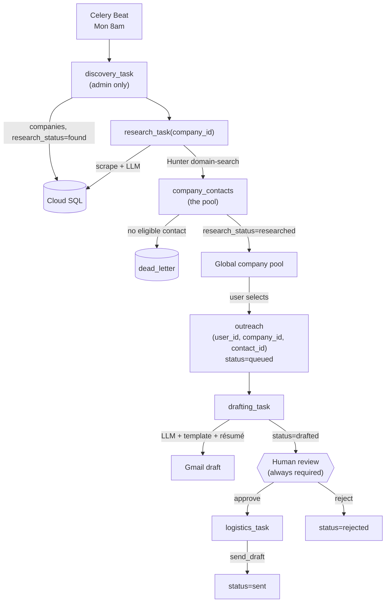
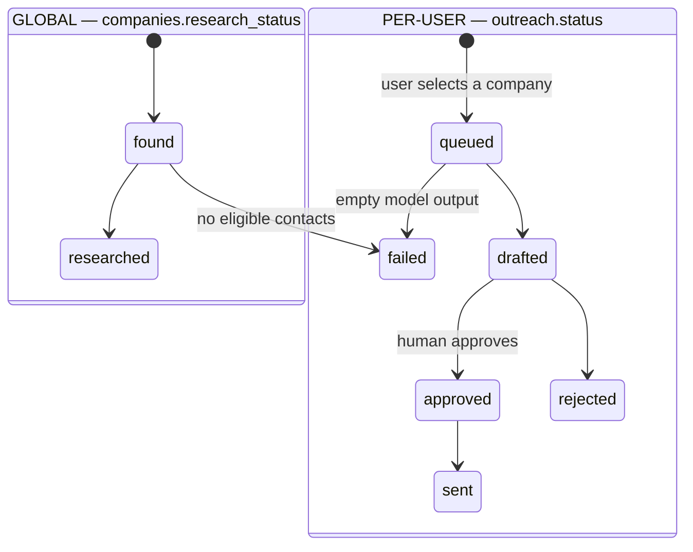

# Stack 1b — Data Model Split & Full Rename Implementation Plan

> **For agentic workers:** REQUIRED SUB-SKILL: Use superpowers:subagent-driven-development (recommended) or superpowers:executing-plans to implement this plan task-by-task. Steps use checkbox (`- [ ]`) syntax for tracking.

**Goal:** Split `leads` into global `companies` + per-user `outreach`, replace the single `founder_email` with a Hunter Domain Search contact pool, migrate all production data, and update every name, document, and diagram that still describes the single-tenant model.

**Architecture:** One transactional SQL migration creates `companies` / `company_contacts` / `outreach`, re-points `research` / `drafts` / `dead_letter`, backfills from `leads`, then renames `leads` to `leads_legacy` (never dropped, so a bad deploy is recoverable). `companies.id` reuses `leads.id` verbatim, which makes every FK remap a pure column rename. Research switches from Hunter Email Finder (one address) to Domain Search (a contact pool). A temporary drafting bridge keeps the pipeline working until Stack 3 adds user selection.

**Tech Stack:** Python 3.12, PostgreSQL 16, SQLAlchemy 2.0, Celery 5.3, Hunter.io Domain Search API, pytest, Next.js 15

**Spec:** [`docs/superpowers/specs/2026-08-14-stack-1b-data-model-design.md`](../specs/2026-08-14-stack-1b-data-model-design.md)

**Branch:** `feat/tenancy-data-model` off `feat/tenancy-auth`. Open the PR with `gh pr create --base feat/tenancy-auth`.

## Global Constraints

- **`companies.id` MUST reuse `leads.id` verbatim.** Every FK remap depends on it. Generating new UUIDs would require an ID translation table throughout the migration.
- `leads` is **renamed to `leads_legacy`, never dropped.** Dropping it is a separate follow-up PR after the deploy is proven.
- Backfilled contacts get `confidence = 25` (`MIN_EMAIL_SCORE`). Hunter's real score was never persisted — `find_email` returns it and `should_accept_email` discards it.
- `MIN_EMAIL_SCORE` stays 25. It changes meaning from a lead-level gate to a per-contact filter; the threshold itself is unchanged.
- `outreach.contact_id` is `ON DELETE SET NULL`, never `CASCADE`. Outreach history must survive a contact purge, or the same person can be re-emailed by the same user.
- The migration **aborts** if no admin user exists. Stack 1a's seed must have run.
- `handle_terminal_failure` becomes two functions — `fail_company` and `fail_outreach`. One function with a nullable pair pushes the branch into every call site.
- The drafting bridge (Task 9) MUST carry a comment naming Stack 3 as its removal point.
- `prompts/email_template.py` `TEMPLATE` text is **unchanged**. Only the values bound to its tokens change.
- Greeting `first_name` comes from `contact_first_name`, **never** `company.founder_name`.
- The April 2026 spec and plan in `docs/superpowers/` are **not rewritten** — only a forward-pointer note is added.
- Run `uv run pytest` before every commit.

---

## File Structure

| File | Responsibility |
|---|---|
| `migrations/006_multi_tenant_schema.sql` | Tables, backfill, view redefinitions, `leads` rename |
| `cold_email/database.py` | `Company`, `CompanyContact`, `Outreach`; `Lead` deleted |
| `cold_email/workers/shared/views.py` | `PendingDraft`, `PendingSend` reshaped |
| `cold_email/workers/shared/db_helpers.py` | Status updaters split by level; dead-letter writer |
| `cold_email/workers/shared/errors.py` | `fail_company`, `fail_outreach` |
| `cold_email/workers/research/helpers/contact_finder.py` | Domain Search + eligibility (replaces `email_finder.py`) |
| `cold_email/workers/research/constants.py` | `DECISION_MAKER_PATTERNS`, Domain Search URL |
| `cold_email/workers/research/helpers/preflight.py` | `resolve_company_url` |
| `cold_email/workers/research/helpers/db_helpers.py` | `save_contacts` (bulk) |
| `cold_email/workers/research/research.py` | Company-oriented flow |
| `cold_email/workers/discovery/discovery.py` | Writes `companies` |
| `cold_email/workers/drafting/drafting.py` | Outreach sweep + temporary bridge |
| `cold_email/workers/drafting/helpers/generation.py` | Contact-aware assembly |
| `cold_email/prompts/email_draft.py` | `recipient_position` replaces `RECIPIENT_TITLE` |
| `cold_email/workers/logistics/logistics.py` | Outreach-oriented send |
| `cold_email/api/routes/outreach.py` | Replaces `leads.py` |
| `docs/architecture-flow.md` | Mermaid diagrams replacing 3 SVGs |
| `tests/test_migration.py` | The highest-value test in this stack |
| `tests/test_contact_finder.py` | Eligibility and classification |

---

### Task 1: Schema migration

**Files:**
- Create: `migrations/006_multi_tenant_schema.sql`
- Test: `tests/test_migration.py` (schema half)

**Interfaces:**
- Consumes: `users` (Stack 1a)
- Produces: tables `companies`, `company_contacts`, `outreach`; altered `research`, `drafts`, `dead_letter`; `leads_legacy`

- [ ] **Step 1: Write the failing test**

Create `tests/test_migration.py`:

```python
"""Migration 006 verification.

Runs the real SQL against a seeded fixture resembling production. This is the
highest-value test in the stack: the migration touches every table at once and
runs exactly once against live data.
"""

import pathlib

import pytest
from sqlalchemy import text

MIGRATION = pathlib.Path("migrations/006_multi_tenant_schema.sql")


async def _run_migration(session):
    await session.execute(text(MIGRATION.read_text()))
    await session.commit()


@pytest.mark.asyncio
async def test_creates_the_three_tables(legacy_fixture, async_session):
    await _run_migration(async_session)
    for table in ("companies", "company_contacts", "outreach"):
        result = await async_session.execute(
            text("SELECT to_regclass(:t) IS NOT NULL"), {"t": table}
        )
        assert result.scalar_one() is True, f"{table} missing"


@pytest.mark.asyncio
async def test_leads_is_renamed_not_dropped(legacy_fixture, async_session):
    """A bad deploy must be recoverable without restoring a backup."""
    await _run_migration(async_session)
    assert (
        await async_session.execute(text("SELECT to_regclass('leads_legacy') IS NOT NULL"))
    ).scalar_one() is True
    assert (
        await async_session.execute(text("SELECT to_regclass('leads') IS NULL"))
    ).scalar_one() is True


@pytest.mark.asyncio
async def test_outreach_unique_user_company(legacy_fixture, async_session, admin_user_id):
    await _run_migration(async_session)
    company_id = (
        await async_session.execute(text("SELECT id FROM companies LIMIT 1"))
    ).scalar_one()

    with pytest.raises(Exception):  # IntegrityError wrapped by asyncpg
        await async_session.execute(
            text(
                "INSERT INTO outreach (user_id, company_id, status) VALUES (:u, :c, 'queued'), "
                "(:u, :c, 'queued')"
            ),
            {"u": admin_user_id, "c": company_id},
        )
        await async_session.commit()


@pytest.mark.asyncio
async def test_dead_letter_requires_one_level(legacy_fixture, async_session):
    """The CHECK constraint prevents a dead-letter row belonging to neither a
    company nor an outreach row — an unretryable orphan."""
    await _run_migration(async_session)
    with pytest.raises(Exception):
        await async_session.execute(
            text(
                "INSERT INTO dead_letter (task_name, stage, error_msg) "
                "VALUES ('t', 'research', 'e')"
            )
        )
        await async_session.commit()


@pytest.mark.asyncio
async def test_aborts_without_an_admin(async_session, legacy_fixture_no_admin):
    """Without an admin there is nobody to own the backfilled outreach rows."""
    with pytest.raises(Exception):
        await _run_migration(async_session)
```

- [ ] **Step 2: Add the legacy fixture**

Append to `tests/conftest.py`:

```python
@pytest_asyncio.fixture
async def admin_user_id(async_session):
    """The admin who inherits all backfilled outreach rows."""
    from cold_email.database import ROLE_ADMIN, User

    user = User(email="admin@example.com", google_sub="sub-admin", role=ROLE_ADMIN)
    async_session.add(user)
    await async_session.commit()
    return user.id


@pytest_asyncio.fixture
async def legacy_fixture(async_session, admin_user_id):
    """Seed a pre-migration database resembling production.

    Deliberately covers every status and both the has-email and no-email cases,
    because the backfill branches on exactly those.
    """
    from sqlalchemy import text

    await async_session.execute(
        text("""
        INSERT INTO leads (id, company_name, founder_name, founder_email, company_url, status)
        VALUES
          ('11111111-1111-1111-1111-111111111111', 'FoundCo',    NULL,        NULL,
           'https://found.co',    'found'),
          ('22222222-2222-2222-2222-222222222222', 'ResearchCo', 'Ann Reed',  'ann@research.co',
           'https://research.co', 'researched'),
          ('33333333-3333-3333-3333-333333333333', 'DraftCo',    'Bo Lin',    'bo@draft.co',
           'https://draft.co',    'drafted'),
          ('44444444-4444-4444-4444-444444444444', 'SentCo',     'Cy Ode',    'cy@sent.co',
           'https://sent.co',     'sent'),
          ('55555555-5555-5555-5555-555555555555', 'NoEmailCo',  'Dee Ray',   NULL,
           'https://noemail.co',  'failed'),
          ('66666666-6666-6666-6666-666666666666', 'DraftFailCo','Eli Poe',   'eli@draftfail.co',
           'https://draftfail.co','failed'),
          ('77777777-7777-7777-7777-777777777777', 'OneWordCo',  'Prince',    'p@oneword.co',
           'https://oneword.co',  'researched')
        """)
    )
    await async_session.execute(
        text("""
        INSERT INTO research (lead_id, tech_stack, recent_news, hook, raw_content)
        SELECT id, '["python"]'::jsonb, 'news', 'hook', 'raw'
        FROM leads WHERE status <> 'found'
        """)
    )
    await async_session.execute(
        text("""
        INSERT INTO drafts (lead_id, subject_line, body, gmail_draft_id)
        VALUES
          ('33333333-3333-3333-3333-333333333333', 'Hi DraftCo', 'body', 'gd-1'),
          ('44444444-4444-4444-4444-444444444444', 'Hi SentCo',  'body', 'gd-2')
        """)
    )
    await async_session.execute(
        text("""
        INSERT INTO dead_letter (lead_id, task_name, stage, error_msg)
        VALUES
          ('55555555-5555-5555-5555-555555555555', 'research_task', 'research',  'no email'),
          ('66666666-6666-6666-6666-666666666666', 'drafting_task', 'drafting',  'empty draft')
        """)
    )
    await async_session.commit()


@pytest_asyncio.fixture
async def legacy_fixture_no_admin(async_session):
    """Same shape, but with no admin user — the migration must abort."""
    from sqlalchemy import text

    await async_session.execute(
        text("""
        INSERT INTO leads (id, company_name, founder_email, status)
        VALUES ('88888888-8888-8888-8888-888888888888', 'OrphanCo', 'x@orphan.co', 'researched')
        """)
    )
    await async_session.commit()
```

- [ ] **Step 3: Run it to verify it fails**

Run: `uv run pytest tests/test_migration.py -v`
Expected: FAIL — `migrations/006_multi_tenant_schema.sql` does not exist.

- [ ] **Step 4: Write the migration**

Create `migrations/006_multi_tenant_schema.sql`:

```sql
-- 006_multi_tenant_schema.sql
--
-- Splits `leads` into global company facts and per-user outreach state, and
-- replaces the single founder_email with a pool of company_contacts.
--
-- THE KEY TRICK: companies.id reuses leads.id verbatim. Because the UUIDs carry
-- over, research.lead_id -> company_id is a pure column rename, dead_letter
-- research rows map directly, and no ID translation table is needed anywhere.
--
-- `leads` is RENAMED to leads_legacy, never dropped, so a bad deploy is
-- recoverable without restoring a backup. A follow-up PR drops it.

BEGIN;

-- Abort if Stack 1a's admin seed has not run: there would be nobody to own the
-- backfilled outreach rows, and silently dropping that history is worse than
-- failing the migration.
DO $$
BEGIN
    IF NOT EXISTS (SELECT 1 FROM users WHERE role = 'admin') THEN
        RAISE EXCEPTION 'No admin user exists. Run scripts/seed_admin.py first.';
    END IF;
END $$;

-- ---------------------------------------------------------------- companies
CREATE TABLE companies (
    id              UUID PRIMARY KEY,
    company_name    TEXT NOT NULL,
    company_url     TEXT,
    linkedin_url    TEXT,
    founder_name    TEXT,
    funding_stage   TEXT,
    headcount       INT,
    industry        TEXT,
    research_status TEXT NOT NULL DEFAULT 'found',   -- found | researched | failed
    error_msg       TEXT,
    created_at      TIMESTAMPTZ NOT NULL DEFAULT now(),
    updated_at      TIMESTAMPTZ NOT NULL DEFAULT now()
);
CREATE INDEX companies_name_idx   ON companies (company_name);
CREATE INDEX companies_status_idx ON companies (research_status);

-- ---------------------------------------------------- company_contacts
-- One row per Hunter domain-search result. Ineligible contacts are stored too,
-- so loosening DECISION_MAKER_PATTERNS later can re-classify stored rows
-- instead of re-spending Hunter credits.
CREATE TABLE company_contacts (
    id          UUID PRIMARY KEY DEFAULT gen_random_uuid(),
    company_id  UUID NOT NULL REFERENCES companies(id) ON DELETE CASCADE,
    email       TEXT NOT NULL,
    first_name  TEXT,
    last_name   TEXT,
    position    TEXT,
    seniority   TEXT,
    department  TEXT,
    confidence  INT  NOT NULL DEFAULT 0,             -- Hunter 0-100
    is_founder  BOOLEAN NOT NULL DEFAULT false,
    eligible    BOOLEAN NOT NULL DEFAULT false,
    created_at  TIMESTAMPTZ NOT NULL DEFAULT now(),
    UNIQUE (company_id, email)
);
-- Partial: selection and pool queries only ever read eligible contacts, so
-- indexing the ineligible ones wastes space and write throughput.
CREATE INDEX company_contacts_eligible_idx
    ON company_contacts (company_id) WHERE eligible;

-- ----------------------------------------------------------------- outreach
CREATE TABLE outreach (
    id                UUID PRIMARY KEY DEFAULT gen_random_uuid(),
    user_id           UUID NOT NULL REFERENCES users(id)            ON DELETE CASCADE,
    company_id        UUID NOT NULL REFERENCES companies(id)        ON DELETE CASCADE,
    -- SET NULL, not CASCADE: if a contact is purged (bounce, GDPR), the record
    -- that an email was sent must survive, or the same user could re-email them.
    contact_id        UUID REFERENCES company_contacts(id)          ON DELETE SET NULL,
    status            TEXT NOT NULL DEFAULT 'queued',
    scheduled_send_at TIMESTAMPTZ,                   -- NULL = send immediately
    error_msg         TEXT,
    created_at        TIMESTAMPTZ NOT NULL DEFAULT now(),
    updated_at        TIMESTAMPTZ NOT NULL DEFAULT now(),
    UNIQUE (user_id, company_id)
);
CREATE INDEX outreach_user_status_idx ON outreach (user_id, status);
-- For Stack 3's per-contact cap query: COUNT(*) WHERE contact_id = ?
CREATE INDEX outreach_contact_idx     ON outreach (contact_id);

-- =================================================================== BACKFILL

-- 1. companies <- leads, id carried verbatim.
--    research_status collapses the old lead-level status to the global facts:
--    anything past research proves research succeeded; 'failed' with no email
--    means research failed; everything else is still 'found'.
INSERT INTO companies (
    id, company_name, company_url, linkedin_url, founder_name,
    funding_stage, headcount, research_status, error_msg, created_at, updated_at
)
SELECT
    id, company_name, company_url, linkedin_url, founder_name,
    funding_stage, headcount,
    CASE
        WHEN status IN ('researched', 'drafted', 'approved', 'sent', 'rejected')
            THEN 'researched'
        WHEN status = 'failed' AND founder_email IS NULL THEN 'failed'
        WHEN status = 'failed' AND founder_email IS NOT NULL THEN 'researched'
        ELSE 'found'
    END,
    error_msg, created_at, updated_at
FROM leads;

-- 2. company_contacts <- the single founder_email per lead.
--    confidence = 25 (MIN_EMAIL_SCORE): the real Hunter score was never
--    persisted, and 25 is the floor these addresses demonstrably cleared.
--    split_part on the name: never fabricate a surname that isn't there.
INSERT INTO company_contacts (
    company_id, email, first_name, last_name, is_founder, eligible, confidence
)
SELECT
    id,
    founder_email,
    NULLIF(split_part(COALESCE(founder_name, ''), ' ', 1), ''),
    NULLIF(substring(COALESCE(founder_name, '') from position(' ' in COALESCE(founder_name, '')) + 1), ''),
    true,
    true,
    25
FROM leads
WHERE founder_email IS NOT NULL;

-- 3. research: pure rename, IDs already match.
ALTER TABLE research RENAME COLUMN lead_id TO company_id;
ALTER TABLE research
    ADD CONSTRAINT research_company_fk
    FOREIGN KEY (company_id) REFERENCES companies(id) ON DELETE CASCADE;

-- 4. outreach <- leads that reached drafting or beyond, owned by the admin.
--    'failed' WITH an email is a drafting/send failure (per-user);
--    'failed' WITHOUT one is a research failure (global) and gets no row.
INSERT INTO outreach (user_id, company_id, contact_id, status, error_msg, created_at, updated_at)
SELECT
    (SELECT id FROM users WHERE role = 'admin' ORDER BY created_at LIMIT 1),
    l.id,
    ct.id,
    l.status,
    l.error_msg,
    l.created_at,
    l.updated_at
FROM leads l
LEFT JOIN company_contacts ct ON ct.company_id = l.id
WHERE l.status IN ('drafted', 'approved', 'sent', 'rejected')
   OR (l.status = 'failed' AND l.founder_email IS NOT NULL);

-- 5. drafts: lead_id -> outreach_id via the shared company id.
ALTER TABLE drafts ADD COLUMN outreach_id UUID REFERENCES outreach(id) ON DELETE CASCADE;
UPDATE drafts d
SET outreach_id = o.id
FROM outreach o
WHERE o.company_id = d.lead_id;
DELETE FROM drafts WHERE outreach_id IS NULL;   -- orphans: no outreach row exists
ALTER TABLE drafts DROP COLUMN lead_id;
ALTER TABLE drafts ALTER COLUMN outreach_id SET NOT NULL;
CREATE INDEX drafts_outreach_idx ON drafts (outreach_id);

-- 6. dead_letter: two nullable FKs. Research failures are company-level
--    ("nobody can email them"); drafting/send failures are outreach-level
--    ("this user's draft broke"). One FK would lose that distinction.
ALTER TABLE dead_letter ADD COLUMN company_id  UUID REFERENCES companies(id) ON DELETE CASCADE;
ALTER TABLE dead_letter ADD COLUMN outreach_id UUID REFERENCES outreach(id) ON DELETE CASCADE;

UPDATE dead_letter SET company_id = lead_id WHERE stage = 'research';

UPDATE dead_letter dl
SET outreach_id = o.id
FROM outreach o
WHERE o.company_id = dl.lead_id AND dl.stage IN ('drafting', 'logistics');

-- Any non-research row without an outreach match is a pre-existing data
-- inconsistency. Anchor it to the company rather than deleting the record.
UPDATE dead_letter SET company_id = lead_id
WHERE outreach_id IS NULL AND company_id IS NULL;

ALTER TABLE dead_letter DROP COLUMN lead_id;
ALTER TABLE dead_letter
    ADD CONSTRAINT dead_letter_one_level
    CHECK (company_id IS NOT NULL OR outreach_id IS NOT NULL);

-- ==================================================================== VIEWS
DROP VIEW IF EXISTS pending_drafts;
DROP VIEW IF EXISTS pending_sends;

CREATE VIEW pending_drafts AS
SELECT DISTINCT ON (o.id)
    o.id            AS outreach_id,
    o.user_id,
    o.company_id,
    o.contact_id,
    c.company_name,
    c.company_url,
    c.founder_name,
    ct.email        AS contact_email,
    ct.first_name   AS contact_first_name,
    ct.position     AS contact_position,
    r.raw_content,
    r.tech_stack,
    r.recent_news,
    r.hook
FROM outreach o
JOIN companies c         ON c.id  = o.company_id
JOIN company_contacts ct ON ct.id = o.contact_id
JOIN research r          ON r.company_id = o.company_id
WHERE o.status = 'queued'
ORDER BY o.id, r.created_at DESC;

-- The scheduled_send_at clause is written now even though nothing sets that
-- column until Stack 4. NULL therefore means "send immediately" from day one,
-- and Stack 4 needs no view migration.
CREATE VIEW pending_sends AS
SELECT DISTINCT ON (o.id)
    o.id          AS outreach_id,
    o.user_id,
    ct.email      AS contact_email,
    d.gmail_draft_id,
    d.subject_line,
    d.body
FROM outreach o
JOIN company_contacts ct ON ct.id = o.contact_id
JOIN drafts d            ON d.outreach_id = o.id
WHERE o.status = 'approved'
  AND (o.scheduled_send_at IS NULL OR o.scheduled_send_at <= now())
ORDER BY o.id, d.created_at DESC;

-- Exposes use_count rather than filtering on the cap: baking K into a view
-- would make changing a business rule require a migration.
CREATE VIEW available_contacts AS
SELECT
    ct.id         AS contact_id,
    ct.company_id,
    ct.confidence,
    ct.is_founder,
    COUNT(o.id)   AS use_count
FROM company_contacts ct
LEFT JOIN outreach o ON o.contact_id = ct.id
WHERE ct.eligible
GROUP BY ct.id;

-- ============================================================ FINALIZE
ALTER TABLE companies ALTER COLUMN id SET DEFAULT gen_random_uuid();
ALTER TABLE leads RENAME TO leads_legacy;

COMMIT;
```

- [ ] **Step 5: Run it to verify it passes**

Run: `uv run pytest tests/test_migration.py -v`
Expected: PASS (5 tests)

- [ ] **Step 6: Commit**

```bash
git add migrations/006_multi_tenant_schema.sql tests/test_migration.py tests/conftest.py
git commit -m "feat(db): add multi-tenant schema migration with backfill

companies.id reuses leads.id verbatim, making every FK remap a pure column
rename. leads is renamed to leads_legacy, not dropped, so a bad deploy is
recoverable."
```

---

### Task 2: Backfill correctness tests

**Files:**
- Modify: `tests/test_migration.py`

**Interfaces:**
- Consumes: migration 006
- Produces: no new symbols

- [ ] **Step 1: Write the failing tests**

Append to `tests/test_migration.py`:

```python
@pytest.mark.asyncio
@pytest.mark.parametrize(
    "company,expected",
    [
        ("FoundCo", "found"),
        ("ResearchCo", "researched"),
        ("DraftCo", "researched"),
        ("SentCo", "researched"),
        ("NoEmailCo", "failed"),       # failed with no email = research failed
        ("DraftFailCo", "researched"),  # failed WITH an email = drafting failed
    ],
)
async def test_research_status_mapping(legacy_fixture, async_session, company, expected):
    await _run_migration(async_session)
    status = (
        await async_session.execute(
            text("SELECT research_status FROM companies WHERE company_name = :n"), {"n": company}
        )
    ).scalar_one()
    assert status == expected


@pytest.mark.asyncio
async def test_company_ids_are_preserved(legacy_fixture, async_session):
    """The trick the whole migration rests on."""
    await _run_migration(async_session)
    row = (
        await async_session.execute(
            text("SELECT id FROM companies WHERE company_name = 'ResearchCo'")
        )
    ).scalar_one()
    assert str(row) == "22222222-2222-2222-2222-222222222222"


@pytest.mark.asyncio
async def test_founder_email_becomes_an_eligible_founder_contact(legacy_fixture, async_session):
    await _run_migration(async_session)
    row = (
        await async_session.execute(
            text("""
            SELECT ct.email, ct.first_name, ct.last_name, ct.is_founder,
                   ct.eligible, ct.confidence
            FROM company_contacts ct
            JOIN companies c ON c.id = ct.company_id
            WHERE c.company_name = 'ResearchCo'
            """)
        )
    ).one()
    assert row.email == "ann@research.co"
    assert row.first_name == "Ann"
    assert row.last_name == "Reed"
    assert row.is_founder is True
    assert row.eligible is True
    assert row.confidence == 25   # sentinel: Hunter's real score was never stored


@pytest.mark.asyncio
async def test_single_word_founder_name_gets_no_fabricated_surname(legacy_fixture, async_session):
    await _run_migration(async_session)
    row = (
        await async_session.execute(
            text("""
            SELECT ct.first_name, ct.last_name FROM company_contacts ct
            JOIN companies c ON c.id = ct.company_id WHERE c.company_name = 'OneWordCo'
            """)
        )
    ).one()
    assert row.first_name == "Prince"
    assert row.last_name is None


@pytest.mark.asyncio
async def test_lead_without_an_email_gets_no_contact_and_no_outreach(
    legacy_fixture, async_session
):
    await _run_migration(async_session)
    counts = (
        await async_session.execute(
            text("""
            SELECT
              (SELECT COUNT(*) FROM company_contacts ct JOIN companies c ON c.id = ct.company_id
                WHERE c.company_name = 'NoEmailCo') AS contacts,
              (SELECT COUNT(*) FROM outreach o JOIN companies c ON c.id = o.company_id
                WHERE c.company_name = 'NoEmailCo') AS outreach
            """)
        )
    ).one()
    assert counts.contacts == 0
    assert counts.outreach == 0


@pytest.mark.asyncio
@pytest.mark.parametrize(
    "company,status",
    [("DraftCo", "drafted"), ("SentCo", "sent"), ("DraftFailCo", "failed")],
)
async def test_outreach_status_carried_over(legacy_fixture, async_session, company, status):
    await _run_migration(async_session)
    got = (
        await async_session.execute(
            text("""
            SELECT o.status FROM outreach o JOIN companies c ON c.id = o.company_id
            WHERE c.company_name = :n
            """),
            {"n": company},
        )
    ).scalar_one()
    assert got == status


@pytest.mark.asyncio
async def test_outreach_is_owned_by_the_admin(legacy_fixture, async_session, admin_user_id):
    await _run_migration(async_session)
    owners = (
        await async_session.execute(text("SELECT DISTINCT user_id FROM outreach"))
    ).scalars().all()
    assert owners == [admin_user_id]


@pytest.mark.asyncio
async def test_research_rows_still_resolve_to_their_company(legacy_fixture, async_session):
    await _run_migration(async_session)
    hook = (
        await async_session.execute(
            text("""
            SELECT r.hook FROM research r JOIN companies c ON c.id = r.company_id
            WHERE c.company_name = 'ResearchCo'
            """)
        )
    ).scalar_one()
    assert hook == "hook"


@pytest.mark.asyncio
async def test_drafts_point_at_the_right_outreach_row(legacy_fixture, async_session):
    await _run_migration(async_session)
    subject = (
        await async_session.execute(
            text("""
            SELECT d.subject_line FROM drafts d
            JOIN outreach o  ON o.id = d.outreach_id
            JOIN companies c ON c.id = o.company_id
            WHERE c.company_name = 'DraftCo'
            """)
        )
    ).scalar_one()
    assert subject == "Hi DraftCo"


@pytest.mark.asyncio
async def test_dead_letter_rows_land_on_the_right_level(legacy_fixture, async_session):
    await _run_migration(async_session)
    rows = (
        await async_session.execute(
            text("SELECT stage, company_id, outreach_id FROM dead_letter ORDER BY stage")
        )
    ).all()
    by_stage = {r.stage: r for r in rows}
    assert by_stage["research"].company_id is not None
    assert by_stage["research"].outreach_id is None
    assert by_stage["drafting"].outreach_id is not None


@pytest.mark.asyncio
async def test_legacy_table_retains_every_row(legacy_fixture, async_session):
    await _run_migration(async_session)
    assert (
        await async_session.execute(text("SELECT COUNT(*) FROM leads_legacy"))
    ).scalar_one() == 7
```

- [ ] **Step 2: Run them**

Run: `uv run pytest tests/test_migration.py -v`
Expected: PASS (21 tests total). If any backfill test fails, fix the SQL in Task 1 — not the test.

- [ ] **Step 3: Commit**

```bash
git add tests/test_migration.py
git commit -m "test(db): verify migration 006 backfill for every status and edge case"
```

---

### Task 3: ORM models

**Files:**
- Modify: `cold_email/database.py`
- Test: `tests/test_models.py`

**Interfaces:**
- Consumes: nothing
- Produces: `Company`, `CompanyContact`, `Outreach`; status constants `RESEARCH_FOUND/RESEARCHED/FAILED` and `OUTREACH_QUEUED/DRAFTED/APPROVED/SENT/REJECTED/FAILED`; `Lead` is deleted

- [ ] **Step 1: Write the failing test**

Create `tests/test_models.py`:

```python
import pytest

from cold_email.database import (
    OUTREACH_QUEUED,
    RESEARCH_FOUND,
    Company,
    CompanyContact,
    Outreach,
)


def test_lead_model_is_gone():
    """The rename must be loud: any missed import should fail at import time,
    not silently read a stale table."""
    import cold_email.database as db

    assert not hasattr(db, "Lead")


@pytest.mark.asyncio
async def test_company_defaults_to_found(async_session):
    company = Company(company_name="Acme")
    async_session.add(company)
    await async_session.commit()
    assert company.research_status == RESEARCH_FOUND


@pytest.mark.asyncio
async def test_contact_cascades_from_company(async_session):
    company = Company(company_name="Acme")
    async_session.add(company)
    await async_session.commit()
    async_session.add(CompanyContact(company_id=company.id, email="a@acme.com"))
    await async_session.commit()

    await async_session.delete(company)
    await async_session.commit()

    from sqlalchemy import func, select

    assert (
        await async_session.execute(select(func.count()).select_from(CompanyContact))
    ).scalar_one() == 0


@pytest.mark.asyncio
async def test_outreach_defaults_to_queued(async_session, admin_user_id):
    company = Company(company_name="Acme")
    async_session.add(company)
    await async_session.commit()

    outreach = Outreach(user_id=admin_user_id, company_id=company.id)
    async_session.add(outreach)
    await async_session.commit()
    assert outreach.status == OUTREACH_QUEUED
    assert outreach.scheduled_send_at is None


@pytest.mark.asyncio
async def test_deleting_a_contact_preserves_outreach_history(async_session, admin_user_id):
    """SET NULL, not CASCADE: losing the record that an email was sent would
    let the same user re-email the same person."""
    company = Company(company_name="Acme")
    async_session.add(company)
    await async_session.commit()

    contact = CompanyContact(company_id=company.id, email="a@acme.com", eligible=True)
    async_session.add(contact)
    await async_session.commit()

    outreach = Outreach(user_id=admin_user_id, company_id=company.id, contact_id=contact.id)
    async_session.add(outreach)
    await async_session.commit()

    await async_session.delete(contact)
    await async_session.commit()
    await async_session.refresh(outreach)

    assert outreach.id is not None
    assert outreach.contact_id is None
```

- [ ] **Step 2: Run it to verify it fails**

Run: `uv run pytest tests/test_models.py -v`
Expected: FAIL — `ImportError: cannot import name 'Company'`

- [ ] **Step 3: Replace the models**

In `cold_email/database.py`, add `Boolean` to the SQLAlchemy imports. Delete
`class Lead` entirely and add:

```python
# Global research lifecycle — a fact about a company, true for every user.
RESEARCH_FOUND = "found"
RESEARCH_RESEARCHED = "researched"
RESEARCH_FAILED = "failed"

# Per-user outreach lifecycle. 'sending' is added in Stack 4.
OUTREACH_QUEUED = "queued"
OUTREACH_DRAFTED = "drafted"
OUTREACH_APPROVED = "approved"
OUTREACH_SENT = "sent"
OUTREACH_REJECTED = "rejected"
OUTREACH_FAILED = "failed"


class Company(Base):
    """A company in the global pool: discovered and researched once, reused by
    every user. Holds only facts true for everyone — no per-user state.
    """

    __tablename__ = "companies"

    id = Column(UUID(as_uuid=True), primary_key=True, default=uuid.uuid4)
    company_name = Column(String, nullable=False, index=True)
    company_url = Column(String)
    linkedin_url = Column(String)
    founder_name = Column(String)
    funding_stage = Column(String)
    headcount = Column(Integer)
    industry = Column(String)
    research_status = Column(String, nullable=False, default=RESEARCH_FOUND, index=True)
    error_msg = Column(Text)
    created_at = Column(DateTime(timezone=True), server_default=func.now())
    updated_at = Column(DateTime(timezone=True), server_default=func.now(), onupdate=func.now())

    research = relationship("Research", back_populates="company", cascade="all, delete-orphan")
    contacts = relationship(
        "CompanyContact", back_populates="company", cascade="all, delete-orphan"
    )
    outreach = relationship("Outreach", back_populates="company", cascade="all, delete-orphan")


class CompanyContact(Base):
    """One emailable person at a company, from Hunter Domain Search.

    A pool rather than a single founder_email: a shared company pool would
    otherwise mean every user emails the same person.

    Ineligible contacts are stored too, so loosening the position filter later
    can re-classify stored rows instead of re-spending Hunter credits.
    """

    __tablename__ = "company_contacts"

    id = Column(UUID(as_uuid=True), primary_key=True, default=uuid.uuid4)
    company_id = Column(
        UUID(as_uuid=True), ForeignKey("companies.id", ondelete="CASCADE"), nullable=False
    )
    email = Column(String, nullable=False)
    first_name = Column(String)
    last_name = Column(String)
    position = Column(String)
    seniority = Column(String)
    department = Column(String)
    confidence = Column(Integer, nullable=False, default=0)  # Hunter 0-100
    is_founder = Column(Boolean, nullable=False, default=False)
    eligible = Column(Boolean, nullable=False, default=False)
    created_at = Column(DateTime(timezone=True), server_default=func.now())

    company = relationship("Company", back_populates="contacts")

    __table_args__ = (UniqueConstraint("company_id", "email", name="uq_contact_company_email"),)


class Outreach(Base):
    """One user's attempt to reach one company — the per-user half of the split.

    UNIQUE(user_id, company_id): a user targets a company at most once. Two
    different users targeting the same company is expected and fine.
    """

    __tablename__ = "outreach"

    id = Column(UUID(as_uuid=True), primary_key=True, default=uuid.uuid4)
    user_id = Column(
        UUID(as_uuid=True), ForeignKey("users.id", ondelete="CASCADE"), nullable=False
    )
    company_id = Column(
        UUID(as_uuid=True), ForeignKey("companies.id", ondelete="CASCADE"), nullable=False
    )
    # SET NULL, not CASCADE — see the model docstring in CompanyContact.
    contact_id = Column(
        UUID(as_uuid=True), ForeignKey("company_contacts.id", ondelete="SET NULL")
    )
    status = Column(String, nullable=False, default=OUTREACH_QUEUED, index=True)
    scheduled_send_at = Column(DateTime(timezone=True))  # NULL = send immediately
    error_msg = Column(Text)
    created_at = Column(DateTime(timezone=True), server_default=func.now())
    updated_at = Column(DateTime(timezone=True), server_default=func.now(), onupdate=func.now())

    company = relationship("Company", back_populates="outreach")
    contact = relationship("CompanyContact")
    drafts = relationship("Draft", back_populates="outreach", cascade="all, delete-orphan")

    __table_args__ = (UniqueConstraint("user_id", "company_id", name="uq_outreach_user_company"),)
```

Add `UniqueConstraint` to the SQLAlchemy imports. Then update `Research`,
`Draft`, and `DeadLetter`:

```python
class Research(Base):
    __tablename__ = "research"

    id = Column(UUID(as_uuid=True), primary_key=True, default=uuid.uuid4)
    company_id = Column(UUID(as_uuid=True), ForeignKey("companies.id", ondelete="CASCADE"))
    tech_stack = Column(JSONB)
    recent_news = Column(Text)
    hook = Column(Text)
    raw_content = Column(Text)
    created_at = Column(DateTime(timezone=True), server_default=func.now())

    company = relationship("Company", back_populates="research")


class Draft(Base):
    __tablename__ = "drafts"

    id = Column(UUID(as_uuid=True), primary_key=True, default=uuid.uuid4)
    outreach_id = Column(
        UUID(as_uuid=True), ForeignKey("outreach.id", ondelete="CASCADE"), nullable=False
    )
    subject_line = Column(String, nullable=False)
    body = Column(Text, nullable=False)
    version = Column(Integer, default=1)
    reviewer_notes = Column(Text)
    gmail_draft_id = Column(String)
    created_at = Column(DateTime(timezone=True), server_default=func.now())

    outreach = relationship("Outreach", back_populates="drafts")


class DeadLetter(Base):
    """One row per terminally-failed task.

    Two nullable FKs with a CHECK that one is set. Research failures are
    company-level (nobody can email them); drafting/send failures are
    outreach-level (one user's problem). Collapsing both into one FK would lose
    that distinction.
    """

    __tablename__ = "dead_letter"

    id = Column(UUID(as_uuid=True), primary_key=True, default=uuid.uuid4)
    company_id = Column(UUID(as_uuid=True), ForeignKey("companies.id", ondelete="CASCADE"))
    outreach_id = Column(UUID(as_uuid=True), ForeignKey("outreach.id", ondelete="CASCADE"))
    task_name = Column(String, nullable=False)
    stage = Column(String, nullable=False)  # research | drafting | logistics
    error_msg = Column(Text)
    retry_count = Column(Integer, nullable=False, default=0)
    created_at = Column(DateTime(timezone=True), server_default=func.now())
    last_retried_at = Column(DateTime(timezone=True))

    __table_args__ = (
        CheckConstraint(
            "company_id IS NOT NULL OR outreach_id IS NOT NULL", name="dead_letter_one_level"
        ),
    )
```

Add `CheckConstraint` to the SQLAlchemy imports.

- [ ] **Step 4: Run it to verify it passes**

Run: `uv run pytest tests/test_models.py -v`
Expected: PASS (5 tests). Other test files will now fail on `Lead` imports — that
is expected and is fixed in Tasks 4–11.

- [ ] **Step 5: Commit**

```bash
git add cold_email/database.py tests/test_models.py
git commit -m "feat(db): replace Lead with Company, CompanyContact, and Outreach"
```

---

### Task 4: Shared helpers — status updates, dead letters, failure handling

**Files:**
- Modify: `cold_email/workers/shared/db_helpers.py`
- Modify: `cold_email/workers/shared/errors.py`
- Modify: `cold_email/workers/shared/views.py`
- Test: `tests/test_shared_helpers.py`

**Interfaces:**
- Consumes: `Company`, `Outreach`, `DeadLetter`
- Produces:
  - `update_company_research_status(company_id, status, error_msg=None) -> None`
  - `update_outreach_status(outreach_id, status, error_msg=None) -> None`
  - `record_dead_letter(*, task_name, stage, error_msg, company_id=None, outreach_id=None) -> None`
  - `fail_company(company_id, reason, *, stage, task_name) -> None`
  - `fail_outreach(outreach_id, reason, *, stage, task_name) -> None`
  - `handle_transient_failure(entity_id, error) -> None`
  - `PendingDraft` with fields `outreach_id, user_id, company_id, contact_id, company_name, company_url, founder_name, contact_email, contact_first_name, contact_position, raw_content, tech_stack, recent_news, hook`
  - `PendingSend` with fields `outreach_id, user_id, contact_email, gmail_draft_id, subject_line, body`

- [ ] **Step 1: Write the failing test**

Create `tests/test_shared_helpers.py`:

```python
import pytest
from sqlalchemy import select

from cold_email.database import (
    OUTREACH_FAILED,
    RESEARCH_FAILED,
    Company,
    DeadLetter,
    Outreach,
)


@pytest.mark.asyncio
async def test_fail_company_marks_and_dead_letters(async_session, monkeypatch, sync_session_for):
    from cold_email.workers.shared.errors import fail_company

    company = Company(company_name="Acme")
    async_session.add(company)
    await async_session.commit()

    fail_company(
        str(company.id), "No eligible contacts found (Hunter)",
        stage="research", task_name="research_task",
    )

    await async_session.refresh(company)
    assert company.research_status == RESEARCH_FAILED

    dl = (await async_session.execute(select(DeadLetter))).scalar_one()
    assert dl.company_id == company.id
    assert dl.outreach_id is None
    assert dl.stage == "research"


@pytest.mark.asyncio
async def test_fail_outreach_marks_and_dead_letters(
    async_session, admin_user_id, sync_session_for
):
    from cold_email.workers.shared.errors import fail_outreach

    company = Company(company_name="Acme")
    async_session.add(company)
    await async_session.commit()
    outreach = Outreach(user_id=admin_user_id, company_id=company.id)
    async_session.add(outreach)
    await async_session.commit()

    fail_outreach(
        str(outreach.id), "Empty model output", stage="drafting", task_name="drafting_task"
    )

    await async_session.refresh(outreach)
    assert outreach.status == OUTREACH_FAILED

    dl = (await async_session.execute(select(DeadLetter))).scalar_one()
    assert dl.outreach_id == outreach.id
    assert dl.company_id is None


def test_pending_draft_carries_contact_fields():
    """The greeting must come from the contact, not the company's founder."""
    from cold_email.workers.shared.views import PendingDraft

    fields = PendingDraft.__dataclass_fields__
    for name in ("outreach_id", "user_id", "contact_email", "contact_first_name",
                 "contact_position"):
        assert name in fields
    assert "lead_id" not in fields
    assert "founder_email" not in fields


def test_pending_send_uses_contact_email():
    from cold_email.workers.shared.views import PendingSend

    fields = PendingSend.__dataclass_fields__
    assert "contact_email" in fields
    assert "user_id" in fields
    assert "lead_id" not in fields
    assert "founder_email" not in fields
```

Add the sync-session bridge fixture to `tests/conftest.py` (workers use the sync
engine while tests use the async one):

```python
@pytest.fixture
def sync_session_for(monkeypatch, async_session):
    """Point the workers' sync session factory at the async test transaction.

    Workers use SyncSessionLocal; tests run inside an async session. Without
    this bridge, a worker write would land in a different transaction and the
    test's assertions would see nothing.
    """
    import contextlib

    @contextlib.contextmanager
    def _get_sync_session():
        class _Shim:
            def __getattr__(self, name):
                return getattr(async_session.sync_session, name)

        yield _Shim()

    for module in (
        "cold_email.workers.shared.db_helpers",
        "cold_email.workers.research.helpers.db_helpers",
        "cold_email.workers.drafting.helpers.db_helpers",
        "cold_email.workers.logistics.helpers.db_helpers",
    ):
        monkeypatch.setattr(f"{module}.get_sync_session", _get_sync_session, raising=False)
```

- [ ] **Step 2: Run it to verify it fails**

Run: `uv run pytest tests/test_shared_helpers.py -v`
Expected: FAIL — `ImportError: cannot import name 'fail_company'`

- [ ] **Step 3: Rewrite `views.py`**

```python
"""Typed row shapes for the read-only pending_* database views.

One dataclass per view (see migration 006). Field names must match the view's
column aliases so a helper can build them with `Model(**row)`.

Both carry user_id: after the tenancy split, a worker must know which user's
profile and mailbox to use.
"""

from dataclasses import dataclass


@dataclass
class PendingDraft:
    """One row of pending_drafts: a queued outreach row + company + contact + research."""

    outreach_id: str
    user_id: str
    company_id: str
    contact_id: str
    company_name: str
    company_url: str
    founder_name: str | None
    contact_email: str
    contact_first_name: str | None
    contact_position: str | None
    raw_content: str
    tech_stack: str | None
    recent_news: str | None
    hook: str | None


@dataclass
class PendingSend:
    """One row of pending_sends: an approved, due outreach row + its latest draft."""

    outreach_id: str
    user_id: str
    contact_email: str
    gmail_draft_id: str | None
    subject_line: str
    body: str
```

- [ ] **Step 4: Rewrite the status helpers**

In `cold_email/workers/shared/db_helpers.py`, replace `update_lead_status` and
`record_dead_letter`:

```python
def update_company_research_status(
    company_id: str, status: str, error_msg: str | None = None
) -> None:
    """Set a company's GLOBAL research status (found | researched | failed)."""
    with get_sync_session() as session:
        company = session.get(Company, company_id)
        if company is None:
            logger.warning(f"Company {company_id} not found; cannot set status {status}")
            return
        company.research_status = status
        if error_msg is not None:
            company.error_msg = error_msg
        session.commit()


def update_outreach_status(outreach_id: str, status: str, error_msg: str | None = None) -> None:
    """Set one user's PER-USER outreach status."""
    with get_sync_session() as session:
        outreach = session.get(Outreach, outreach_id)
        if outreach is None:
            logger.warning(f"Outreach {outreach_id} not found; cannot set status {status}")
            return
        outreach.status = status
        if error_msg is not None:
            outreach.error_msg = error_msg
        session.commit()


def record_dead_letter(
    *,
    task_name: str,
    stage: str,
    error_msg: str,
    company_id: str | None = None,
    outreach_id: str | None = None,
) -> None:
    """Write a DLQ row at exactly one level.

    Keyword-only and exclusive by construction: the CHECK constraint on the
    table is the backstop, but passing neither is a programming error worth
    catching here, where the traceback names the caller.
    """
    if not (bool(company_id) ^ bool(outreach_id)):
        raise ValueError("record_dead_letter requires exactly one of company_id / outreach_id")

    with get_sync_session() as session:
        session.add(
            DeadLetter(
                company_id=company_id,
                outreach_id=outreach_id,
                task_name=task_name,
                stage=stage,
                error_msg=error_msg,
            )
        )
        session.commit()
```

Update the imports at the top of the file to `Company, DeadLetter, Outreach`.

- [ ] **Step 5: Rewrite `errors.py`**

```python
"""Shared failure handlers for Celery workers.

Two failure shapes recur, mapping to opposite state-machine outcomes:

  * terminal  — a permanent problem. Mark the entity 'failed' so it leaves its
    current state, drops out of the pending_* views, and is not retried. Also
    write a DLQ row so it stays independently retryable.
  * transient — a passing problem (network blip, rate limit). Log it and leave
    the status untouched so the next run retries naturally.

After the tenancy split, terminal failure needs TWO entry points because the two
levels update different tables and mean different things:

  * fail_company  — nobody can email this company (research found no contacts)
  * fail_outreach — this user's draft or send broke

One function with a nullable company_id/outreach_id pair would push the branch
into every call site and make the CHECK constraint reachable by accident.
"""

import logging

from cold_email.database import OUTREACH_FAILED, RESEARCH_FAILED
from cold_email.workers.shared.db_helpers import (
    record_dead_letter,
    update_company_research_status,
    update_outreach_status,
)

logger = logging.getLogger(__name__)


def fail_company(company_id: str, reason: str, *, stage: str, task_name: str) -> None:
    """Terminal failure at the GLOBAL level: this company is not emailable."""
    update_company_research_status(company_id, RESEARCH_FAILED, error_msg=reason)
    record_dead_letter(
        company_id=company_id, task_name=task_name, stage=stage, error_msg=reason
    )
    logger.warning(f"Company {company_id} failed and dead-lettered ({stage}): {reason}")


def fail_outreach(outreach_id: str, reason: str, *, stage: str, task_name: str) -> None:
    """Terminal failure at the PER-USER level: this user's outreach broke."""
    update_outreach_status(outreach_id, OUTREACH_FAILED, error_msg=reason)
    record_dead_letter(
        outreach_id=outreach_id, task_name=task_name, stage=stage, error_msg=reason
    )
    logger.warning(f"Outreach {outreach_id} failed and dead-lettered ({stage}): {reason}")


def handle_transient_failure(entity_id: str, error: Exception | str) -> None:
    """Log a transient failure, leaving status untouched so the next run retries."""
    logger.error(f"Transient failure on {entity_id}: {error}")
```

- [ ] **Step 6: Run it to verify it passes**

Run: `uv run pytest tests/test_shared_helpers.py -v`
Expected: PASS (4 tests)

- [ ] **Step 7: Commit**

```bash
git add cold_email/workers/shared/ tests/test_shared_helpers.py tests/conftest.py
git commit -m "refactor(workers): split failure handling by tenancy level

fail_company vs fail_outreach: research failures are global (nobody can
email them), drafting failures are per-user. One function with a nullable
FK pair would push the branch into every call site."
```

---

### Task 5: Hunter Domain Search and eligibility

**Files:**
- Create: `cold_email/workers/research/helpers/contact_finder.py`
- Delete: `cold_email/workers/research/helpers/email_finder.py`
- Modify: `cold_email/workers/research/constants.py`
- Test: `tests/test_contact_finder.py`
- Delete: `tests/test_email_finder.py` (its `domain_from_url` cases move over)

**Interfaces:**
- Consumes: `settings.hunter_api_key`
- Produces: `HunterContact` dataclass (`email, first_name, last_name, position, seniority, department, confidence, is_generic`), `domain_from_url(url) -> str | None`, `looks_like_person_name(name) -> bool`, `find_contacts(domain) -> list[HunterContact]`, `classify_contacts(contacts, founder_name) -> list[ClassifiedContact]`, `has_eligible_contact(contacts) -> bool`; constants `HUNTER_DOMAIN_SEARCH_URL`, `DECISION_MAKER_PATTERNS`, `ERR_NO_ELIGIBLE_CONTACTS`

- [ ] **Step 1: Write the failing test**

Create `tests/test_contact_finder.py`:

```python
import httpx
import pytest

from cold_email.workers.research.constants import DECISION_MAKER_PATTERNS
from cold_email.workers.research.helpers.contact_finder import (
    HunterContact,
    classify_contacts,
    domain_from_url,
    find_contacts,
    has_eligible_contact,
    looks_like_person_name,
)


def _contact(**overrides) -> HunterContact:
    base = {
        "email": "person@acme.com",
        "first_name": "Ann",
        "last_name": "Reed",
        "position": "CTO",
        "seniority": "executive",
        "department": "it",
        "confidence": 90,
        "is_generic": False,
    }
    return HunterContact(**{**base, **overrides})


# ---------------------------------------------------------------- eligibility

def test_generic_addresses_are_ineligible():
    """info@ and support@ land in a shared queue and reply poorly."""
    [c] = classify_contacts([_contact(email="info@acme.com", is_generic=True)], "Ann Reed")
    assert c.eligible is False


def test_sub_threshold_confidence_is_ineligible():
    """MIN_EMAIL_SCORE is unchanged at 25; it is now a per-contact filter."""
    [c] = classify_contacts([_contact(confidence=10)], "Ann Reed")
    assert c.eligible is False


def test_non_decision_maker_position_is_ineligible():
    [c] = classify_contacts([_contact(position="Staff Accountant")], "Ann Reed")
    assert c.eligible is False


@pytest.mark.parametrize("pattern", DECISION_MAKER_PATTERNS)
def test_every_decision_maker_pattern_is_eligible(pattern):
    [c] = classify_contacts([_contact(position=pattern.title())], "Ann Reed")
    assert c.eligible is True, f"pattern not matched: {pattern}"


def test_missing_position_is_ineligible_unless_founder():
    [c] = classify_contacts([_contact(position=None)], "Zed Other")
    assert c.eligible is False

    [f] = classify_contacts([_contact(position=None)], "Ann Reed")
    assert f.is_founder is True
    assert f.eligible is True


# ------------------------------------------------------------------ is_founder

def test_is_founder_by_name_match():
    [c] = classify_contacts([_contact(position="Engineer")], "Ann Reed")
    assert c.is_founder is True


def test_name_match_is_case_insensitive():
    [c] = classify_contacts([_contact(first_name="ANN", last_name="reed")], "Ann Reed")
    assert c.is_founder is True


def test_is_founder_by_position():
    [c] = classify_contacts([_contact(position="Co-Founder")], "Someone Else")
    assert c.is_founder is True


def test_unusable_founder_name_does_not_match_anyone():
    """looks_like_person_name survives the Hunter switch precisely for this:
    'the founders' must not be matched against a contact."""
    [c] = classify_contacts([_contact(position="Engineer")], "the founders")
    assert c.is_founder is False


# ------------------------------------------------------------------ fail-fast

def test_has_eligible_contact_false_for_all_generic():
    contacts = classify_contacts(
        [
            _contact(email="info@acme.com", is_generic=True, position=None),
            _contact(email="support@acme.com", is_generic=True, position=None),
        ],
        "Zed Other",
    )
    assert has_eligible_contact(contacts) is False


def test_has_eligible_contact_true_when_one_qualifies():
    contacts = classify_contacts(
        [_contact(email="info@acme.com", is_generic=True, position=None), _contact()],
        "Zed Other",
    )
    assert has_eligible_contact(contacts) is True


# ------------------------------------------------------------- Hunter mapping

def test_find_contacts_maps_the_hunter_payload(monkeypatch):
    payload = {
        "data": {
            "domain": "acme.com",
            "emails": [
                {
                    "value": "ann@acme.com",
                    "first_name": "Ann",
                    "last_name": "Reed",
                    "position": "CTO",
                    "seniority": "executive",
                    "department": "it",
                    "confidence": 92,
                    "type": "personal",
                },
                {
                    "value": "info@acme.com",
                    "first_name": None,
                    "last_name": None,
                    "position": None,
                    "seniority": None,
                    "department": None,
                    "confidence": 70,
                    "type": "generic",
                },
            ],
        }
    }
    monkeypatch.setattr(
        "cold_email.workers.research.helpers.contact_finder.requests.get",
        lambda *a, **k: httpx.Response(200, json=payload),
    )
    contacts = find_contacts("acme.com")
    assert len(contacts) == 2
    assert contacts[0].email == "ann@acme.com"
    assert contacts[0].confidence == 92
    assert contacts[0].is_generic is False
    assert contacts[1].is_generic is True


def test_find_contacts_returns_empty_on_network_error(monkeypatch):
    """Non-fatal, matching the old find_email contract: the caller gates on the
    result rather than the call raising."""
    import requests

    def boom(*a, **k):
        raise requests.RequestException("timeout")

    monkeypatch.setattr(
        "cold_email.workers.research.helpers.contact_finder.requests.get", boom
    )
    assert find_contacts("acme.com") == []


def test_find_contacts_without_a_domain_makes_no_call():
    assert find_contacts(None) == []


# ------------------------------------- carried over from test_email_finder.py

@pytest.mark.parametrize(
    "url,expected",
    [
        ("https://www.acme.com/about", "acme.com"),
        ("http://acme.com", "acme.com"),
        ("acme.com/team", "acme.com"),
        ("https://sub.acme.co.uk/", "sub.acme.co.uk"),
        (None, None),
        ("", None),
    ],
)
def test_domain_from_url(url, expected):
    assert domain_from_url(url) == expected


@pytest.mark.parametrize(
    "name,expected",
    [
        ("Ann Reed", True),
        ("Ann", False),
        ("Ann Reed, Bo Lin", False),
        ("the founders", False),
        ("CEO", False),
        (None, False),
        ("", False),
    ],
)
def test_looks_like_person_name(name, expected):
    assert looks_like_person_name(name) is expected
```

- [ ] **Step 2: Run it to verify it fails**

Run: `uv run pytest tests/test_contact_finder.py -v`
Expected: FAIL — `ModuleNotFoundError: ...helpers.contact_finder`

- [ ] **Step 3: Add the constants**

In `cold_email/workers/research/constants.py`, replace the
`HUNTER_EMAIL_FINDER_URL` line and the `ERR_NO_EMAIL_FOUND` line:

```python
HUNTER_DOMAIN_SEARCH_URL = "https://api.hunter.io/v2/domain-search"
HUNTER_TIMEOUT_SECONDS = 15
# Max contacts to request per domain. Hunter pages results; a startup rarely has
# more than a handful of decision-makers, so a small page keeps credits down.
HUNTER_DOMAIN_SEARCH_LIMIT = 25

# Minimum Hunter confidence (0-100) for a contact to be usable. Unchanged
# threshold, but it is now a PER-CONTACT filter rather than a lead-level gate.
MIN_EMAIL_SCORE = 25

# Positions worth cold-emailing as a candidate. The email template is
# founder-flavored ("I admire what you're building"), so restricting recipients
# to decision-makers and hiring roles keeps it honest with no prompt changes.
# Matched case-insensitively as substrings against Hunter's `position`.
DECISION_MAKER_PATTERNS = (
    "founder",
    "co-founder",
    "cofounder",
    "ceo",
    "cto",
    "coo",
    "chief technology",
    "chief executive",
    "vp engineering",
    "vp of engineering",
    "head of engineering",
    "director of engineering",
    "engineering manager",
    "eng lead",
    "technical lead",
    "recruit",
    "talent",
    "people ops",
    "head of people",
    "hiring",
)

# Terminal failure reason when research finds nobody worth emailing.
ERR_NO_ELIGIBLE_CONTACTS = "No eligible contacts found (Hunter)"
```

- [ ] **Step 4: Implement `contact_finder.py`**

```python
"""Hunter.io Domain Search — build the emailable contact pool for a company.

Replaces the old Email Finder call. /v2/email-finder takes name + domain and
returns exactly ONE address, so it structurally cannot produce a pool — and a
shared company pool with one address per company means every user emails the
same founder. /v2/domain-search takes a domain and returns many contacts with
positions, seniority, and confidence.

Contacts are classified but ALL of them are stored by the caller. Loosening
DECISION_MAKER_PATTERNS later can then re-classify stored rows instead of
re-spending Hunter credits.
"""

import logging
import re
from dataclasses import dataclass
from urllib.parse import urlparse

import requests

from cold_email.config import settings
from cold_email.workers.research.constants import (
    DECISION_MAKER_PATTERNS,
    HUNTER_DOMAIN_SEARCH_LIMIT,
    HUNTER_DOMAIN_SEARCH_URL,
    HUNTER_TIMEOUT_SECONDS,
    MIN_EMAIL_SCORE,
)

logger = logging.getLogger(__name__)

# Tokens that signal the LLM returned a non-name (title, hedge, or placeholder)
# rather than a person. Matched case-insensitively against whole words.
_NON_NAME_TOKENS = {
    "not", "founder", "founders", "ceo", "cto", "coo", "cofounder", "co-founder",
    "the", "team", "board", "director", "directors", "unknown", "none", "na",
    "n/a", "unclear", "unnamed", "and",
}
_NAME_WORD = re.compile(r"^[A-Za-z][A-Za-z.'-]*$")


@dataclass(frozen=True)
class HunterContact:
    """One raw contact as Hunter returned it."""

    email: str
    first_name: str | None
    last_name: str | None
    position: str | None
    seniority: str | None
    department: str | None
    confidence: int
    is_generic: bool


@dataclass(frozen=True)
class ClassifiedContact:
    """A HunterContact plus our two derived flags."""

    contact: HunterContact
    is_founder: bool
    eligible: bool

    # Convenience passthroughs so callers can treat this as one object.
    @property
    def email(self) -> str:
        return self.contact.email


def looks_like_person_name(name: str | None) -> bool:
    """True if `name` is a plausible single 'First Last'.

    Kept from the Email Finder era, but its job changed: it no longer gates an
    API call, it decides whether the LLM-extracted founder_name is trustworthy
    enough to match against Hunter's results. Matching "the founders" against a
    contact would flag an arbitrary person as the founder.
    """
    if not name:
        return False
    name = name.strip()
    if "," in name or len(name) > 40:
        return False
    words = name.split()
    if not (2 <= len(words) <= 4):
        return False
    if not all(_NAME_WORD.match(w) for w in words):
        return False
    return not ({w.lower().strip(".") for w in words} & _NON_NAME_TOKENS)


def domain_from_url(url: str | None) -> str | None:
    """Extract a bare domain (no scheme, no www, no path) from a company URL."""
    if not url:
        return None
    parsed = urlparse(url if "//" in url else f"//{url}")
    host = (parsed.netloc or parsed.path).strip().lower()
    host = host.removeprefix("www.")
    return host.split("/")[0] or None


def find_contacts(domain: str | None) -> list[HunterContact]:
    """Fetch every contact Hunter knows for a domain.

    Returns [] on missing inputs or any API error — non-fatal, matching the old
    find_email contract. The caller gates on `has_eligible_contact`.
    """
    if not domain or not settings.hunter_api_key:
        return []

    try:
        response = requests.get(
            HUNTER_DOMAIN_SEARCH_URL,
            params={
                "domain": domain,
                "limit": HUNTER_DOMAIN_SEARCH_LIMIT,
                "api_key": settings.hunter_api_key,
            },
            timeout=HUNTER_TIMEOUT_SECONDS,
        )
        response.raise_for_status()
        emails = response.json().get("data", {}).get("emails", [])
    except (requests.RequestException, ValueError) as exc:
        logger.error(f"Hunter domain-search failed for {domain}: {exc}")
        return []

    contacts = [
        HunterContact(
            email=entry["value"],
            first_name=entry.get("first_name"),
            last_name=entry.get("last_name"),
            position=entry.get("position"),
            seniority=entry.get("seniority"),
            department=entry.get("department"),
            confidence=entry.get("confidence") or 0,
            is_generic=entry.get("type") == "generic",
        )
        for entry in emails
        if entry.get("value")
    ]
    logger.info(f"Hunter returned {len(contacts)} contacts for {domain}")
    return contacts


def _is_decision_maker(position: str | None) -> bool:
    if not position:
        return False
    lowered = position.lower()
    return any(pattern in lowered for pattern in DECISION_MAKER_PATTERNS)


def _matches_founder(contact: HunterContact, founder_name: str | None) -> bool:
    if not looks_like_person_name(founder_name):
        return False
    full = f"{contact.first_name or ''} {contact.last_name or ''}".strip().lower()
    return bool(full) and full == founder_name.strip().lower()


def classify_contacts(
    contacts: list[HunterContact], founder_name: str | None
) -> list[ClassifiedContact]:
    """Derive is_founder and eligible for every contact.

    Eligible requires ALL of:
      1. not a generic catch-all (info@, support@) — those reply poorly and land
         in a shared queue
      2. confidence >= MIN_EMAIL_SCORE — a bounce hurts sender reputation
      3. a decision-maker/hiring position, OR is_founder
    """
    classified = []
    for contact in contacts:
        is_founder = _matches_founder(contact, founder_name) or _is_founder_position(
            contact.position
        )
        eligible = (
            not contact.is_generic
            and contact.confidence >= MIN_EMAIL_SCORE
            and (_is_decision_maker(contact.position) or is_founder)
        )
        classified.append(
            ClassifiedContact(contact=contact, is_founder=is_founder, eligible=eligible)
        )
    return classified


def _is_founder_position(position: str | None) -> bool:
    return bool(position) and "founder" in position.lower()


def has_eligible_contact(contacts: list[ClassifiedContact]) -> bool:
    """True if at least one contact is worth emailing.

    Replaces should_accept_email as research's fail-fast gate: no eligible
    contact means nobody can email this company, so it is dead-lettered at
    research rather than wasting the drafting stage.
    """
    return any(c.eligible for c in contacts)
```

- [ ] **Step 5: Delete the old module and its test**

```bash
git rm cold_email/workers/research/helpers/email_finder.py tests/test_email_finder.py
```

- [ ] **Step 6: Run it to verify it passes**

Run: `uv run pytest tests/test_contact_finder.py -v`
Expected: PASS (all parametrized cases)

- [ ] **Step 7: Commit**

```bash
git add cold_email/workers/research/ tests/test_contact_finder.py
git commit -m "feat(research): replace Hunter Email Finder with Domain Search

email-finder returns exactly one address per company, so a shared pool means
every user emails the same founder. domain-search returns a contact pool with
positions and confidence, filtered to decision-makers and hiring roles."
```

---

### Task 6: Research worker

**Files:**
- Modify: `cold_email/workers/research/research.py`
- Modify: `cold_email/workers/research/helpers/preflight.py`
- Modify: `cold_email/workers/research/helpers/db_helpers.py`
- Modify: `cold_email/workers/research/helpers/extraction.py`
- Test: `tests/test_research.py`

**Interfaces:**
- Consumes: `find_contacts`, `classify_contacts`, `has_eligible_contact`, `fail_company`, `update_company_research_status`
- Produces: `research_task(company_id: str) -> dict`, `resolve_company_url(company_id) -> CompanyResolution` (fields `company`, `url`, `failure`), `save_contacts(company_id, contacts: list[ClassifiedContact]) -> int`, `commit_research(company_id=..., ...)`

- [ ] **Step 1: Write the failing test**

Rewrite `tests/test_research.py` around the new flow. Add these cases:

```python
@pytest.mark.asyncio
async def test_saves_every_contact_including_ineligible(
    async_session, monkeypatch, sync_session_for
):
    """Ineligible contacts are stored so a future loosening of the position
    filter can re-classify them without re-spending Hunter credits."""
    from cold_email.database import Company, CompanyContact
    from cold_email.workers.research.helpers.contact_finder import HunterContact

    company = Company(company_name="Acme", company_url="https://acme.com")
    async_session.add(company)
    await async_session.commit()

    monkeypatch.setattr(
        "cold_email.workers.research.research.find_contacts",
        lambda domain: [
            HunterContact("cto@acme.com", "Ann", "Reed", "CTO", "executive", "it", 90, False),
            HunterContact("info@acme.com", None, None, None, None, None, 80, True),
        ],
    )
    _stub_scrape_and_llm(monkeypatch, founder_name="Ann Reed")

    from cold_email.workers.research.research import research_task

    research_task(str(company.id))

    from sqlalchemy import select

    contacts = (
        await async_session.execute(
            select(CompanyContact).where(CompanyContact.company_id == company.id)
        )
    ).scalars().all()
    assert len(contacts) == 2
    assert {c.eligible for c in contacts} == {True, False}


@pytest.mark.asyncio
async def test_no_eligible_contact_fails_the_company(
    async_session, monkeypatch, sync_session_for
):
    from cold_email.database import RESEARCH_FAILED, Company, DeadLetter
    from cold_email.workers.research.constants import ERR_NO_ELIGIBLE_CONTACTS
    from cold_email.workers.research.helpers.contact_finder import HunterContact

    company = Company(company_name="Acme", company_url="https://acme.com")
    async_session.add(company)
    await async_session.commit()

    monkeypatch.setattr(
        "cold_email.workers.research.research.find_contacts",
        lambda domain: [
            HunterContact("info@acme.com", None, None, None, None, None, 80, True)
        ],
    )
    _stub_scrape_and_llm(monkeypatch, founder_name="Ann Reed")

    from cold_email.workers.research.research import research_task

    result = research_task(str(company.id))
    assert result["status"] == "failed"

    await async_session.refresh(company)
    assert company.research_status == RESEARCH_FAILED

    from sqlalchemy import select

    dl = (await async_session.execute(select(DeadLetter))).scalar_one()
    assert dl.company_id == company.id
    assert dl.outreach_id is None
    assert dl.error_msg == ERR_NO_ELIGIBLE_CONTACTS


@pytest.mark.asyncio
async def test_contacts_are_saved_before_the_eligibility_gate(
    async_session, monkeypatch, sync_session_for
):
    """Even a company that fails research keeps its contact rows."""
    from cold_email.database import Company, CompanyContact
    from cold_email.workers.research.helpers.contact_finder import HunterContact

    company = Company(company_name="Acme", company_url="https://acme.com")
    async_session.add(company)
    await async_session.commit()

    monkeypatch.setattr(
        "cold_email.workers.research.research.find_contacts",
        lambda domain: [
            HunterContact("info@acme.com", None, None, None, None, None, 80, True)
        ],
    )
    _stub_scrape_and_llm(monkeypatch, founder_name="Ann Reed")

    from cold_email.workers.research.research import research_task

    research_task(str(company.id))

    from sqlalchemy import func, select

    count = (
        await async_session.execute(
            select(func.count()).select_from(CompanyContact)
            .where(CompanyContact.company_id == company.id)
        )
    ).scalar_one()
    assert count == 1


@pytest.mark.asyncio
async def test_save_contacts_is_idempotent(async_session, sync_session_for):
    """A retried research task must not duplicate contacts.
    UNIQUE(company_id, email) + ON CONFLICT DO NOTHING."""
    from cold_email.database import Company, CompanyContact
    from cold_email.workers.research.helpers.contact_finder import (
        ClassifiedContact,
        HunterContact,
    )
    from cold_email.workers.research.helpers.db_helpers import save_contacts

    company = Company(company_name="Acme")
    async_session.add(company)
    await async_session.commit()

    contact = ClassifiedContact(
        contact=HunterContact("a@acme.com", "A", "B", "CTO", None, None, 90, False),
        is_founder=False,
        eligible=True,
    )
    save_contacts(str(company.id), [contact])
    save_contacts(str(company.id), [contact])

    from sqlalchemy import func, select

    assert (
        await async_session.execute(select(func.count()).select_from(CompanyContact))
    ).scalar_one() == 1
```

Add the shared stub helper at the top of the file:

```python
def _stub_scrape_and_llm(monkeypatch, founder_name: str):
    """Stub the scrape + LLM extraction steps so tests exercise only the
    contact-finding path."""
    import json

    monkeypatch.setattr(
        "cold_email.workers.research.research.scrape_website", lambda url: "page text"
    )
    monkeypatch.setattr(
        "cold_email.workers.research.research.call_llm_extraction",
        lambda text, name: json.dumps(
            {
                "founder_name": founder_name,
                "tech_stack": ["python"],
                "recent_news": "news",
                "hook": "hook",
            }
        ),
    )
```

- [ ] **Step 2: Run it to verify it fails**

Run: `uv run pytest tests/test_research.py -v`
Expected: FAIL on imports and on `research_task` still using `find_email`.

- [ ] **Step 3: Rename in `preflight.py`**

Rename `resolve_lead_url` → `resolve_company_url`, `LeadResolution` →
`CompanyResolution`, its `.lead` field → `.company`, and replace the `Lead` query
with `Company`. The failure branch calls `fail_company` instead of
`handle_terminal_failure`.

- [ ] **Step 4: Add `save_contacts` to `research/helpers/db_helpers.py`**

Delete `save_founder_contact` and add:

```python
def save_contacts(company_id: str, contacts: list[ClassifiedContact]) -> int:
    """Bulk-upsert a company's contact pool. Returns the number inserted.

    ON CONFLICT DO NOTHING against UNIQUE(company_id, email): a retried research
    task must not duplicate contacts, and re-classifying an existing row is a
    separate concern from discovering one.
    """
    if not contacts:
        return 0

    rows = [
        {
            "company_id": company_id,
            "email": c.contact.email,
            "first_name": c.contact.first_name,
            "last_name": c.contact.last_name,
            "position": c.contact.position,
            "seniority": c.contact.seniority,
            "department": c.contact.department,
            "confidence": c.contact.confidence,
            "is_founder": c.is_founder,
            "eligible": c.eligible,
        }
        for c in contacts
    ]

    with get_sync_session() as session:
        statement = pg_insert(CompanyContact).values(rows).on_conflict_do_nothing(
            index_elements=["company_id", "email"]
        )
        result = session.execute(statement)
        session.commit()
        return result.rowcount or 0
```

Import `from sqlalchemy.dialects.postgresql import insert as pg_insert` and
`CompanyContact`. Change `commit_research`'s `lead_id` parameter to `company_id`.

- [ ] **Step 5: Rewrite the task body**

In `cold_email/workers/research/research.py`, replace the imports and the task:

```python
def research_task(self, company_id: str) -> dict:
    """
    Dispatched by discovery_task per company.
    Steps:
      1. Resolve the official company homepage (DuckDuckGo + scoring)
      2. Scrape it (BeautifulSoup, Firecrawl fallback)
      3. LLM structured extraction
      4. Insert a research row
      5. Fetch the contact pool from Hunter Domain Search and classify it
      6. Save EVERY contact, then gate on whether any is eligible
    """
    resolution = resolve_company_url(company_id)
    if resolution.failure:
        return resolution.failure

    company, company_url = resolution.company, resolution.url

    text = scrape_website(company_url)
    raw = call_llm_extraction(text, company.company_name)
    research_dict = parse_llm_response(raw)

    commit_research(
        company_id=company_id,
        tech_stack=research_dict.get("tech_stack"),
        recent_news=research_dict.get("recent_news"),
        hook=research_dict.get("hook"),
        raw_content=raw,
    )

    founder_name = research_dict.get("founder_name") or company.founder_name
    contacts = classify_contacts(find_contacts(domain_from_url(company_url)), founder_name)

    # Save BEFORE gating: a company that fails research keeps its contact rows,
    # so loosening DECISION_MAKER_PATTERNS later can re-classify them instead of
    # re-spending Hunter credits.
    save_contacts(company_id, contacts)

    if not has_eligible_contact(contacts):
        fail_company(
            company_id,
            ERR_NO_ELIGIBLE_CONTACTS,
            stage=RESEARCH,
            task_name="cold_email.workers.research.research_task",
        )
        return {"status": "failed", "error": ERR_NO_ELIGIBLE_CONTACTS}

    update_company_research_status(company_id, RESEARCH_RESEARCHED)
    return {"status": "success", "contacts": len(contacts)}
```

- [ ] **Step 6: Run it to verify it passes**

Run: `uv run pytest tests/test_research.py -v`
Expected: PASS

- [ ] **Step 7: Commit**

```bash
git add cold_email/workers/research/ tests/test_research.py
git commit -m "refactor(research): operate on companies and build a contact pool"
```

---

### Task 7: Discovery worker

**Files:**
- Modify: `cold_email/workers/discovery/discovery.py`
- Modify: `cold_email/workers/discovery/constants.py`
- Test: `tests/test_discovery.py`

**Interfaces:**
- Consumes: `Company`
- Produces: `discovery_task() -> dict` writing `companies` rows and dispatching `research_task(company_id)`

- [ ] **Step 1: Write the failing test**

In `tests/test_discovery.py`, replace `Lead` with `Company` throughout and add:

```python
@pytest.mark.asyncio
async def test_new_companies_start_at_found(async_session, monkeypatch, sync_session_for):
    from cold_email.database import RESEARCH_FOUND, Company

    _stub_firecrawl(monkeypatch, [{"company_name": "NewCo", "company_url": "https://new.co"}])

    from cold_email.workers.discovery.discovery import discovery_task

    discovery_task()

    from sqlalchemy import select

    company = (
        await async_session.execute(select(Company).where(Company.company_name == "NewCo"))
    ).scalar_one()
    assert company.research_status == RESEARCH_FOUND


@pytest.mark.asyncio
async def test_dedupes_against_existing_companies(async_session, monkeypatch, sync_session_for):
    """Dedup now protects the GLOBAL pool: a duplicate would give two users
    different contact pools for the same company."""
    from cold_email.database import Company

    async_session.add(Company(company_name="ExistingCo"))
    await async_session.commit()

    _stub_firecrawl(monkeypatch, [{"company_name": "ExistingCo", "company_url": "https://e.co"}])

    from cold_email.workers.discovery.discovery import discovery_task

    result = discovery_task()
    assert result["saved"] == 0

    from sqlalchemy import func, select

    assert (
        await async_session.execute(select(func.count()).select_from(Company))
    ).scalar_one() == 1


@pytest.mark.asyncio
async def test_dispatches_research_with_a_company_id(async_session, monkeypatch, sync_session_for):
    dispatched = []
    monkeypatch.setattr(
        "cold_email.workers.discovery.discovery.research_task",
        type("T", (), {"delay": staticmethod(lambda cid: dispatched.append(cid))}),
    )
    _stub_firecrawl(monkeypatch, [{"company_name": "NewCo", "company_url": "https://new.co"}])

    from cold_email.workers.discovery.discovery import discovery_task

    discovery_task()
    assert len(dispatched) == 1
```

- [ ] **Step 2: Run it to verify it fails**

Run: `uv run pytest tests/test_discovery.py -v`
Expected: FAIL — `Lead` no longer exists.

- [ ] **Step 3: Update the worker**

In `discovery.py`: replace every `Lead(` with `Company(`, `Lead.company_name`
with `Company.company_name`, the `status="found"` kwarg with
`research_status=RESEARCH_FOUND`, and `research_task.delay(str(lead.id))` with
`research_task.delay(str(company.id))`. Rename local variables `lead`/`leads` to
`company`/`companies`. In `constants.py`, rename any `LEADS_*` constant to
`COMPANIES_*`.

Add this comment above the dedup query:

```python
    # Dedup protects the GLOBAL pool: a duplicate company would give two users
    # different contact pools for the same business, and the per-contact cap
    # could then be silently doubled.
```

- [ ] **Step 4: Run it to verify it passes**

Run: `uv run pytest tests/test_discovery.py -v`
Expected: PASS

- [ ] **Step 5: Commit**

```bash
git add cold_email/workers/discovery/ tests/test_discovery.py
git commit -m "refactor(discovery): write companies instead of leads"
```

---

### Task 8: Draft generation — contact-aware assembly

**Files:**
- Modify: `cold_email/prompts/email_draft.py`
- Modify: `cold_email/workers/drafting/helpers/generation.py`
- Test: `tests/test_email_assembly.py`

**Interfaces:**
- Consumes: `PendingDraft` (with `contact_*` fields)
- Produces: `build_email_draft_messages(recipient_name, recipient_position, company_name, tech_stack, recent_news, hook, resume_text) -> str`; `assemble_email(context, row, profile) -> dict` using `row.contact_first_name`; `RECIPIENT_TITLE` deleted

- [ ] **Step 1: Write the failing test**

Add to `tests/test_email_assembly.py`:

```python
def test_greeting_uses_the_contact_not_the_founder(profile):
    """A user emailing the CTO must not be greeted by the founder's name.

    This is the most visible way contact spreading could embarrass a user, and
    it is a one-line mistake to make.
    """
    from cold_email.workers.drafting.helpers.generation import assemble_email
    from cold_email.workers.shared.views import PendingDraft

    row = PendingDraft(
        outreach_id="o1",
        user_id="u1",
        company_id="c1",
        contact_id="ct1",
        company_name="Acme",
        company_url="https://acme.com",
        founder_name="Ann Reed",          # the founder
        contact_email="bo@acme.com",
        contact_first_name="Bo",          # but we are emailing Bo
        contact_position="CTO",
        raw_content="raw",
        tech_stack=["python"],
        recent_news="news",
        hook="hook",
    )
    context = {
        "subject": "Acme",
        "company_interest": "x",
        "admiration_detail": "y",
        "intro": "I'm someone.",
        "tailored_bullets": ["A: did a thing"],
    }
    result = assemble_email(context, row, profile)
    assert "Hi Bo," in result["body"]
    assert "Ann" not in result["body"]


def test_greeting_falls_back_when_the_contact_has_no_first_name(profile):
    from cold_email.workers.drafting.helpers.generation import assemble_email
    from cold_email.workers.shared.views import PendingDraft

    row = PendingDraft(
        outreach_id="o1", user_id="u1", company_id="c1", contact_id="ct1",
        company_name="Acme", company_url="https://acme.com", founder_name=None,
        contact_email="team@acme.com", contact_first_name=None, contact_position="CTO",
        raw_content="raw", tech_stack=["python"], recent_news="n", hook="h",
    )
    context = {
        "subject": "Acme", "company_interest": "x", "admiration_detail": "y",
        "intro": "I'm someone.", "tailored_bullets": ["A: did a thing"],
    }
    assert "Hi there," in assemble_email(context, row, profile)["body"]


def test_recipient_title_constant_is_gone():
    """'Founder' was hardcoded because there was no title column. There is now,
    and the recipient is frequently not a founder."""
    import cold_email.prompts.email_draft as ed

    assert not hasattr(ed, "RECIPIENT_TITLE")


def test_prompt_carries_the_contacts_real_position():
    from cold_email.prompts.email_draft import build_email_draft_messages

    prompt = build_email_draft_messages(
        recipient_name="Bo Lin",
        recipient_position="CTO",
        company_name="Acme",
        tech_stack=["python"],
        recent_news="news",
        hook="hook",
        resume_text="resume",
    )
    assert "CTO" in prompt
    assert "Bo Lin" in prompt


def test_prompt_falls_back_to_founder_when_position_is_missing():
    from cold_email.prompts.email_draft import build_email_draft_messages

    prompt = build_email_draft_messages(
        recipient_name="Bo Lin", recipient_position=None, company_name="Acme",
        tech_stack=[], recent_news="", hook="", resume_text="r",
    )
    assert "Founder" in prompt
```

- [ ] **Step 2: Run it to verify it fails**

Run: `uv run pytest tests/test_email_assembly.py -v`
Expected: FAIL — `assemble_email` still reads `row.founder_name`.

- [ ] **Step 3: Update `prompts/email_draft.py`**

Delete the `RECIPIENT_TITLE` constant and its comment. Change the signature:

```python
def build_email_draft_messages(
    recipient_name: str,
    recipient_position: str | None,
    company_name: str,
    tech_stack: list[str],
    recent_news: str,
    hook: str,
    resume_text: str,
) -> str:
    """Build the drafting prompt: company research + the sender's full resume.

    `recipient_position` comes from company_contacts.position. It replaces a
    hardcoded "Founder" — after contact spreading, the recipient is frequently
    a CTO or a head of engineering, and telling the model otherwise produces
    copy addressed to the wrong role.
    """
    position = recipient_position or "Founder"
    return (
        f"Company: {company_name} (recipient: {recipient_name}, {position})\n"
        f"What they're building / recent news: {recent_news}\n"
        f"Why their work is compelling: {hook}\n"
        f"Their tech stack: {', '.join(tech_stack)}\n\n"
        f"Sender's Resume:\n{resume_text}\n\n"
        "Fill the requested fields."
    )
```

- [ ] **Step 4: Update `generation.py`**

In `generate_email`, build the recipient name from the contact:

```python
    recipient_name = " ".join(
        part for part in (row.contact_first_name, getattr(row, "contact_last_name", None)) if part
    ) or (row.founder_name or "there")

    messages = build_email_draft_messages(
        recipient_name=recipient_name,
        recipient_position=row.contact_position,
        company_name=row.company_name,
        tech_stack=tech_stack,
        recent_news=row.recent_news or "",
        hook=row.hook or "",
        resume_text=PROFILE.effective_resume_text,
    )
```

In `assemble_email`, replace the `first_name` derivation:

```python
    # The CONTACT's first name, not the company's founder. Addressing the CTO
    # by the founder's name is the most visible way this could embarrass a user.
    first_name = row.contact_first_name or "there"
```

- [ ] **Step 5: Run it to verify it passes**

Run: `uv run pytest tests/test_email_assembly.py -v`
Expected: PASS

- [ ] **Step 6: Commit**

```bash
git add cold_email/prompts/email_draft.py cold_email/workers/drafting/helpers/generation.py tests/test_email_assembly.py
git commit -m "fix(drafting): address the actual contact, not the founder

RECIPIENT_TITLE was hardcoded 'Founder' because there was no title column.
There is now, and after contact spreading the recipient is often a CTO."
```

---

### Task 9: Drafting worker and the temporary bridge

**Files:**
- Modify: `cold_email/workers/drafting/drafting.py`
- Modify: `cold_email/workers/drafting/helpers/db_helpers.py`
- Modify: `cold_email/workers/drafting/constants.py`
- Test: `tests/test_drafting.py`

**Interfaces:**
- Consumes: `PendingDraft`, `fail_outreach`, `update_outreach_status`
- Produces: `drafting_task() -> dict`; `bridge_queue_admin_outreach() -> int` (**deleted in Stack 3**); `fetch_pending_drafts() -> list[PendingDraft]`; `commit_draft(outreach_id=..., subject_line=..., body=..., gmail_draft_id=...)`

- [ ] **Step 1: Write the failing test**

Add to `tests/test_drafting.py`:

```python
@pytest.mark.asyncio
async def test_bridge_queues_researched_companies_for_the_admin(
    async_session, admin_user_id, sync_session_for
):
    """Nothing creates outreach rows until Stack 3's pool UI, so the bridge
    preserves today's behaviour (admin drafts everything researched)."""
    from cold_email.database import (
        OUTREACH_QUEUED,
        RESEARCH_RESEARCHED,
        Company,
        CompanyContact,
        Outreach,
    )
    from cold_email.workers.drafting.drafting import bridge_queue_admin_outreach

    company = Company(company_name="Acme", research_status=RESEARCH_RESEARCHED)
    async_session.add(company)
    await async_session.commit()
    async_session.add(
        CompanyContact(company_id=company.id, email="a@acme.com", eligible=True, confidence=90)
    )
    await async_session.commit()

    assert bridge_queue_admin_outreach() == 1

    from sqlalchemy import select

    outreach = (await async_session.execute(select(Outreach))).scalar_one()
    assert outreach.user_id == admin_user_id
    assert outreach.status == OUTREACH_QUEUED


@pytest.mark.asyncio
async def test_bridge_skips_companies_without_an_eligible_contact(
    async_session, admin_user_id, sync_session_for
):
    from cold_email.database import RESEARCH_RESEARCHED, Company, CompanyContact
    from cold_email.workers.drafting.drafting import bridge_queue_admin_outreach

    company = Company(company_name="Acme", research_status=RESEARCH_RESEARCHED)
    async_session.add(company)
    await async_session.commit()
    async_session.add(
        CompanyContact(company_id=company.id, email="info@acme.com", eligible=False)
    )
    await async_session.commit()

    assert bridge_queue_admin_outreach() == 0


@pytest.mark.asyncio
async def test_bridge_is_idempotent(async_session, admin_user_id, sync_session_for):
    """Runs on every 15-minute sweep; must not duplicate."""
    from cold_email.database import RESEARCH_RESEARCHED, Company, CompanyContact
    from cold_email.workers.drafting.drafting import bridge_queue_admin_outreach

    company = Company(company_name="Acme", research_status=RESEARCH_RESEARCHED)
    async_session.add(company)
    await async_session.commit()
    async_session.add(
        CompanyContact(company_id=company.id, email="a@acme.com", eligible=True, confidence=90)
    )
    await async_session.commit()

    assert bridge_queue_admin_outreach() == 1
    assert bridge_queue_admin_outreach() == 0


@pytest.mark.asyncio
async def test_bridge_picks_the_highest_confidence_contact(
    async_session, admin_user_id, sync_session_for
):
    """The bridge uses simple highest-confidence selection; least-used-with-cap
    selection is Stack 3's."""
    from cold_email.database import RESEARCH_RESEARCHED, Company, CompanyContact, Outreach
    from cold_email.workers.drafting.drafting import bridge_queue_admin_outreach

    company = Company(company_name="Acme", research_status=RESEARCH_RESEARCHED)
    async_session.add(company)
    await async_session.commit()
    async_session.add_all([
        CompanyContact(company_id=company.id, email="low@acme.com", eligible=True, confidence=30),
        CompanyContact(company_id=company.id, email="high@acme.com", eligible=True, confidence=95),
    ])
    await async_session.commit()

    bridge_queue_admin_outreach()

    from sqlalchemy import select

    outreach = (await async_session.execute(select(Outreach))).scalar_one()
    contact = (
        await async_session.execute(
            select(CompanyContact).where(CompanyContact.id == outreach.contact_id)
        )
    ).scalar_one()
    assert contact.email == "high@acme.com"


@pytest.mark.asyncio
async def test_empty_model_output_fails_only_that_outreach_row(
    async_session, admin_user_id, monkeypatch, sync_session_for
):
    """One bad row must not abort the sweep."""
    from cold_email.database import OUTREACH_FAILED, DeadLetter
    ...  # arrange two queued rows, stub draft_email to return {} for the first

    from sqlalchemy import select

    dl = (await async_session.execute(select(DeadLetter))).scalar_one()
    assert dl.outreach_id is not None
    assert dl.company_id is None
    assert dl.stage == "drafting"
```

Replace the `...` line above with a concrete arrangement following the pattern in
the preceding tests: create two companies with eligible contacts, run the bridge,
monkeypatch `cold_email.workers.drafting.drafting.draft_email` to return `{}` for
the first row and a full dict for the second, run `drafting_task()`, then assert
one row is `OUTREACH_FAILED` and the other is `drafted`.

- [ ] **Step 2: Run it to verify it fails**

Run: `uv run pytest tests/test_drafting.py -v`
Expected: FAIL — `bridge_queue_admin_outreach` does not exist.

- [ ] **Step 3: Add the bridge**

In `cold_email/workers/drafting/drafting.py`:

```python
def bridge_queue_admin_outreach() -> int:
    """TEMPORARY: queue outreach rows for the admin over every researched company.

    ================== DELETE THIS IN STACK 3 ==================
    Nothing creates outreach rows until Stack 3 adds the pool UI, so without
    this the pipeline would silently stop drafting the moment 1b lands. This
    exactly preserves today's behaviour: the admin drafts everything researched.

    Stack 3 replaces it with user selection via POST /api/outreach, and this
    function plus its call in drafting_task must be removed then.

    Selection here is simply highest-confidence eligible contact. The real
    least-globally-contacted-with-cap selection is Stack 3's.
    ============================================================
    """
    with get_sync_session() as session:
        admin = (
            session.query(User).filter(User.role == ROLE_ADMIN).order_by(User.created_at).first()
        )
        if admin is None:
            logger.warning("No admin user; bridge cannot queue outreach")
            return 0

        rows = session.execute(
            text("""
            SELECT DISTINCT ON (c.id) c.id AS company_id, ct.id AS contact_id
            FROM companies c
            JOIN company_contacts ct ON ct.company_id = c.id AND ct.eligible
            WHERE c.research_status = 'researched'
              AND NOT EXISTS (
                  SELECT 1 FROM outreach o
                  WHERE o.company_id = c.id AND o.user_id = :admin_id
              )
            ORDER BY c.id, ct.confidence DESC, ct.id
            """),
            {"admin_id": admin.id},
        ).all()

        for row in rows:
            session.add(
                Outreach(
                    user_id=admin.id,
                    company_id=row.company_id,
                    contact_id=row.contact_id,
                    status=OUTREACH_QUEUED,
                )
            )
        session.commit()
        if rows:
            logger.info(f"Bridge queued {len(rows)} outreach rows for admin")
        return len(rows)
```

- [ ] **Step 4: Update the task body**

```python
def drafting_task(self) -> dict:
    """Draft an email for every outreach row currently in pending_drafts."""
    # TEMPORARY (Stack 1b): see bridge_queue_admin_outreach. Remove in Stack 3.
    bridge_queue_admin_outreach()

    pending = fetch_pending_drafts()
    if not pending:
        return {"status": "success", "drafted": 0}

    drafted = 0
    for row in pending:
        outreach_id = row.outreach_id

        if not row.contact_email:
            fail_outreach(
                outreach_id,
                ERR_NO_CONTACT_EMAIL,
                stage=DRAFTING,
                task_name="cold_email.workers.drafting.drafting_task",
            )
            continue

        try:
            draft = draft_email(row)
            time.sleep(LLM_MIN_INTERVAL_SECONDS)

            if not draft.get("subject") or not draft.get("body"):
                fail_outreach(
                    outreach_id,
                    ERR_EMPTY_DRAFT,
                    stage=DRAFTING,
                    task_name="cold_email.workers.drafting.drafting_task",
                )
                continue

            # Stack 2 replaces this repo-relative lookup with the per-user
            # résumé stored on the profile row.
            resume_path = Path(__file__).resolve().parent.parent.parent / "resume.pdf"
            attachment_path = str(resume_path) if resume_path.exists() else None

            gmail_draft_id = create_draft(
                to=row.contact_email,
                subject=draft["subject"],
                body=draft["body"],
                html=draft.get("body_html"),
                attachment_path=attachment_path,
            )
            commit_draft(
                outreach_id=outreach_id,
                subject_line=draft["subject"],
                body=draft["body"],
                gmail_draft_id=gmail_draft_id,
            )
            update_outreach_status(outreach_id, OUTREACH_DRAFTED)
            drafted += 1

        except Exception as exc:
            handle_transient_failure(outreach_id, exc)

    return {"status": "success", "drafted": drafted}
```

Rename `ERR_NO_FOUNDER_EMAIL` → `ERR_NO_CONTACT_EMAIL` in `constants.py` and
update `fetch_pending_drafts` / `commit_draft` in `helpers/db_helpers.py` to use
`outreach_id`. Move the `from pathlib import Path` import to the top of the file.

- [ ] **Step 5: Run it to verify it passes**

Run: `uv run pytest tests/test_drafting.py -v`
Expected: PASS

- [ ] **Step 6: Commit**

```bash
git add cold_email/workers/drafting/ tests/test_drafting.py
git commit -m "refactor(drafting): sweep outreach rows; add temporary admin bridge

The bridge preserves today's behaviour until Stack 3 adds user selection.
It is marked for deletion in Stack 3."
```

---

### Task 10: Logistics worker

**Files:**
- Modify: `cold_email/workers/logistics/logistics.py`
- Modify: `cold_email/workers/logistics/helpers/db_helpers.py`
- Modify: `cold_email/workers/logistics/constants.py`
- Test: `tests/test_logistics.py`

**Interfaces:**
- Consumes: `PendingSend`, `fail_outreach`, `update_outreach_status`
- Produces: `logistics_task(outreach_id: str) -> dict`

- [ ] **Step 1: Write the failing test**

In `tests/test_logistics.py`, replace `lead_id` with `outreach_id` and
`founder_email` with `contact_email` throughout, and add:

```python
@pytest.mark.asyncio
async def test_no_draft_to_send_fails_the_outreach_row(
    async_session, admin_user_id, sync_session_for
):
    from cold_email.database import OUTREACH_APPROVED, OUTREACH_FAILED, Company, DeadLetter, Outreach

    company = Company(company_name="Acme")
    async_session.add(company)
    await async_session.commit()
    outreach = Outreach(
        user_id=admin_user_id, company_id=company.id, status=OUTREACH_APPROVED
    )
    async_session.add(outreach)
    await async_session.commit()

    from cold_email.workers.logistics.logistics import logistics_task

    logistics_task(str(outreach.id))

    await async_session.refresh(outreach)
    assert outreach.status == OUTREACH_FAILED

    from sqlalchemy import select

    dl = (await async_session.execute(select(DeadLetter))).scalar_one()
    assert dl.outreach_id == outreach.id
    assert dl.company_id is None
    assert dl.stage == "logistics"
```

- [ ] **Step 2: Run it to verify it fails**

Run: `uv run pytest tests/test_logistics.py -v`
Expected: FAIL on imports.

- [ ] **Step 3: Update the worker**

Change the task parameter from `lead_id` to `outreach_id`, the pending-send
lookup to filter on `outreach_id`, `row.founder_email` to `row.contact_email`,
`handle_terminal_failure` to `fail_outreach`, and `update_lead_status(..., "sent")`
to `update_outreach_status(..., OUTREACH_SENT)`.

- [ ] **Step 4: Run it to verify it passes**

Run: `uv run pytest tests/test_logistics.py -v`
Expected: PASS

- [ ] **Step 5: Commit**

```bash
git add cold_email/workers/logistics/ tests/test_logistics.py
git commit -m "refactor(logistics): send by outreach_id"
```

---

### Task 11: API routes

**Files:**
- Create: `cold_email/api/routes/outreach.py`
- Delete: `cold_email/api/routes/leads.py`
- Modify: `cold_email/api/routes/api.py`
- Modify: `cold_email/api/routes/pipeline.py`
- Modify: `cold_email/api/routes/dlq.py`
- Modify: `cold_email/api/routes/system.py`
- Test: `tests/test_api.py`

**Interfaces:**
- Consumes: `get_current_user`, `require_admin`, `Company`, `Outreach`, `CompanyContact`
- Produces: `GET /api/outreach`, `GET /api/outreach/drafts`, `POST /api/outreach/{id}/{approve,reject,regenerate}`, `GET /api/companies` (admin view of the pool), `GET /api/pipeline/stats` (both levels)

- [ ] **Step 1: Write the failing test**

Add the tenancy-isolation tests to `tests/test_api.py` — the highest-value new
tests in this task:

```python
@pytest.mark.asyncio
async def test_drafts_queue_returns_only_the_callers_rows(
    async_session, user_client, other_user_outreach
):
    """Tenancy isolation. Invisible in single-user manual testing and
    catastrophic in production."""
    body = (await user_client.get("/api/outreach/drafts")).json()
    assert body == []


@pytest.mark.asyncio
@pytest.mark.parametrize("action", ["approve", "reject", "regenerate"])
async def test_cannot_mutate_another_users_outreach(
    async_session, user_client, other_user_outreach, action
):
    """404, not 403: a 403 confirms the id exists, turning an authorization
    check into an existence oracle."""
    response = await user_client.post(f"/api/outreach/{other_user_outreach.id}/{action}")
    assert response.status_code == 404

    await async_session.refresh(other_user_outreach)
    assert other_user_outreach.status == "drafted"   # unchanged


@pytest.mark.asyncio
async def test_stats_reports_both_levels(async_session, user_client):
    body = (await user_client.get("/api/pipeline/stats")).json()
    assert "companies" in body and "outreach" in body
    assert set(body["companies"]) >= {"found", "researched", "failed"}
    assert set(body["outreach"]) >= {"queued", "drafted", "approved", "sent", "rejected", "failed"}
```

Add the fixture to `tests/conftest.py`:

```python
@pytest_asyncio.fixture
async def other_user_outreach(async_session):
    """A drafted outreach row owned by somebody other than `user_client`."""
    from cold_email.database import OUTREACH_DRAFTED, ROLE_USER, Company, Outreach, User

    other = User(email="other@example.com", google_sub="sub-other", role=ROLE_USER)
    company = Company(company_name="OtherCo")
    async_session.add_all([other, company])
    await async_session.commit()

    outreach = Outreach(user_id=other.id, company_id=company.id, status=OUTREACH_DRAFTED)
    async_session.add(outreach)
    await async_session.commit()
    return outreach
```

- [ ] **Step 2: Run it to verify it fails**

Run: `uv run pytest tests/test_api.py -v`
Expected: FAIL — `/api/outreach/*` does not exist.

- [ ] **Step 3: Create `outreach.py`**

Port `leads.py` with three systematic changes:

1. Every query starts from `Outreach` and **filters on `Outreach.user_id == user.id`**.
2. `session.get(Outreach, id)` is replaced by a `select().where(id AND user_id)` —
   so a missing row and another user's row both yield `None` and the same 404.
3. Response items carry `company` (from the joined `Company`) and `contact`
   (first name, position, email) rather than flat `founder_*` fields.

Add this comment at the top:

```python
"""Per-user outreach routes (replaces leads.py).

Every query filters on Outreach.user_id. Lookups use a WHERE on both id and
user_id rather than session.get(), so another user's row is indistinguishable
from a nonexistent one — a 403 would confirm the id exists and turn an
authorization check into an existence oracle.
"""
```

The lookup helper:

```python
async def _own_outreach(session: AsyncSession, outreach_id: str, user: User) -> Outreach:
    """Fetch an outreach row the caller owns, or 404.

    Filtering by user_id in the QUERY (rather than fetching then comparing)
    makes correct behaviour fall out of the query shape instead of depending on
    a remembered convention at each call site.
    """
    result = await session.execute(
        select(Outreach)
        .where(Outreach.id == outreach_id, Outreach.user_id == user.id)
        .options(selectinload(Outreach.drafts), selectinload(Outreach.company))
    )
    outreach = result.scalar_one_or_none()
    if outreach is None:
        raise HTTPException(status_code=404, detail="Outreach not found")
    return outreach
```

- [ ] **Step 4: Update the remaining routes**

- `api.py`: `leads` → `outreach` in the import and `include_router` call.
- `pipeline.py`: `/stats` returns two dicts, `companies` (grouped by
  `research_status`) and `outreach` (grouped by `status`, filtered to the caller).
- `dlq.py`: `Lead` → `Company`/`Outreach`; the joined name comes from `Company`
  via either FK; retry resets `research`→`companies.research_status='found'`,
  `drafting`→`outreach.status='queued'`, `logistics`→`outreach.status='approved'`.
- `system.py`: the health check counts `Company` instead of `Lead`.

```bash
git rm cold_email/api/routes/leads.py
```

- [ ] **Step 5: Run it to verify it passes**

Run: `uv run pytest tests/test_api.py -v`
Expected: PASS

- [ ] **Step 6: Run the whole suite**

Run: `uv run pytest && uv run ruff check .`
Expected: PASS. Then confirm no stale references remain:

```bash
grep -rn "Lead\b\|lead_id\|founder_email" --include="*.py" cold_email/ | grep -v legacy
```
Expected: no output.

- [ ] **Step 7: Commit**

```bash
git add cold_email/api/ tests/test_api.py tests/conftest.py
git commit -m "refactor(api): replace leads routes with user-scoped outreach routes

Every query filters on user_id, and lookups 404 rather than 403 on another
user's row so the endpoint is not an existence oracle."
```

---

### Task 12: Frontend rename

**Files:**
- Modify: `frontend/lib/api.ts`
- Rename: `frontend/components/LeadExplorer.tsx` → `CompanyExplorer.tsx`
- Modify: `frontend/components/ReviewDeck.tsx`
- Modify: `frontend/app/page.tsx`

**Interfaces:**
- Consumes: `/api/outreach/*`, `/api/companies`, `/api/pipeline/stats`
- Produces: no new exports beyond the renamed component

- [ ] **Step 1: Update the API client**

In `frontend/lib/api.ts`: `/leads` → `/outreach`, `lead_id` → `outreach_id`.
Update the TypeScript types so a row is `{outreach_id, status, company: {...},
contact: {first_name, position, email} | null, draft, research}`.

- [ ] **Step 2: Show the contact in the review deck**

In `ReviewDeck.tsx`, add the recipient above the draft body:

```tsx
{/* Which human this email is going to. Without this a user cannot tell
    whether they are writing to the founder or the CTO — the visible payoff
    of contact spreading. */}
<div className="mb-2 text-sm text-gray-600">
  To: <strong>{lead.contact?.first_name ?? 'Unknown'}</strong>
  {lead.contact?.position && <> — {lead.contact.position}</>}
  {lead.contact?.email && <> ({lead.contact.email})</>}
</div>
```

- [ ] **Step 3: Rename the explorer**

```bash
cd frontend && git mv components/LeadExplorer.tsx components/CompanyExplorer.tsx
```

Rename the component and its import in `page.tsx`. Add `queued` to the status
badge map.

- [ ] **Step 4: Verify the build**

```bash
cd frontend && npm run build
```
Expected: succeeds with no type errors.

- [ ] **Step 5: Commit**

```bash
git add frontend/
git commit -m "refactor(frontend): rename leads to outreach and show the contact"
```

---

### Task 13: Documentation and Mermaid diagrams

**Files:**
- Modify: `CLAUDE.md`
- Modify: `docs/architecture-flow.md`
- Modify: `README.md`
- Delete: `docs/coreArchitecture.svg`, `docs/pipeline.svg`, `docs/lifcecycle.svg`
- Modify: `docs/superpowers/specs/2026-04-18-cold-email-agent-design.md`
- Modify: `docs/superpowers/plans/2026-04-18-boilerplate.md`

**Interfaces:**
- Consumes: everything above
- Produces: no code

- [ ] **Step 1: Convert the diagrams to Mermaid**

Replace the three SVG references in `docs/architecture-flow.md` with Mermaid
blocks. Hand-authored SVG cannot be diffed in a pull request; Mermaid makes
diagram changes reviewable. The `lifcecycle` → `lifecycle` typo dies with the file.



Add a second Mermaid block for the two-level status lifecycle:



- [ ] **Step 2: Rewrite `docs/architecture-flow.md` prose**

Explain the two-level model: companies and research are global and
admin-populated; outreach, drafts, and status are per-user. State that contact
spreading exists so a shared pool does not mean one founder receives an email
from every user.

- [ ] **Step 3: Update `CLAUDE.md`**

- Schema section: `companies`, `company_contacts`, `outreach`, the two-level
  status vocabulary, the three views, and `leads_legacy`.
- Worker pipeline: all four descriptions. Rewrite the "Email-finding (Hunter.io)"
  bullet for Domain Search, eligibility, and contact spreading. Change the
  fail-fast bullet to reference `has_eligible_contact` and
  `ERR_NO_ELIGIBLE_CONTACTS`.
- Endpoint table: `/leads/*` → `/outreach/*`; add `/companies`.
- DLQ section: the two nullable FKs, the CHECK, and `fail_company` vs
  `fail_outreach`.
- Note the temporary drafting bridge and that Stack 3 removes it.

- [ ] **Step 4: Add the forward-pointer to the April docs**

Insert at the very top of **both**
`docs/superpowers/specs/2026-04-18-cold-email-agent-design.md` and
`docs/superpowers/plans/2026-04-18-boilerplate.md`:

```markdown
> **Superseded.** This document describes the original single-tenant system,
> where one person's identity was compiled into the codebase and every lead
> implicitly belonged to them. It is kept as a dated record of the original
> design and is deliberately **not** updated.
>
> For the current multi-tenant architecture see
> [the multi-tenant revamp overview](../specs/2026-08-14-multi-tenant-revamp-overview-design.md).
```

Do not change anything else in these two files. Retconning them would destroy
the project's design history.

- [ ] **Step 5: Delete the SVGs**

```bash
git rm docs/coreArchitecture.svg docs/pipeline.svg docs/lifcecycle.svg
```

- [ ] **Step 6: Verify nothing references the old model**

```bash
grep -rn "founder_email\|lead_id\|\bLead\b" --include="*.py" --include="*.ts" \
  --include="*.tsx" --include="*.md" . \
  | grep -v node_modules | grep -v "\.venv" | grep -v legacy \
  | grep -v "2026-04-18" | grep -v "migrations/00[1-4]"
```
Expected: no output. Hits in `migrations/001-004` and the April docs are correct —
those are historical records.

- [ ] **Step 7: Full verification**

```bash
uv run pytest
uv run ruff check .
cd frontend && npm run build
```
Expected: all pass.

- [ ] **Step 8: Commit and open the PR**

```bash
git add CLAUDE.md README.md docs/
git commit -m "docs: rewrite for the multi-tenant model; SVGs to Mermaid

Hand-authored SVG cannot be diffed in a PR. The April 2026 spec and plan are
marked superseded but deliberately not rewritten — they are a dated record."
git push -u origin feat/tenancy-data-model
gh pr create --base feat/tenancy-auth --title "Stack 1b: data model split and full rename" \
  --body "Implements docs/superpowers/specs/2026-08-14-stack-1b-data-model-design.md

Splits \`leads\` into global \`companies\` + per-user \`outreach\`, replaces the
single \`founder_email\` with a Hunter Domain Search contact pool, migrates all
production data, and updates every name, doc, and diagram.

\`companies.id\` reuses \`leads.id\` verbatim, so every FK remap is a pure column
rename. \`leads\` is renamed to \`leads_legacy\`, not dropped — a follow-up PR
drops it once this deploy is proven.

Carries a temporary drafting bridge (marked for deletion in Stack 3) so the
pipeline keeps working before user selection exists.

🤖 Generated with [Claude Code](https://claude.com/claude-code)"
```

---

## Self-Review

**Spec coverage.** The seam and schema (Tasks 1, 3); migration and backfill with
every failure mode (1, 2); views (1); the status split (3); Hunter Domain Search
and eligibility (5); the research flow (6); the greeting/recipient-title fix (8);
every rename in the spec's table (4, 6, 7, 8, 9, 10, 11, 12); the drafting bridge
(9); frontend (12); testing strategy (2, 5, 6, 11); documentation and diagrams (13).

**Placeholder scan.** One intentional prose instruction remains in Task 9 Step 1,
where a test arrangement is described rather than written out — it is immediately
followed by an explicit paragraph specifying the arrangement, and the surrounding
tests in the same step supply the pattern verbatim. Everything else carries real
code.

**Type consistency.** `PendingDraft` / `PendingSend` fields are defined in Task 4
and used with exactly those names in Tasks 8, 9, and 10. `ClassifiedContact`
(fields `contact`, `is_founder`, `eligible`) is defined in Task 5 and consumed by
`save_contacts` in Task 6. `fail_company` / `fail_outreach` signatures from Task 4
match every call in Tasks 6, 9, and 10. Status constants from Task 3 are used in
Tasks 4, 6, 7, 9, and 10. `resolve_company_url` returns `CompanyResolution` with
`.company` / `.url` / `.failure`, matching its use in Task 6.
