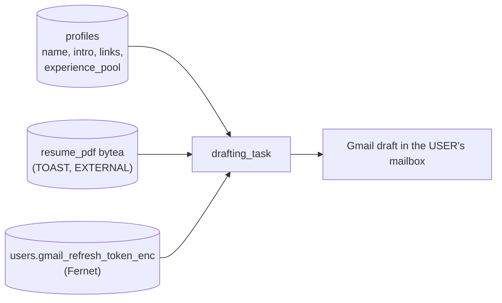

# Stack 2 — Sender Identity Implementation Plan

> **For agentic workers:** REQUIRED SUB-SKILL: Use superpowers:subagent-driven-development (recommended) or superpowers:executing-plans to implement this plan task-by-task. Steps use checkbox (`- [ ]`) syntax for tracking.

**Goal:** Give every user their own résumé, profile fields, and Gmail mailbox — removing the last compiled-in identity from the codebase.

**Architecture:** A `profiles` table keyed by `user_id` holds the fields that `sender_profile.PROFILE` used to hardcode, plus the résumé PDF as `bytea` with `STORAGE EXTERNAL`. Uploads are validated, stored, parsed with `pypdf`, and turned into a *suggested* profile by one `generate_json` call the user reviews before saving. `gmail_client` stops reading `settings` and takes a `GmailCredentials` argument. The `SenderProfile` dataclass survives; only its source changes.

**Tech Stack:** Python 3.12, FastAPI, SQLAlchemy 2.0, PostgreSQL 16 (`bytea` + TOAST), `pypdf`, Celery 5.3, pytest, Next.js 15

**Spec:** [`docs/superpowers/specs/2026-08-14-stack-2-sender-identity-design.md`](../specs/2026-08-14-stack-2-sender-identity-design.md)

**Branch:** `feat/sender-identity` off `feat/tenancy-data-model`. Open the PR with `gh pr create --base feat/tenancy-data-model`.

## Global Constraints

- **`gmail_client_id` and `gmail_client_secret` stay in `settings`.** They identify the OAuth *application* and are required to refresh **any** user's token. Only `gmail_refresh_token` and `gmail_sender_email` are per-user, and those two are deleted from `settings` in this stack.
- `MAX_RESUME_BYTES = 5 * 1024 * 1024`. Cloud SQL disk grows but **never shrinks** — an unbounded upload path permanently inflates the instance and every backup.
- Validate the `%PDF-` **magic bytes**, never the `Content-Type` header or the file extension. Both are attacker-controlled, and `pypdf` on arbitrary bytes is a parser you do not want to hand untrusted input.
- `GET /api/profile` must **never** return `resume_pdf`.
- All PDF reads and writes go through `resume_store`. No other module touches `Profile.resume_pdf`.
- `ALTER COLUMN resume_pdf SET STORAGE EXTERNAL` — PDFs are already compressed, so the default `EXTENDED` strategy burns CPU for no size gain.
- A drafting sweep loads the profile, résumé bytes, and Gmail credentials **once per sweep**, never per lead.
- Missing profile or missing Gmail credentials abort the sweep and leave rows at `queued` — never `failed`, and never a DLQ row. Finishing the profile should make those drafts happen with no manual retry.
- `experience_pool` entries must contain `": "` so `_bullet_md`'s `partition(": ")` keeps producing bold-label bullets.
- Never log a decrypted refresh token or résumé bytes.
- Run `uv run pytest` before every commit.

---

## File Structure

| File | Responsibility |
|---|---|
| `migrations/007_profiles.sql` | `profiles` table + `STORAGE EXTERNAL` |
| `cold_email/database.py` | `Profile` model |
| `cold_email/resume_store.py` | The **entire** read/write surface for PDF bytes |
| `cold_email/profile_extract.py` | `pypdf` text extraction + LLM suggestion |
| `cold_email/prompts/resume_profile.py` | `ResumeProfile` schema + system prompt |
| `cold_email/sender_profile.py` | `SenderProfile.from_row`; `PROFILE` deleted |
| `cold_email/auth/gmail_creds.py` | `resolve_gmail_credentials(user)` |
| `cold_email/workers/shared/gmail_client.py` | Takes `GmailCredentials`; attachment as bytes |
| `cold_email/api/routes/profile.py` | Profile + résumé endpoints |
| `frontend/app/onboarding/page.tsx` | Upload → review → save |
| `frontend/app/profile/page.tsx` | Edit profile, Gmail status |
| Deleted | `scripts/gmail_auth.py`, `cold_email/resume.txt`, `cold_email/resume.pdf` |

---

### Task 1: `profiles` table

**Files:**
- Create: `migrations/007_profiles.sql`
- Modify: `cold_email/database.py`
- Modify: `pyproject.toml`
- Test: `tests/test_profile_model.py`

**Interfaces:**
- Consumes: `users`
- Produces: `database.Profile` with `user_id` (PK), `name`, `intro`, `linkedin`, `github`, `website`, `experience_pool`, `company_links`, `resume_pdf`, `resume_filename`, `resume_text`, `parsed_at`

- [ ] **Step 1: Add the dependency**

```bash
uv add "pypdf>=5.0"
```

- [ ] **Step 2: Write the failing test**

Create `tests/test_profile_model.py`:

```python
import pytest

from cold_email.database import Profile


@pytest.mark.asyncio
async def test_one_profile_per_user(async_session, admin_user_id):
    """user_id is the PRIMARY KEY, so uniqueness is structural rather than a
    separate constraint on a surrogate id."""
    from sqlalchemy.exc import IntegrityError

    async_session.add(Profile(user_id=admin_user_id, name="A", intro="i"))
    await async_session.commit()

    async_session.add(Profile(user_id=admin_user_id, name="B", intro="j"))
    with pytest.raises(IntegrityError):
        await async_session.commit()


@pytest.mark.asyncio
async def test_json_fields_default_to_empty(async_session, admin_user_id):
    profile = Profile(user_id=admin_user_id, name="A", intro="i")
    async_session.add(profile)
    await async_session.commit()
    await async_session.refresh(profile)
    assert profile.experience_pool == []
    assert profile.company_links == {}


@pytest.mark.asyncio
async def test_stores_pdf_bytes(async_session, admin_user_id):
    profile = Profile(
        user_id=admin_user_id,
        name="A",
        intro="i",
        resume_pdf=b"%PDF-1.7 fake",
        resume_filename="cv.pdf",
    )
    async_session.add(profile)
    await async_session.commit()
    assert profile.resume_pdf.startswith(b"%PDF-")


@pytest.mark.asyncio
async def test_cascades_when_the_user_is_deleted(async_session, admin_user_id):
    from sqlalchemy import func, select

    from cold_email.database import User

    async_session.add(Profile(user_id=admin_user_id, name="A", intro="i"))
    await async_session.commit()

    await async_session.delete(await async_session.get(User, admin_user_id))
    await async_session.commit()

    assert (
        await async_session.execute(select(func.count()).select_from(Profile))
    ).scalar_one() == 0
```

- [ ] **Step 3: Run it to verify it fails**

Run: `uv run pytest tests/test_profile_model.py -v`
Expected: FAIL — `ImportError: cannot import name 'Profile'`

- [ ] **Step 4: Write the migration**

Create `migrations/007_profiles.sql`:

```sql
-- 007_profiles.sql
--
-- Per-user sender identity. Replaces sender_profile.PROFILE (a frozen
-- module-level dataclass) and the resume.txt / resume.pdf files that were
-- committed to the repo.
--
-- user_id is the PRIMARY KEY: one profile per user, enforced by the schema
-- rather than a unique constraint on a surrogate id.

CREATE TABLE IF NOT EXISTS profiles (
    user_id         UUID PRIMARY KEY REFERENCES users(id) ON DELETE CASCADE,
    name            TEXT NOT NULL,
    intro           TEXT NOT NULL,
    linkedin        TEXT,
    github          TEXT,
    website         TEXT,
    -- JSONB, not child tables: always read and written whole, never queried
    -- into, and the SenderProfile dataclass already models them as a list and
    -- a dict. Child tables would add joins and buy nothing.
    experience_pool JSONB NOT NULL DEFAULT '[]'::jsonb,
    company_links   JSONB NOT NULL DEFAULT '{}'::jsonb,
    resume_pdf      BYTEA,
    resume_filename TEXT,
    resume_text     TEXT,
    parsed_at       TIMESTAMPTZ,
    created_at      TIMESTAMPTZ NOT NULL DEFAULT now(),
    updated_at      TIMESTAMPTZ NOT NULL DEFAULT now()
);

-- Postgres pages are 8KB, so a ~400KB PDF is stored out-of-line in the TOAST
-- side table with an 18-byte pointer in the heap row — SELECT name FROM profiles
-- never touches the bytes.
--
-- EXTERNAL rather than the default EXTENDED: PDFs are already compressed, so
-- Postgres's compression attempt burns CPU on every write for no size gain.
ALTER TABLE profiles ALTER COLUMN resume_pdf SET STORAGE EXTERNAL;
```

- [ ] **Step 5: Add the ORM model**

In `cold_email/database.py`, add after `class User`:

```python
class Profile(Base):
    """Per-user sender identity: the fields the email template fills.

    Replaces sender_profile.PROFILE. The SenderProfile dataclass still exists as
    the in-memory shape — only its source changed, from a module constant to
    this row (see SenderProfile.from_row).

    resume_pdf reads and writes go through cold_email.resume_store, never
    directly, so a future move to GCS is one implementation swap.
    """

    __tablename__ = "profiles"

    user_id = Column(
        UUID(as_uuid=True), ForeignKey("users.id", ondelete="CASCADE"), primary_key=True
    )
    name = Column(String, nullable=False)
    intro = Column(Text, nullable=False)
    linkedin = Column(String)
    github = Column(String)
    website = Column(String)
    experience_pool = Column(JSONB, nullable=False, default=list)
    company_links = Column(JSONB, nullable=False, default=dict)
    resume_pdf = Column(LargeBinary)
    resume_filename = Column(String)
    resume_text = Column(Text)
    parsed_at = Column(DateTime(timezone=True))
    created_at = Column(DateTime(timezone=True), server_default=func.now())
    updated_at = Column(DateTime(timezone=True), server_default=func.now(), onupdate=func.now())

    @property
    def has_resume(self) -> bool:
        return self.resume_pdf is not None
```

- [ ] **Step 6: Run it to verify it passes**

Run: `uv run pytest tests/test_profile_model.py -v`
Expected: PASS (4 tests)

- [ ] **Step 7: Commit**

```bash
git add migrations/007_profiles.sql cold_email/database.py pyproject.toml uv.lock tests/test_profile_model.py
git commit -m "feat(profile): add profiles table with STORAGE EXTERNAL resume bytes"
```

---

### Task 2: `resume_store`

**Files:**
- Create: `cold_email/resume_store.py`
- Test: `tests/test_resume_store.py`

**Interfaces:**
- Consumes: `database.Profile`
- Produces: `MAX_RESUME_BYTES`, `PDF_MAGIC`, `ResumeInvalid`, `validate_resume(filename, data) -> None`, `put_resume(session, user_id, filename, data) -> None`, `get_resume(session, user_id) -> tuple[str, bytes] | None`, `delete_resume(session, user_id) -> None`

- [ ] **Step 1: Write the failing test**

Create `tests/test_resume_store.py`:

```python
import pytest

from cold_email.database import Profile
from cold_email.resume_store import (
    MAX_RESUME_BYTES,
    ResumeInvalid,
    delete_resume,
    get_resume,
    put_resume,
    validate_resume,
)

VALID_PDF = b"%PDF-1.7\n" + b"x" * 2048


@pytest.fixture
async def profile(async_session, admin_user_id):
    p = Profile(user_id=admin_user_id, name="A", intro="i")
    async_session.add(p)
    await async_session.commit()
    return p


def test_validate_accepts_a_real_pdf():
    validate_resume("cv.pdf", VALID_PDF)  # does not raise


def test_validate_rejects_oversize():
    """Cloud SQL disk grows but never shrinks, so an unbounded upload path
    permanently inflates the instance and every backup."""
    with pytest.raises(ResumeInvalid, match="too large"):
        validate_resume("cv.pdf", b"%PDF-" + b"x" * MAX_RESUME_BYTES)


def test_validate_rejects_non_pdf_magic_bytes():
    """Magic bytes, not the extension or Content-Type — both are
    attacker-controlled, and pypdf on arbitrary bytes is a parser you do not
    want to hand untrusted input."""
    with pytest.raises(ResumeInvalid, match="not a PDF"):
        validate_resume("cv.pdf", b"MZ\x90\x00 this is an exe")


def test_validate_rejects_empty():
    with pytest.raises(ResumeInvalid):
        validate_resume("cv.pdf", b"")


@pytest.mark.asyncio
async def test_round_trip(async_session, profile):
    await put_resume(async_session, profile.user_id, "cv.pdf", VALID_PDF)
    filename, data = await get_resume(async_session, profile.user_id)
    assert filename == "cv.pdf"
    assert data == VALID_PDF


@pytest.mark.asyncio
async def test_get_returns_none_when_absent(async_session, profile):
    assert await get_resume(async_session, profile.user_id) is None


@pytest.mark.asyncio
async def test_delete_clears_bytes_but_keeps_the_profile(async_session, profile):
    await put_resume(async_session, profile.user_id, "cv.pdf", VALID_PDF)
    await delete_resume(async_session, profile.user_id)

    assert await get_resume(async_session, profile.user_id) is None
    await async_session.refresh(profile)
    assert profile.name == "A"  # profile fields survive


@pytest.mark.asyncio
async def test_put_validates_before_storing(async_session, profile):
    with pytest.raises(ResumeInvalid):
        await put_resume(async_session, profile.user_id, "bad.pdf", b"not a pdf")
    assert await get_resume(async_session, profile.user_id) is None
```

- [ ] **Step 2: Run it to verify it fails**

Run: `uv run pytest tests/test_resume_store.py -v`
Expected: FAIL — `ModuleNotFoundError: cold_email.resume_store`

- [ ] **Step 3: Implement it**

Create `cold_email/resume_store.py`:

```python
"""The entire read/write surface for résumé PDF bytes.

Stored as `bytea` on the profile row rather than in GCS. At ~400KB per user the
dollar difference is under $1/month either way; bytea wins because the profile
row and the PDF commit in ONE transaction. With GCS they are two systems, and a
crash between the blob write and the row commit leaves an orphan file whose
reconciliation you own.

Everything goes through get_resume / put_resume so a future GCS migration is one
implementation swap plus a backfill — not a hunt through the drafting worker.
Revisit at ~5GB total, or when multi-file/versioned résumés appear.
"""

import logging
import uuid

from sqlalchemy.ext.asyncio import AsyncSession

from cold_email.database import Profile

logger = logging.getLogger(__name__)

MAX_RESUME_BYTES = 5 * 1024 * 1024  # 5 MB
PDF_MAGIC = b"%PDF-"


class ResumeInvalid(ValueError):
    """The uploaded file is not a PDF we are willing to store."""


def validate_resume(filename: str, data: bytes) -> None:
    """Reject anything we should not store or hand to pypdf.

    Checks the magic bytes rather than the extension or Content-Type: both are
    attacker-controlled, and pypdf parsing arbitrary bytes is a liability.
    """
    if not data:
        raise ResumeInvalid("File is empty")
    if len(data) > MAX_RESUME_BYTES:
        raise ResumeInvalid(
            f"File is too large ({len(data)} bytes); the limit is {MAX_RESUME_BYTES}"
        )
    if not data.startswith(PDF_MAGIC):
        raise ResumeInvalid("File is not a PDF")


async def put_resume(session: AsyncSession, user_id: uuid.UUID, filename: str, data: bytes) -> None:
    """Validate then store a résumé on the user's profile row."""
    validate_resume(filename, data)

    profile = await session.get(Profile, user_id)
    if profile is None:
        raise ResumeInvalid("No profile exists for this user")

    profile.resume_pdf = data
    profile.resume_filename = filename
    await session.commit()
    # Log the size, never the bytes.
    logger.info(f"Stored résumé for user {user_id} ({len(data)} bytes)")


async def get_resume(session: AsyncSession, user_id: uuid.UUID) -> tuple[str, bytes] | None:
    """Return (filename, bytes), or None when the user has no résumé."""
    profile = await session.get(Profile, user_id)
    if profile is None or profile.resume_pdf is None:
        return None
    return profile.resume_filename or "resume.pdf", bytes(profile.resume_pdf)


async def delete_resume(session: AsyncSession, user_id: uuid.UUID) -> None:
    """Clear the bytes, keeping the profile fields intact."""
    profile = await session.get(Profile, user_id)
    if profile is None:
        return
    profile.resume_pdf = None
    profile.resume_filename = None
    await session.commit()
```

Add a sync twin at the bottom for Celery workers (which use the sync engine):

```python
def get_resume_sync(session, user_id: uuid.UUID) -> tuple[str, bytes] | None:
    """Sync variant for Celery workers.

    Duplicated rather than shared because the async and sync SQLAlchemy sessions
    have genuinely different APIs; a shim would be more code than these 4 lines.
    """
    profile = session.get(Profile, user_id)
    if profile is None or profile.resume_pdf is None:
        return None
    return profile.resume_filename or "resume.pdf", bytes(profile.resume_pdf)
```

- [ ] **Step 4: Run it to verify it passes**

Run: `uv run pytest tests/test_resume_store.py -v`
Expected: PASS (8 tests)

- [ ] **Step 5: Commit**

```bash
git add cold_email/resume_store.py tests/test_resume_store.py
git commit -m "feat(profile): add resume_store with size cap and magic-byte validation"
```

---

### Task 3: Résumé parsing and profile suggestion

**Files:**
- Create: `cold_email/prompts/resume_profile.py`
- Create: `cold_email/profile_extract.py`
- Test: `tests/test_profile_extract.py`
- Test fixture: `tests/fixtures/sample_resume.pdf`

**Interfaces:**
- Consumes: `generate_json` (the existing provider-agnostic LLM layer)
- Produces: `ResumeProfile` (pydantic), `RESUME_PROFILE_SYSTEM`, `build_resume_profile_prompt(resume_text) -> str`, `MIN_EXTRACTED_CHARS = 100`, `extract_text(pdf_bytes) -> str`, `suggest_profile(resume_text) -> dict`, `ResumeUnreadable`

- [ ] **Step 1: Write the failing test**

Create `tests/test_profile_extract.py`:

```python
import json
import pathlib

import pytest

from cold_email.profile_extract import (
    MIN_EXTRACTED_CHARS,
    ResumeUnreadable,
    extract_text,
    suggest_profile,
)

FIXTURES = pathlib.Path("tests/fixtures")


def test_extracts_text_from_a_pdf():
    text = extract_text((FIXTURES / "sample_resume.pdf").read_bytes())
    assert len(text) > MIN_EXTRACTED_CHARS
    assert "Engineer" in text


def test_corrupt_pdf_raises_unreadable():
    with pytest.raises(ResumeUnreadable):
        extract_text(b"%PDF-1.7 truncated garbage")


def test_image_only_pdf_raises_unreadable():
    """A scanned résumé yields near-zero text. Passing that to the LLM produces
    a confidently fabricated profile, which is far worse than an error."""
    with pytest.raises(ResumeUnreadable, match="couldn't read text"):
        extract_text((FIXTURES / "image_only.pdf").read_bytes())


def test_suggest_profile_maps_the_llm_payload(monkeypatch):
    payload = {
        "name": "Liyu Xiao",
        "intro": "My name is Liyu, a CS student at McMaster.",
        "linkedin": "https://linkedin.com/in/liyu",
        "github": "https://github.com/liyuxiao2",
        "website": "https://liyuxiao.ca",
        "experience_pool": [
            "Wealthsimple: Cut logging latency by 80%.",
            "IBM: Built backend services for millions of learners.",
        ],
        "company_links": {"Wealthsimple": "https://www.wealthsimple.com"},
    }
    monkeypatch.setattr(
        "cold_email.profile_extract.generate_json", lambda **kw: json.dumps(payload)
    )

    result = suggest_profile("resume text " * 50)
    assert result["name"] == "Liyu Xiao"
    assert len(result["experience_pool"]) == 2
    assert result["company_links"]["Wealthsimple"].startswith("https://")


def test_suggested_bullets_survive_the_bullet_parser(monkeypatch):
    """_bullet_md does `label, sep, rest = bullet.partition(": ")`. Without the
    ': ' separator every bullet silently loses its bold label and its link."""
    payload = {
        "name": "A",
        "intro": "i",
        "linkedin": None,
        "github": None,
        "website": None,
        "experience_pool": ["Acme: shipped a thing", "Beta: shipped another"],
        "company_links": {},
    }
    monkeypatch.setattr(
        "cold_email.profile_extract.generate_json", lambda **kw: json.dumps(payload)
    )

    for bullet in suggest_profile("text " * 50)["experience_pool"]:
        assert ": " in bullet


def test_short_text_is_rejected_before_calling_the_llm(monkeypatch):
    called = False

    def spy(**kw):
        nonlocal called
        called = True
        return "{}"

    monkeypatch.setattr("cold_email.profile_extract.generate_json", spy)

    with pytest.raises(ResumeUnreadable):
        suggest_profile("too short")
    assert called is False
```

- [ ] **Step 2: Create the test fixtures**

```bash
mkdir -p tests/fixtures
uv run python - <<'PY'
# A minimal text-bearing PDF and an image-only one, generated so the fixtures
# are reproducible rather than opaque binaries checked in by hand.
import pathlib
from pypdf import PdfWriter
from reportlab.pdfgen import canvas

out = pathlib.Path("tests/fixtures")
out.mkdir(parents=True, exist_ok=True)

c = canvas.Canvas(str(out / "sample_resume.pdf"))
c.drawString(72, 720, "Liyu Xiao — Software Engineer")
c.drawString(72, 700, "Wealthsimple: Cut logging latency by 80 percent.")
c.drawString(72, 680, "IBM: Built backend services for millions of learners.")
c.save()

# Image-only: a page with no text operators at all.
w = PdfWriter()
w.add_blank_page(width=612, height=792)
with open(out / "image_only.pdf", "wb") as fh:
    w.write(fh)
PY
```

Add `reportlab` as a dev dependency: `uv add --dev "reportlab>=4.0"`.

- [ ] **Step 3: Run it to verify it fails**

Run: `uv run pytest tests/test_profile_extract.py -v`
Expected: FAIL — `ModuleNotFoundError: cold_email.profile_extract`

- [ ] **Step 4: Write the prompt**

Create `cold_email/prompts/resume_profile.py`:

```python
"""LLM contract for turning résumé text into a suggested sender profile.

The result is a SUGGESTION the user reviews and edits, never an authoritative
profile. Every draft email a user sends is built from these fields, so a mangled
name or an invented link would propagate to every stranger they contact.
"""

from pydantic import BaseModel, Field

RESUME_PROFILE_SYSTEM = (
    "You extract a structured sender profile from a résumé, for a cold-outreach "
    "tool that emails startups on the candidate's behalf.\n\n"
    "Rules:\n"
    "- `name`: the candidate's full name exactly as written on the résumé.\n"
    "- `intro`: ONE first-person sentence introducing them, e.g. 'My name is "
    "Liyu, a Computer Science student at McMaster, previously at Wealthsimple "
    "and IBM.' Professional, natural, no adjectives about their own quality.\n"
    "- `experience_pool`: 4-8 entries, each formatted EXACTLY as "
    "'Label: achievement' where Label is the company or project name. Preserve "
    "concrete numbers verbatim. Never fabricate an achievement or change a "
    "figure.\n"
    "- `company_links`: a URL for a Label ONLY if the résumé literally contains "
    "one. Omit otherwise — a missing link degrades to a plain bold label, but a "
    "wrong link is sent to a stranger.\n"
    "- `linkedin`, `github`, `website`: only if present in the résumé. Null "
    "otherwise.\n"
    "- Extract, never invent. If something is absent, return null."
)


class ResumeProfile(BaseModel):
    """The profile fields extracted from a résumé."""

    name: str = Field(description="Full name exactly as written on the résumé")
    intro: str = Field(description="One first-person introduction sentence")
    linkedin: str | None = Field(default=None, description="LinkedIn URL if present")
    github: str | None = Field(default=None, description="GitHub URL if present")
    website: str | None = Field(default=None, description="Personal site if present")
    experience_pool: list[str] = Field(
        description="4-8 'Label: achievement' strings; the ': ' separator is required"
    )
    company_links: dict[str, str] = Field(
        default_factory=dict, description="Label -> URL, only for URLs in the résumé"
    )


def build_resume_profile_prompt(resume_text: str) -> str:
    return f"Résumé:\n{resume_text}\n\nExtract the profile fields."
```

- [ ] **Step 5: Implement the extractor**

Create `cold_email/profile_extract.py`:

```python
"""Résumé PDF → text → suggested profile.

Two steps, deliberately separate: extraction can fail for reasons the user can
act on (a scanned PDF), while the LLM step can fail transiently. Splitting them
lets the route return a precise status for each.
"""

import io
import logging

from pypdf import PdfReader

from cold_email.prompts.resume_profile import (
    RESUME_PROFILE_SYSTEM,
    ResumeProfile,
    build_resume_profile_prompt,
)
from cold_email.workers.shared.json_parsing import parse_fenced_json
from cold_email.workers.shared.llm import generate_json

logger = logging.getLogger(__name__)

# Below this, the PDF is almost certainly a scan or an image export. Handing
# near-empty text to the LLM yields a confidently fabricated profile — a far
# worse outcome than an error message telling the user to upload a text PDF.
MIN_EXTRACTED_CHARS = 100


class ResumeUnreadable(ValueError):
    """The PDF is corrupt, or carries no extractable text."""


def extract_text(pdf_bytes: bytes) -> str:
    """Extract text from every page of a PDF."""
    try:
        reader = PdfReader(io.BytesIO(pdf_bytes))
        text = "\n".join(page.extract_text() or "" for page in reader.pages).strip()
    except Exception as exc:
        raise ResumeUnreadable(f"Could not parse the PDF: {exc}") from exc

    if len(text) < MIN_EXTRACTED_CHARS:
        raise ResumeUnreadable(
            "We couldn't read text from this PDF; it may be a scan or an image export. "
            "Please upload a text-based PDF."
        )
    return text


def suggest_profile(resume_text: str) -> dict:
    """Ask the LLM for a suggested profile. Provider fallback is inside generate_json."""
    if len(resume_text) < MIN_EXTRACTED_CHARS:
        raise ResumeUnreadable("Résumé text is too short to extract a profile")

    raw = generate_json(
        system=RESUME_PROFILE_SYSTEM,
        prompt=build_resume_profile_prompt(resume_text),
        schema=ResumeProfile,
    )
    suggestion = parse_fenced_json(raw)
    if not suggestion:
        raise ResumeUnreadable("The model returned no usable profile")

    # _bullet_md partitions on ': ' to build bold-label bullets. Drop entries
    # missing the separator rather than shipping a bullet with no label.
    suggestion["experience_pool"] = [
        bullet for bullet in suggestion.get("experience_pool", []) if ": " in bullet
    ]
    return suggestion
```

- [ ] **Step 6: Run it to verify it passes**

Run: `uv run pytest tests/test_profile_extract.py -v`
Expected: PASS (6 tests)

- [ ] **Step 7: Commit**

```bash
git add cold_email/profile_extract.py cold_email/prompts/resume_profile.py tests/ pyproject.toml uv.lock
git commit -m "feat(profile): extract a suggested profile from a résumé PDF"
```

---

### Task 4: `SenderProfile.from_row`; delete `PROFILE`

**Files:**
- Modify: `cold_email/sender_profile.py`
- Delete: `cold_email/resume.txt`, `cold_email/resume.pdf`
- Modify: `cold_email/workers/drafting/helpers/generation.py`
- Test: `tests/test_sender_profile.py`

**Interfaces:**
- Consumes: `database.Profile`
- Produces: `SenderProfile.from_row(row) -> SenderProfile`; `PROFILE`, `load_resume`, `_RESUME_PATH` deleted; `draft_email(row, profile)` and `generate_email(row, profile)`

- [ ] **Step 1: Write the failing test**

Create `tests/test_sender_profile.py`:

```python
import pytest

from cold_email.sender_profile import SenderProfile


def test_module_constant_is_gone():
    """One person's identity must no longer be compiled into the codebase."""
    import cold_email.sender_profile as sp

    assert not hasattr(sp, "PROFILE")
    assert not hasattr(sp, "load_resume")


@pytest.mark.asyncio
async def test_from_row_maps_every_field(async_session, admin_user_id):
    from cold_email.database import Profile

    row = Profile(
        user_id=admin_user_id,
        name="Liyu Xiao",
        intro="My name is Liyu.",
        linkedin="https://linkedin.com/in/liyu",
        github="https://github.com/liyuxiao2",
        website="https://liyuxiao.ca",
        experience_pool=["Acme: shipped a thing"],
        company_links={"Acme": "https://acme.com"},
        resume_text="full résumé text",
    )
    async_session.add(row)
    await async_session.commit()

    profile = SenderProfile.from_row(row)
    assert profile.name == "Liyu Xiao"
    assert profile.first_name == "Liyu"
    assert profile.github == "https://github.com/liyuxiao2"
    assert profile.experience_pool == ["Acme: shipped a thing"]
    assert profile.company_links == {"Acme": "https://acme.com"}
    assert profile.effective_resume_text == "full résumé text"


@pytest.mark.asyncio
async def test_effective_resume_text_falls_back_to_the_pool(async_session, admin_user_id):
    """A user who fills the form manually without uploading a PDF still needs
    résumé text for the drafting prompt."""
    from cold_email.database import Profile

    row = Profile(
        user_id=admin_user_id,
        name="A B",
        intro="I am A.",
        experience_pool=["Acme: did a thing"],
        resume_text=None,
    )
    async_session.add(row)
    await async_session.commit()

    text = SenderProfile.from_row(row).effective_resume_text
    assert "I am A." in text
    assert "Acme: did a thing" in text


def test_from_row_tolerates_null_json_columns():
    class _Row:
        name, intro = "A B", "i"
        linkedin = github = website = resume_text = None
        experience_pool = company_links = None

    profile = SenderProfile.from_row(_Row())
    assert profile.experience_pool == []
    assert profile.company_links == {}
```

- [ ] **Step 2: Run it to verify it fails**

Run: `uv run pytest tests/test_sender_profile.py -v`
Expected: FAIL — `PROFILE` still exists; `from_row` does not.

- [ ] **Step 3: Rewrite `sender_profile.py`**

Delete `load_resume`, `_RESUME_PATH`, `_CURRENT_DIR`, and the entire `PROFILE`
constant. Update the docstring and add the constructor:

```python
"""The in-memory shape of a user's sender identity.

The dataclass survives the multi-tenant migration; only its SOURCE changed —
from a frozen module-level constant plus resume.txt in the repo, to a `profiles`
row per user (see SenderProfile.from_row).
"""

from dataclasses import dataclass, field


@dataclass(frozen=True)
class SenderProfile:
    name: str
    intro: str  # first-person sentence dropped verbatim into the template
    linkedin: str
    github: str
    website: str
    resume_text: str = ""
    experience_pool: list[str] = field(default_factory=list)
    company_links: dict[str, str] = field(default_factory=dict)

    @classmethod
    def from_row(cls, row) -> "SenderProfile":
        """Build from a `profiles` row.

        Coerces NULL JSONB columns to empty containers so callers never have to
        None-check them — the template fill would otherwise raise mid-draft.
        """
        return cls(
            name=row.name,
            intro=row.intro,
            linkedin=row.linkedin or "",
            github=row.github or "",
            website=row.website or "",
            resume_text=row.resume_text or "",
            experience_pool=list(row.experience_pool or []),
            company_links=dict(row.company_links or {}),
        )

    @property
    def first_name(self) -> str:
        return self.name.split()[0]

    @property
    def effective_resume_text(self) -> str:
        """The résumé text for the drafting prompt.

        Falls back to synthesising from intro + experience_pool, which is what a
        user who filled the profile form without uploading a PDF needs.
        """
        if self.resume_text:
            return self.resume_text
        pool = "\n".join(f"- {b}" for b in self.experience_pool)
        return f"{self.intro}\n\nExperience:\n{pool}"
```

- [ ] **Step 4: Thread the profile through generation**

In `cold_email/workers/drafting/helpers/generation.py`, remove the `PROFILE`
import and change both signatures:

```python
def draft_email(row: PendingDraft, profile: SenderProfile) -> dict:
    """Produce a {subject, body, body_html} draft ({} if unusable)."""
    context = parse_email_response(generate_email(row, profile))
    if not context:
        return {}
    return assemble_email(context, row, profile)


def generate_email(row: PendingDraft, profile: SenderProfile) -> str:
    """Ask the LLM for the contextual slots; returns raw JSON text."""
    ...
        resume_text=profile.effective_resume_text,
    )
```

- [ ] **Step 5: Delete the committed résumé files**

```bash
git rm cold_email/resume.txt cold_email/resume.pdf
```

- [ ] **Step 6: Run it to verify it passes**

Run: `uv run pytest tests/test_sender_profile.py tests/test_email_assembly.py -v`
Expected: PASS

- [ ] **Step 7: Commit**

```bash
git add cold_email/sender_profile.py cold_email/workers/drafting/helpers/generation.py tests/test_sender_profile.py
git commit -m "refactor(profile): load sender identity from the DB, not a module constant"
```

---

### Task 5: Per-user Gmail credentials

**Files:**
- Create: `cold_email/auth/gmail_creds.py`
- Modify: `cold_email/workers/shared/gmail_client.py`
- Modify: `cold_email/config.py`
- Delete: `scripts/gmail_auth.py`
- Test: `tests/test_gmail_client.py`

**Interfaces:**
- Consumes: `auth.crypto.decrypt`, `database.User`
- Produces: `GmailCredentials` (`refresh_token`, `sender_email`), `resolve_gmail_credentials(user) -> GmailCredentials | None`, `create_draft(creds, to, subject, body, html=None, attachment=None) -> str`, `send_draft(creds, draft_id) -> str`

- [ ] **Step 1: Write the failing test**

Rewrite `tests/test_gmail_client.py`:

```python
import base64
from email import message_from_bytes

import pytest

from cold_email.workers.shared.gmail_client import GmailCredentials, create_draft, send_draft

CREDS = GmailCredentials(refresh_token="rt-123", sender_email="me@example.com")


class _FakeDrafts:
    def __init__(self, sink):
        self.sink = sink

    def create(self, userId, body):
        self.sink["create"] = body
        return self

    def send(self, userId, body):
        self.sink["send"] = body
        return self

    def execute(self):
        return {"id": "draft-1"}


def _stub_service(monkeypatch, sink):
    class _Users:
        def drafts(self):
            return _FakeDrafts(sink)

    class _Service:
        def users(self):
            return _Users()

    monkeypatch.setattr("cold_email.workers.shared.gmail_client.build", lambda *a, **k: _Service())


def _decode(sink) -> "email.message.Message":
    raw = sink["create"]["message"]["raw"]
    return message_from_bytes(base64.urlsafe_b64decode(raw))


def test_credentials_come_from_the_argument_not_settings(monkeypatch):
    """The regression that matters: if create_draft still read
    settings.gmail_refresh_token, every user's mail would silently send from
    one mailbox."""
    captured = {}

    def fake_credentials(**kwargs):
        captured.update(kwargs)
        return object()

    monkeypatch.setattr("cold_email.workers.shared.gmail_client.Credentials", fake_credentials)
    _stub_service(monkeypatch, {})

    create_draft(CREDS, to="them@example.com", subject="s", body="b")
    assert captured["refresh_token"] == "rt-123"


def test_settings_no_longer_expose_a_refresh_token():
    from cold_email.config import settings

    assert not hasattr(settings, "gmail_refresh_token")
    assert not hasattr(settings, "gmail_sender_email")


def test_oauth_app_credentials_remain_in_settings():
    """client_id/secret are APP-level and required to refresh ANY user's token.
    Moving all four to the users table is the classic multi-tenant OAuth
    mistake — nothing can then be refreshed."""
    from cold_email.config import settings

    assert hasattr(settings, "gmail_client_id")
    assert hasattr(settings, "gmail_client_secret")


def test_from_header_uses_the_users_sender_email(monkeypatch):
    sink = {}
    _stub_service(monkeypatch, sink)
    monkeypatch.setattr("cold_email.workers.shared.gmail_client.Credentials", lambda **k: object())

    create_draft(CREDS, to="them@example.com", subject="s", body="b")
    assert _decode(sink)["From"] == "me@example.com"


def test_attaches_bytes_as_a_pdf(monkeypatch):
    sink = {}
    _stub_service(monkeypatch, sink)
    monkeypatch.setattr("cold_email.workers.shared.gmail_client.Credentials", lambda **k: object())

    create_draft(
        CREDS,
        to="them@example.com",
        subject="s",
        body="plain",
        html="<p>rich</p>",
        attachment=("cv.pdf", b"%PDF-1.7 bytes"),
    )

    parts = list(_decode(sink).walk())
    types = [p.get_content_type() for p in parts]
    assert "text/plain" in types
    assert "text/html" in types
    assert "application/pdf" in types

    pdf = next(p for p in parts if p.get_content_type() == "application/pdf")
    assert pdf.get_filename() == "cv.pdf"


def test_no_attachment_still_produces_a_multipart_alternative(monkeypatch):
    sink = {}
    _stub_service(monkeypatch, sink)
    monkeypatch.setattr("cold_email.workers.shared.gmail_client.Credentials", lambda **k: object())

    create_draft(CREDS, to="t@example.com", subject="s", body="plain", html="<p>rich</p>")
    types = [p.get_content_type() for p in _decode(sink).walk()]
    assert "text/plain" in types and "text/html" in types
    assert "application/pdf" not in types


def test_send_draft_sends_the_given_id(monkeypatch):
    sink = {}
    _stub_service(monkeypatch, sink)
    monkeypatch.setattr("cold_email.workers.shared.gmail_client.Credentials", lambda **k: object())

    send_draft(CREDS, "draft-9")
    assert sink["send"] == {"id": "draft-9"}


@pytest.mark.asyncio
async def test_resolve_returns_none_without_a_stored_token(async_session, admin_user_id):
    from cold_email.auth.gmail_creds import resolve_gmail_credentials
    from cold_email.database import User

    user = await async_session.get(User, admin_user_id)
    assert resolve_gmail_credentials(user) is None


@pytest.mark.asyncio
async def test_resolve_decrypts_the_stored_token(async_session, admin_user_id):
    from cold_email.auth.crypto import encrypt
    from cold_email.auth.gmail_creds import resolve_gmail_credentials
    from cold_email.database import User

    user = await async_session.get(User, admin_user_id)
    user.gmail_refresh_token_enc = encrypt("rt-real")
    user.gmail_sender_email = "me@example.com"
    await async_session.commit()

    creds = resolve_gmail_credentials(user)
    assert creds.refresh_token == "rt-real"
    assert creds.sender_email == "me@example.com"
```

- [ ] **Step 2: Run it to verify it fails**

Run: `uv run pytest tests/test_gmail_client.py -v`
Expected: FAIL — `create_draft` does not accept a `creds` argument.

- [ ] **Step 3: Add the resolver**

Create `cold_email/auth/gmail_creds.py`:

```python
"""Decrypt a user's Gmail credentials.

Lives in the auth package so the Fernet key never leaves it — workers ask for
credentials and receive plaintext, without importing crypto themselves.
"""

import logging

from cold_email.auth.crypto import decrypt
from cold_email.database import User
from cold_email.workers.shared.gmail_client import GmailCredentials

logger = logging.getLogger(__name__)


def resolve_gmail_credentials(user: User) -> GmailCredentials | None:
    """Return the user's Gmail credentials, or None if they have not connected.

    None is not an error at login — Google omits refresh_token for a user who
    consented before. It only blocks sending, and the UI surfaces it as
    "Reconnect Gmail".
    """
    if not user.gmail_refresh_token_enc:
        return None
    return GmailCredentials(
        refresh_token=decrypt(user.gmail_refresh_token_enc),
        sender_email=user.gmail_sender_email or user.email,
    )
```

- [ ] **Step 4: Rewrite `gmail_client.py`**

```python
"""Gmail API client — per-user OAuth2 refresh-token flow.

Each user sends from their own mailbox, so credentials are an ARGUMENT, never
read from settings. The split is easy to get backwards:

  * gmail_client_id / gmail_client_secret are APP-level and stay in settings.
    Google requires them to refresh ANY user's token.
  * refresh_token / sender_email are USER-level and live on the users row.

Moving all four to the user row is the classic multi-tenant OAuth mistake —
nothing can then be refreshed.

Scope: gmail.compose is the minimum for creating and sending drafts.
"""

import base64
import logging
from dataclasses import dataclass
from email.message import EmailMessage

from google.oauth2.credentials import Credentials
from googleapiclient.discovery import build

from cold_email.config import settings

logger = logging.getLogger(__name__)

GMAIL_TOKEN_URI = "https://oauth2.googleapis.com/token"  # noqa: S105 (endpoint, not a secret)
GMAIL_SCOPES = ["https://www.googleapis.com/auth/gmail.compose"]


@dataclass(frozen=True)
class GmailCredentials:
    """One user's mailbox identity."""

    refresh_token: str
    sender_email: str


def _build_service(creds: GmailCredentials):
    """Authenticated Gmail service for one user's mailbox."""
    credentials = Credentials(
        token=None,
        refresh_token=creds.refresh_token,
        client_id=settings.gmail_client_id,  # app-level
        client_secret=settings.gmail_client_secret,  # app-level
        token_uri=GMAIL_TOKEN_URI,
        scopes=GMAIL_SCOPES,
    )
    return build("gmail", "v1", credentials=credentials)


def create_draft(
    creds: GmailCredentials,
    to: str,
    subject: str,
    body: str,
    html: str | None = None,
    attachment: tuple[str, bytes] | None = None,
) -> str:
    """Create a draft in the user's mailbox; return its draft ID.

    `attachment` is (filename, data) rather than a path: after the multi-tenant
    migration there is no file on disk — the bytes come from resume_store. The
    résumé is always a PDF, so the old mimetypes.guess_type fallback is gone.
    """
    message = EmailMessage()
    message["To"] = to
    message["From"] = creds.sender_email
    message["Subject"] = subject
    message.set_content(body)
    if html:
        message.add_alternative(html, subtype="html")

    if attachment:
        filename, data = attachment
        message.add_attachment(data, maintype="application", subtype="pdf", filename=filename)

    raw = base64.urlsafe_b64encode(message.as_bytes()).decode()
    service = _build_service(creds)
    draft = service.users().drafts().create(userId="me", body={"message": {"raw": raw}}).execute()
    logger.info(f"Created Gmail draft {draft['id']} to {to} from {creds.sender_email}")
    return draft["id"]


def send_draft(creds: GmailCredentials, draft_id: str) -> str:
    """Send an existing draft; return the sent message ID."""
    service = _build_service(creds)
    sent = service.users().drafts().send(userId="me", body={"id": draft_id}).execute()
    logger.info(f"Sent Gmail draft {draft_id} as message {sent['id']}")
    return sent["id"]
```

- [ ] **Step 5: Remove the dead settings and script**

In `cold_email/config.py`, delete the `gmail_refresh_token` and
`gmail_sender_email` lines. Keep `gmail_client_id` and `gmail_client_secret`, with
this comment:

```python
    # Gmail OAuth APPLICATION credentials. App-level, not per-user: Google
    # requires them to refresh ANY user's token. The per-user refresh token
    # lives on users.gmail_refresh_token_enc.
    gmail_client_id: str = ""
    gmail_client_secret: str = ""
```

```bash
git rm scripts/gmail_auth.py
```

The web consent flow (Stack 1a) replaces the one-off CLI token minting entirely.

- [ ] **Step 6: Run it to verify it passes**

Run: `uv run pytest tests/test_gmail_client.py -v`
Expected: PASS (9 tests)

- [ ] **Step 7: Commit**

```bash
git add cold_email/auth/gmail_creds.py cold_email/workers/shared/gmail_client.py cold_email/config.py tests/test_gmail_client.py
git commit -m "feat(gmail): send from each user's own mailbox

client_id/secret stay app-level (required to refresh any user's token);
refresh_token/sender_email move to the users row. scripts/gmail_auth.py is
obsolete — the web consent flow replaces it."
```

---

### Task 6: Profile API routes

**Files:**
- Create: `cold_email/api/routes/profile.py`
- Modify: `cold_email/api/routes/api.py`
- Modify: `cold_email/api/routes/auth.py`
- Test: `tests/test_profile_api.py`

**Interfaces:**
- Consumes: `resume_store`, `profile_extract`, `get_current_user`
- Produces: `GET/PUT /api/profile`, `POST/GET/DELETE /api/profile/resume`; `/api/auth/me` extended with `profile_complete`

- [ ] **Step 1: Write the failing test**

Create `tests/test_profile_api.py`:

```python
import pytest

VALID_PDF = b"%PDF-1.7\n" + b"x" * 2048


@pytest.mark.asyncio
@pytest.mark.parametrize(
    "method,path",
    [
        ("GET", "/api/profile"),
        ("PUT", "/api/profile"),
        ("POST", "/api/profile/resume"),
        ("GET", "/api/profile/resume"),
        ("DELETE", "/api/profile/resume"),
    ],
)
async def test_all_profile_routes_require_auth(client, method, path):
    assert (await client.request(method, path)).status_code == 401


@pytest.mark.asyncio
async def test_get_profile_never_returns_the_pdf_bytes(user_client, seeded_profile):
    """Beyond payload size: base64-ing a PDF into every profile fetch pulls the
    bytes out of the TOAST table on a request that only wanted a name — exactly
    the cost STORAGE EXTERNAL was chosen to avoid."""
    body = (await user_client.get("/api/profile")).json()
    assert "resume_pdf" not in body
    assert body["has_resume"] is True
    assert body["resume_filename"] == "cv.pdf"


@pytest.mark.asyncio
async def test_put_profile_rejects_an_empty_name(user_client, seeded_profile):
    response = await user_client.put("/api/profile", json={"name": "", "intro": "hi"})
    assert response.status_code == 422


@pytest.mark.asyncio
async def test_upload_over_the_cap_is_413(user_client, seeded_profile):
    from cold_email.resume_store import MAX_RESUME_BYTES

    response = await user_client.post(
        "/api/profile/resume",
        files={"file": ("big.pdf", b"%PDF-" + b"x" * MAX_RESUME_BYTES, "application/pdf")},
    )
    assert response.status_code == 413


@pytest.mark.asyncio
async def test_upload_without_pdf_magic_bytes_is_415(user_client, seeded_profile):
    response = await user_client.post(
        "/api/profile/resume",
        files={"file": ("evil.pdf", b"MZ\x90\x00", "application/pdf")},
    )
    assert response.status_code == 415


@pytest.mark.asyncio
async def test_unparseable_pdf_is_422_and_stores_nothing(
    user_client, seeded_profile, async_session
):
    from cold_email.database import Profile

    response = await user_client.post(
        "/api/profile/resume",
        files={"file": ("bad.pdf", b"%PDF-1.7 truncated", "application/pdf")},
    )
    assert response.status_code == 422

    profile = await async_session.get(Profile, seeded_profile.user_id)
    await async_session.refresh(profile)
    assert profile.resume_pdf is None


@pytest.mark.asyncio
async def test_llm_failure_keeps_the_uploaded_bytes(
    user_client, seeded_profile, async_session, monkeypatch
):
    """The upload succeeded and only the SUGGESTION failed. Discarding a 5MB
    upload the user just waited for would be gratuitous."""
    from cold_email.api.routes import profile as profile_routes

    monkeypatch.setattr(profile_routes, "extract_text", lambda data: "text " * 100)

    def boom(text):
        raise RuntimeError("all models exhausted")

    monkeypatch.setattr(profile_routes, "suggest_profile", boom)

    response = await user_client.post(
        "/api/profile/resume", files={"file": ("cv.pdf", VALID_PDF, "application/pdf")}
    )
    assert response.status_code == 503

    from cold_email.database import Profile

    profile = await async_session.get(Profile, seeded_profile.user_id)
    await async_session.refresh(profile)
    assert profile.resume_pdf is not None  # bytes survived


@pytest.mark.asyncio
async def test_upload_returns_a_suggestion_without_committing_it(
    user_client, seeded_profile, async_session, monkeypatch
):
    """The LLM will occasionally mangle a name. Every draft this user sends is
    built from these fields, so nothing is authoritative until they confirm."""
    from cold_email.api.routes import profile as profile_routes

    monkeypatch.setattr(profile_routes, "extract_text", lambda data: "text " * 100)
    monkeypatch.setattr(
        profile_routes,
        "suggest_profile",
        lambda text: {
            "name": "Suggested Name",
            "intro": "Suggested intro.",
            "linkedin": None,
            "github": None,
            "website": None,
            "experience_pool": ["Acme: a thing"],
            "company_links": {},
        },
    )

    body = (
        await user_client.post(
            "/api/profile/resume", files={"file": ("cv.pdf", VALID_PDF, "application/pdf")}
        )
    ).json()
    assert body["suggested"]["name"] == "Suggested Name"

    from cold_email.database import Profile

    profile = await async_session.get(Profile, seeded_profile.user_id)
    await async_session.refresh(profile)
    assert profile.name != "Suggested Name"  # not committed


@pytest.mark.asyncio
async def test_download_returns_only_the_callers_own_resume(
    user_client, seeded_profile, other_users_profile
):
    """Tenancy isolation: a user must never receive another user's résumé."""
    response = await user_client.get("/api/profile/resume")
    assert response.status_code == 200
    assert response.content == VALID_PDF  # the caller's, not the other user's


@pytest.mark.asyncio
async def test_me_reports_profile_completeness(user_client, seeded_profile):
    body = (await user_client.get("/api/auth/me")).json()
    assert body["profile_complete"] is True
```

Add the fixtures to `tests/conftest.py`:

```python
@pytest_asyncio.fixture
async def seeded_profile(async_session, user_client):
    """A complete profile with a résumé, owned by user_client's account."""
    from sqlalchemy import select

    from cold_email.database import Profile, User

    user = (
        await async_session.execute(select(User).where(User.email == "user@example.com"))
    ).scalar_one()
    profile = Profile(
        user_id=user.id,
        name="Test User",
        intro="I am a test.",
        experience_pool=["Acme: a thing"],
        resume_pdf=b"%PDF-1.7\n" + b"x" * 2048,
        resume_filename="cv.pdf",
    )
    async_session.add(profile)
    await async_session.commit()
    return profile


@pytest_asyncio.fixture
async def other_users_profile(async_session):
    """A profile with a DIFFERENT résumé, owned by somebody else."""
    from cold_email.database import ROLE_USER, Profile, User

    other = User(email="other2@example.com", google_sub="sub-other2", role=ROLE_USER)
    async_session.add(other)
    await async_session.commit()

    profile = Profile(
        user_id=other.id,
        name="Other",
        intro="Not you.",
        resume_pdf=b"%PDF-1.7 SOMEONE ELSE",
        resume_filename="other.pdf",
    )
    async_session.add(profile)
    await async_session.commit()
    return profile
```

- [ ] **Step 2: Run it to verify it fails**

Run: `uv run pytest tests/test_profile_api.py -v`
Expected: FAIL — `/api/profile` does not exist.

- [ ] **Step 3: Implement the routes**

Create `cold_email/api/routes/profile.py`:

```python
"""Per-user sender profile and résumé.

Every route is scoped to the calling user via get_current_user, so there is no
user_id in any path — a user cannot address another user's profile at all.
"""

import logging

from fastapi import APIRouter, Depends, File, HTTPException, Response, UploadFile, status
from pydantic import BaseModel, Field, field_validator
from sqlalchemy.ext.asyncio import AsyncSession

from cold_email.auth.deps import get_current_user
from cold_email.database import Profile, User, get_async_session
from cold_email.profile_extract import ResumeUnreadable, extract_text, suggest_profile
from cold_email.resume_store import (
    MAX_RESUME_BYTES,
    ResumeInvalid,
    delete_resume,
    get_resume,
    put_resume,
    validate_resume,
)

logger = logging.getLogger(__name__)

router = APIRouter(prefix="/profile", tags=["profile"])


class ProfileUpdate(BaseModel):
    name: str = Field(min_length=1)
    intro: str = Field(min_length=1)
    linkedin: str | None = None
    github: str | None = None
    website: str | None = None
    experience_pool: list[str] = Field(default_factory=list)
    company_links: dict[str, str] = Field(default_factory=dict)

    @field_validator("experience_pool")
    @classmethod
    def bullets_need_a_label(cls, value: list[str]) -> list[str]:
        """_bullet_md partitions on ': ' to build bold-label bullets. A bullet
        without it silently renders unlabelled and unlinked."""
        bad = [b for b in value if ": " not in b]
        if bad:
            raise ValueError(f"Bullets must be 'Label: achievement'. Offending: {bad}")
        return value


def _serialize(profile: Profile) -> dict:
    """Profile fields for the client. Deliberately omits resume_pdf."""
    return {
        "name": profile.name,
        "intro": profile.intro,
        "linkedin": profile.linkedin,
        "github": profile.github,
        "website": profile.website,
        "experience_pool": profile.experience_pool or [],
        "company_links": profile.company_links or {},
        "has_resume": profile.resume_pdf is not None,
        "resume_filename": profile.resume_filename,
    }


@router.get("")
async def get_profile(
    user: User = Depends(get_current_user),
    session: AsyncSession = Depends(get_async_session),
):
    """The caller's profile, or 404 if they have not created one."""
    profile = await session.get(Profile, user.id)
    if profile is None:
        raise HTTPException(status_code=404, detail="No profile yet")
    return _serialize(profile)


@router.put("")
async def upsert_profile(
    payload: ProfileUpdate,
    user: User = Depends(get_current_user),
    session: AsyncSession = Depends(get_async_session),
):
    """Create or replace the caller's profile fields (never the résumé bytes)."""
    profile = await session.get(Profile, user.id)
    if profile is None:
        profile = Profile(user_id=user.id, name=payload.name, intro=payload.intro)
        session.add(profile)

    for field in (
        "name",
        "intro",
        "linkedin",
        "github",
        "website",
        "experience_pool",
        "company_links",
    ):
        setattr(profile, field, getattr(payload, field))

    await session.commit()
    await session.refresh(profile)
    return _serialize(profile)


@router.post("/resume")
async def upload_resume(
    file: UploadFile = File(...),
    user: User = Depends(get_current_user),
    session: AsyncSession = Depends(get_async_session),
):
    """Store a résumé and return a SUGGESTED profile for the user to review.

    Order matters: validate, parse, THEN store. A PDF pypdf cannot read is
    rejected without leaving unusable bytes in the database.
    """
    data = await file.read()

    try:
        validate_resume(file.filename or "resume.pdf", data)
    except ResumeInvalid as exc:
        if "too large" in str(exc):
            raise HTTPException(
                status_code=status.HTTP_413_REQUEST_ENTITY_TOO_LARGE, detail=str(exc)
            ) from exc
        raise HTTPException(
            status_code=status.HTTP_415_UNSUPPORTED_MEDIA_TYPE, detail=str(exc)
        ) from exc

    try:
        resume_text = extract_text(data)
    except ResumeUnreadable as exc:
        raise HTTPException(
            status_code=status.HTTP_422_UNPROCESSABLE_ENTITY, detail=str(exc)
        ) from exc

    profile = await session.get(Profile, user.id)
    if profile is None:
        # A placeholder so the bytes have somewhere to live during onboarding;
        # the user's confirmed values arrive via PUT /api/profile.
        profile = Profile(user_id=user.id, name=user.name or user.email, intro="")
        session.add(profile)
        await session.commit()

    await put_resume(session, user.id, file.filename or "resume.pdf", data)
    profile.resume_text = resume_text
    await session.commit()

    try:
        suggested = suggest_profile(resume_text)
    except Exception as exc:
        # The bytes ARE stored: the upload succeeded, only the suggestion
        # failed. Discarding a 5MB upload the user just waited for would be
        # gratuitous — they can retry parsing without re-uploading.
        logger.error(f"Profile suggestion failed for user {user.id}: {exc}")
        raise HTTPException(
            status_code=status.HTTP_503_SERVICE_UNAVAILABLE,
            detail="Résumé stored, but we couldn't extract a profile. Please retry.",
        ) from exc

    return {"stored": True, "suggested": suggested}


@router.get("/resume")
async def download_resume(
    user: User = Depends(get_current_user),
    session: AsyncSession = Depends(get_async_session),
):
    """Download the caller's own résumé."""
    result = await get_resume(session, user.id)
    if result is None:
        raise HTTPException(status_code=404, detail="No résumé stored")
    filename, data = result
    return Response(
        content=data,
        media_type="application/pdf",
        headers={"Content-Disposition": f'attachment; filename="{filename}"'},
    )


@router.delete("/resume")
async def remove_resume(
    user: User = Depends(get_current_user),
    session: AsyncSession = Depends(get_async_session),
):
    """Clear the caller's résumé, keeping their profile fields."""
    await delete_resume(session, user.id)
    return {"success": True}
```

- [ ] **Step 4: Register the router and extend `/auth/me`**

In `api.py`, add `profile` to the import and `router.include_router(profile.router)`.

In `auth.py`'s `me()`, add `profile_complete`:

```python
    profile = await session.get(Profile, user.id)
    ...
        # Drives the frontend's onboarding gate. Returned here so a new user
        # needs ONE request, not two, to decide where to land.
        "profile_complete": profile is not None and bool(profile.name and profile.intro),
```

`me()` needs a `session: AsyncSession = Depends(get_async_session)` parameter.

- [ ] **Step 5: Run it to verify it passes**

Run: `uv run pytest tests/test_profile_api.py -v`
Expected: PASS (13 tests)

- [ ] **Step 6: Commit**

```bash
git add cold_email/api/routes/ tests/test_profile_api.py tests/conftest.py
git commit -m "feat(profile): add profile and résumé endpoints

Upload returns a SUGGESTED profile the user confirms; the LLM's output is
never committed unreviewed. GET /api/profile never returns the PDF bytes."
```

---

### Task 7: Worker wiring

**Files:**
- Modify: `cold_email/workers/drafting/drafting.py`
- Modify: `cold_email/workers/logistics/logistics.py`
- Modify: `cold_email/workers/drafting/constants.py`
- Test: `tests/test_drafting.py`, `tests/test_logistics.py`

**Interfaces:**
- Consumes: `SenderProfile.from_row`, `get_resume_sync`, `resolve_gmail_credentials`
- Produces: `load_sender_context(session, user_id) -> SenderContext | None` (fields `profile`, `attachment`, `creds`)

- [ ] **Step 1: Write the failing test**

Add to `tests/test_drafting.py`:

```python
@pytest.mark.asyncio
async def test_missing_profile_aborts_the_sweep_and_keeps_rows_queued(
    async_session, admin_user_id, sync_session_for, queued_outreach
):
    """Rows stay queued rather than failing: finishing the profile should make
    these drafts happen, with no DLQ retry needed."""
    from cold_email.database import OUTREACH_QUEUED, DeadLetter
    from cold_email.workers.drafting.drafting import drafting_task

    result = drafting_task()
    assert result["status"] == "no_profile"

    await async_session.refresh(queued_outreach)
    assert queued_outreach.status == OUTREACH_QUEUED

    from sqlalchemy import func, select

    assert (
        await async_session.execute(select(func.count()).select_from(DeadLetter))
    ).scalar_one() == 0


@pytest.mark.asyncio
async def test_missing_gmail_credentials_aborts_the_sweep(
    async_session, admin_user_id, sync_session_for, queued_outreach, admin_profile
):
    from cold_email.database import OUTREACH_QUEUED
    from cold_email.workers.drafting.drafting import drafting_task

    result = drafting_task()
    assert result["status"] == "gmail_disconnected"

    await async_session.refresh(queued_outreach)
    assert queued_outreach.status == OUTREACH_QUEUED


@pytest.mark.asyncio
async def test_profile_without_a_pdf_drafts_with_no_attachment(
    async_session,
    sync_session_for,
    queued_outreach,
    admin_profile_no_pdf,
    admin_gmail_connected,
    monkeypatch,
    captured_drafts,
):
    from cold_email.workers.drafting.drafting import drafting_task

    drafting_task()
    assert captured_drafts[0]["attachment"] is None


@pytest.mark.asyncio
async def test_resume_is_read_once_per_sweep_not_per_lead(
    async_session,
    sync_session_for,
    three_queued_outreach,
    admin_profile,
    admin_gmail_connected,
    monkeypatch,
):
    """The bytes cross the DB connection on every read. A 40-lead sweep reading
    per lead would pull ~16MB out of Cloud SQL to attach the same file."""
    reads = []
    import cold_email.workers.drafting.drafting as drafting_module

    original = drafting_module.get_resume_sync

    def counting(session, user_id):
        reads.append(user_id)
        return original(session, user_id)

    monkeypatch.setattr(drafting_module, "get_resume_sync", counting)

    drafting_module.drafting_task()
    assert len(reads) == 1, f"résumé read {len(reads)} times for 3 leads"
```

Add these fixtures to `tests/conftest.py` following the pattern of
`seeded_profile`: `queued_outreach` (one `queued` outreach row for the admin with
an eligible contact and a research row), `three_queued_outreach` (the same for
three companies), `admin_profile` (a profile with a PDF), `admin_profile_no_pdf`,
`admin_gmail_connected` (sets `gmail_refresh_token_enc` via `encrypt`), and
`captured_drafts` (monkeypatches `create_draft` to record its kwargs and return a
fake id).

- [ ] **Step 2: Run it to verify it fails**

Run: `uv run pytest tests/test_drafting.py -v`
Expected: FAIL — `load_sender_context` does not exist.

- [ ] **Step 3: Add the context loader**

In `cold_email/workers/drafting/drafting.py`:

```python
@dataclass(frozen=True)
class SenderContext:
    """Everything a drafting sweep needs about the sending user."""

    profile: SenderProfile
    attachment: tuple[str, bytes] | None
    creds: GmailCredentials


def load_sender_context(session, user_id: str) -> tuple[SenderContext | None, str]:
    """Load profile, résumé, and Gmail credentials ONCE for a sweep.

    Once, not per lead: the résumé bytes cross the DB connection on every read,
    so a 40-lead sweep would pull ~16MB out of Cloud SQL to attach the same file
    40 times.

    Returns (context, reason). A None context is terminal for the SWEEP, not for
    any single row — neither missing piece can be fixed by trying another lead.
    """
    row = session.get(Profile, user_id)
    if row is None or not (row.name and row.intro):
        return None, "no_profile"

    user = session.get(User, user_id)
    creds = resolve_gmail_credentials(user)
    if creds is None:
        return None, "gmail_disconnected"

    # A missing PDF is NOT terminal: effective_resume_text falls back to
    # intro + experience_pool, so the email is still personalised.
    attachment = get_resume_sync(session, user_id)

    return SenderContext(
        profile=SenderProfile.from_row(row), attachment=attachment, creds=creds
    ), "ok"
```

- [ ] **Step 4: Use it in the sweep**

```python
def drafting_task(self) -> dict:
    """Draft an email for every queued outreach row."""
    bridge_queue_admin_outreach()   # TEMPORARY (Stack 1b) — remove in Stack 3

    pending = fetch_pending_drafts()
    if not pending:
        return {"status": "success", "drafted": 0}

    # Sweeps are single-user until Stack 3 makes drafting_task(user_id).
    user_id = pending[0].user_id
    with get_sync_session() as session:
        context, reason = load_sender_context(session, user_id)

    if context is None:
        # Leave rows at 'queued' and write NO dead-letter row: completing the
        # profile or reconnecting Gmail should make these drafts happen with no
        # manual retry.
        logger.warning(f"Sweep aborted for user {user_id}: {reason}")
        return {"status": reason, "drafted": 0}

    drafted = 0
    for row in pending:
        ...
            draft = draft_email(row, context.profile)
            ...
            gmail_draft_id = create_draft(
                context.creds,
                to=row.contact_email,
                subject=draft["subject"],
                body=draft["body"],
                html=draft.get("body_html"),
                attachment=context.attachment,
            )
```

Delete the `Path(__file__).resolve().parent.parent.parent / "resume.pdf"` lookup
and its "Resume PDF not found" warning entirely. A missing résumé is now a data
condition on the profile row, checked before the loop — not a filesystem accident
discovered mid-sweep.

- [ ] **Step 5: Update logistics**

In `logistics.py`, resolve the owning user's credentials before sending:

```python
with get_sync_session() as session:
    outreach = session.get(Outreach, outreach_id)
    user = session.get(User, outreach.user_id)
    creds = resolve_gmail_credentials(user)

if creds is None:
    fail_outreach(
        outreach_id,
        ERR_GMAIL_DISCONNECTED,
        stage=LOGISTICS,
        task_name="cold_email.workers.logistics.logistics_task",
    )
    return {"status": "failed", "error": ERR_GMAIL_DISCONNECTED}

message_id = send_draft(creds, row.gmail_draft_id)
```

Add `ERR_GMAIL_DISCONNECTED = "Gmail not connected for this user"` to
`logistics/constants.py`.

- [ ] **Step 6: Run it to verify it passes**

Run: `uv run pytest tests/test_drafting.py tests/test_logistics.py -v`
Expected: PASS

- [ ] **Step 7: Commit**

```bash
git add cold_email/workers/ tests/ 
git commit -m "feat(workers): draft and send using each user's profile and mailbox

Profile, résumé bytes, and credentials load once per sweep — the bytes cross
the DB connection on every read."
```

---

### Task 8: Onboarding and profile UI

**Files:**
- Create: `frontend/app/onboarding/page.tsx`
- Create: `frontend/app/profile/page.tsx`
- Create: `frontend/components/ProfileForm.tsx`
- Create: `frontend/components/ResumeUpload.tsx`
- Modify: `frontend/lib/auth.tsx`
- Modify: `frontend/lib/api.ts`

**Interfaces:**
- Consumes: `/api/profile`, `/api/profile/resume`, `/api/auth/me`
- Produces: `ProfileForm` (props: `initial`, `onSave`), `ResumeUpload` (props: `onSuggestion`)

- [ ] **Step 1: Add the API client functions**

In `frontend/lib/api.ts`:

```typescript
export type SenderProfile = {
  name: string;
  intro: string;
  linkedin: string | null;
  github: string | null;
  website: string | null;
  experience_pool: string[];
  company_links: Record<string, string>;
  has_resume: boolean;
  resume_filename: string | null;
};

export const getProfile = () => request<SenderProfile>('/api/profile');
export const saveProfile = (p: Partial<SenderProfile>) =>
  request<SenderProfile>('/api/profile', { method: 'PUT', body: JSON.stringify(p) });

export async function uploadResume(file: File) {
  const form = new FormData();
  form.append('file', file);
  // No Content-Type header: the browser must set the multipart boundary itself.
  const response = await fetch(`${API_URL}/api/profile/resume`, {
    method: 'POST',
    credentials: 'include',
    body: form,
  });
  if (!response.ok) throw new Error((await response.json()).detail ?? 'Upload failed');
  return response.json() as Promise<{ stored: boolean; suggested: Partial<SenderProfile> }>;
}
```

- [ ] **Step 2: Build `ResumeUpload`**

A drag-and-drop input with a client-side pre-check:

```tsx
'use client';

import { useState } from 'react';
import { uploadResume, type SenderProfile } from '@/lib/api';

const MAX_BYTES = 5 * 1024 * 1024;

export default function ResumeUpload({
  onSuggestion,
}: {
  onSuggestion: (s: Partial<SenderProfile>) => void;
}) {
  const [error, setError] = useState<string | null>(null);
  const [busy, setBusy] = useState(false);

  const handle = async (file: File) => {
    // A courtesy that saves a 5MB round trip. validate_resume on the server is
    // the actual enforcement — this check is trivially bypassable.
    if (file.size > MAX_BYTES) return setError('Please upload a PDF under 5MB.');
    if (!file.name.toLowerCase().endsWith('.pdf')) return setError('Please upload a PDF.');

    setBusy(true);
    setError(null);
    try {
      onSuggestion((await uploadResume(file)).suggested);
    } catch (e) {
      setError(e instanceof Error ? e.message : 'Upload failed');
    } finally {
      setBusy(false);
    }
  };

  return (
    <div>
      <input
        type="file"
        accept="application/pdf"
        disabled={busy}
        onChange={(e) => e.target.files?.[0] && handle(e.target.files[0])}
      />
      {busy && <p className="text-sm text-gray-500">Reading your résumé…</p>}
      {error && <p className="text-sm text-red-600">{error}</p>}
    </div>
  );
}
```

- [ ] **Step 3: Build `ProfileForm`**

Fields for `name`, `intro`, `linkedin`, `github`, `website`, plus an
add/remove/reorder list for `experience_pool`. Include this hint next to the
bullet list, because the server rejects bullets without it:

```tsx
<p className="text-xs text-gray-500">
  Format each bullet as <code>Company: achievement</code> — the label is bolded
  and linked in the email.
</p>
```

- [ ] **Step 4: Build the onboarding page**

`ResumeUpload` → on suggestion, prefill `ProfileForm` → on save, `PUT /api/profile`
then redirect to `/`. Include a "Skip and fill in manually" link that renders an
empty `ProfileForm`, so a user with a scanned PDF is not stuck.

- [ ] **Step 5: Build the profile page**

`ProfileForm` prefilled from `GET /api/profile`, a "Replace résumé" `ResumeUpload`,
and a Gmail connection panel:

```tsx
{!user.gmail_connected && (
  <div className="rounded border border-amber-300 bg-amber-50 p-4">
    <p>Gmail isn't connected, so drafts can't be created.</p>
    {/* Recovery path for the Stack 1a case where Google returned no refresh
        token (it omits one for a user who consented before). */}
    <button onClick={reconnectGmail}>Reconnect Gmail</button>
  </div>
)}
```

- [ ] **Step 6: Add the onboarding gate**

In `frontend/lib/auth.tsx`, extend the `User` type with `profile_complete: boolean`
and redirect in `page.tsx`:

```tsx
  useEffect(() => {
    if (loading) return;
    if (!user) router.push('/login');
    else if (!user.profile_complete) router.push('/onboarding');
  }, [loading, user, router]);
```

- [ ] **Step 7: Verify the build**

```bash
cd frontend && npm run build
```
Expected: succeeds with no type errors.

- [ ] **Step 8: Commit**

```bash
git add frontend/
git commit -m "feat(frontend): add résumé upload, onboarding, and profile pages"
```

---

### Task 9: Documentation

**Files:**
- Modify: `CLAUDE.md`
- Modify: `README.md`
- Modify: `docs/architecture-flow.md`
- Modify: `.env.example`

- [ ] **Step 1: Fix the now-false claim in `CLAUDE.md`**

The line **"Sender identity is code, not config — see `cold_email/sender_profile.py`
(PROFILE)"** is now false. Replace it with a Sender Identity section covering: the
`profiles` table, the upload → parse → confirm flow, `resume_store` and why `bytea`
with `STORAGE EXTERNAL`, and the app-level vs user-level Gmail credential split.

Remove `GMAIL_REFRESH_TOKEN` and `GMAIL_SENDER_EMAIL` from the env block, keep
`GMAIL_CLIENT_ID` / `GMAIL_CLIENT_SECRET`, and state why. Remove the
`scripts/gmail_auth.py` minting instruction. Update the drafting pipeline
description: it no longer reads a repo-relative `resume.pdf`, and a sweep aborts
(leaving rows `queued`) on a missing profile or disconnected Gmail.

- [ ] **Step 2: Update `README.md`**

Replace the `gmail_auth.py` setup step with the onboarding flow: sign in with
Google → upload résumé → review the extracted profile → save.

- [ ] **Step 3: Update `docs/architecture-flow.md`**

Extend the drafting Mermaid block with the profile inputs:



- [ ] **Step 4: Update `.env.example`**

Delete `GMAIL_REFRESH_TOKEN` and `GMAIL_SENDER_EMAIL`. Add a comment above the
remaining two:

```bash
# Gmail OAuth APPLICATION credentials — app-level, not per-user. Required to
# refresh ANY user's token. Per-user refresh tokens live in the users table.
GMAIL_CLIENT_ID=
GMAIL_CLIENT_SECRET=
```

- [ ] **Step 5: Full verification**

```bash
uv run pytest
uv run ruff check .
cd frontend && npm run build
grep -rn "PROFILE\b\|resume\.txt\|resume\.pdf\|gmail_refresh_token\b" \
  --include="*.py" cold_email/ scripts/
```
Expected: tests and lint pass; the grep returns no output.

- [ ] **Step 6: Commit and open the PR**

```bash
git add CLAUDE.md README.md docs/ .env.example
git commit -m "docs: document per-user sender identity and the Gmail credential split"
git push -u origin feat/sender-identity
gh pr create --base feat/tenancy-data-model --title "Stack 2: per-user résumé, profile, and Gmail" \
  --body "Implements docs/superpowers/specs/2026-08-14-stack-2-sender-identity-design.md

Removes the last compiled-in identity. Every user gets their own profile
(\`profiles\` table), their own résumé (\`bytea\`, STORAGE EXTERNAL, behind
\`resume_store\`), and sends from their own mailbox.

Deletes \`sender_profile.PROFILE\`, \`cold_email/resume.txt\`,
\`cold_email/resume.pdf\`, and \`scripts/gmail_auth.py\`.

Note the OAuth split: \`gmail_client_id\`/\`_secret\` stay app-level (Google needs
them to refresh ANY user's token); only the refresh token is per-user.

🤖 Generated with [Claude Code](https://claude.com/claude-code)"
```

---

## Self-Review

**Spec coverage.** The OAuth config split (5); `profiles` (1); `resume_store` with
the cap and magic bytes (2); extraction and the `ResumeProfile` prompt (3);
`SenderProfile.from_row` and `PROFILE`'s deletion (4); `gmail_client` taking
credentials plus the attachment-as-bytes change (5); worker changes with the
load-once rule and the three preflight outcomes (7); the API surface (6); the
frontend (8); every row of the spec's error-handling table has a test in 2, 3, 6,
or 7; documentation (9).

**Placeholder scan.** Two steps describe fixtures and form fields rather than
listing them verbatim — Task 7 Step 1 (fixtures, each named with its exact
contents and an explicit pattern to follow from `seeded_profile`) and Task 8
Step 3 (`ProfileForm` fields, each named). Both are mechanical given the
surrounding code. No TBDs.

**Type consistency.** `GmailCredentials` (`refresh_token`, `sender_email`) is
defined in Task 5 and used in Tasks 5 and 7. `SenderProfile.from_row` from Task 4
is called in Task 7. `get_resume_sync` from Task 2 is used in Task 7.
`ResumeUnreadable` and `ResumeInvalid` from Tasks 3 and 2 are caught in Task 6.
`SenderContext` (`profile`, `attachment`, `creds`) is defined and consumed within
Task 7. `create_draft`'s `attachment: tuple[str, bytes] | None` in Task 5 matches
`SenderContext.attachment` in Task 7.
