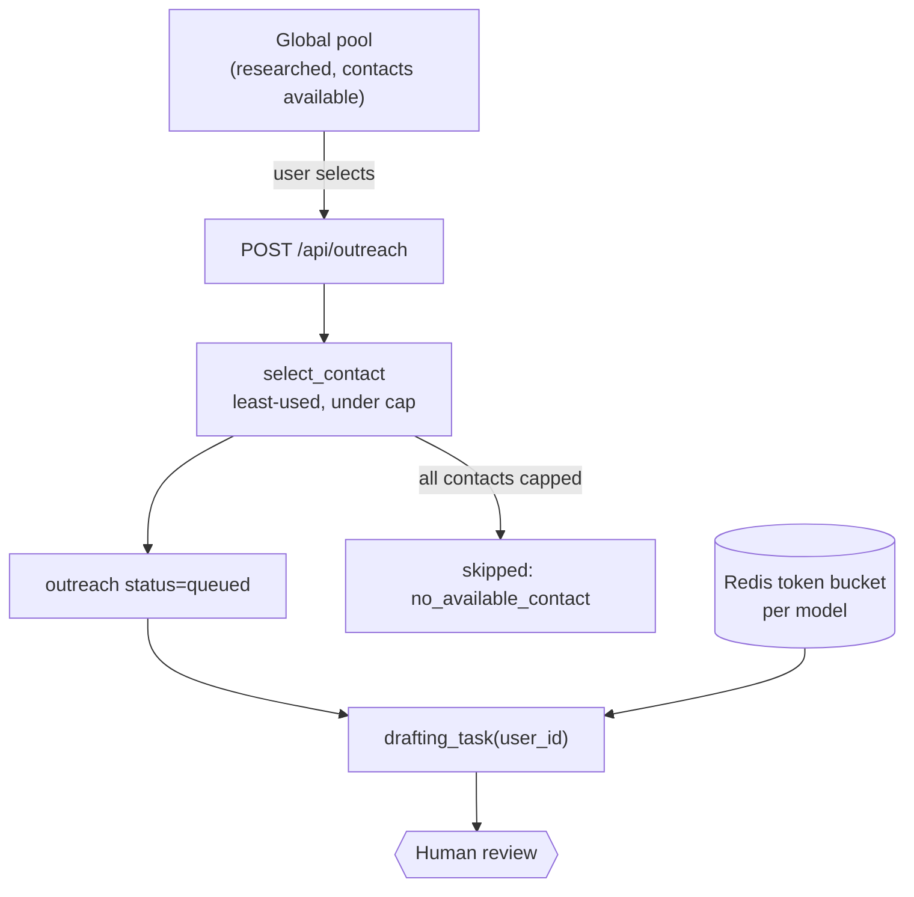

# Stack 3 — Pool Browsing, Contact Selection & Per-User Drafting Implementation Plan

> **For agentic workers:** REQUIRED SUB-SKILL: Use superpowers:subagent-driven-development (recommended) or superpowers:executing-plans to implement this plan task-by-task. Steps use checkbox (`- [ ]`) syntax for tracking.

**Goal:** Ship the product: users browse the global pool, select companies, and get drafts — with contact spreading that stops a shared pool from spamming founders, and rate limiting that survives concurrent multi-user drafting.

**Architecture:** `select_contact` reads the `available_contacts` view and picks the least-globally-contacted eligible contact under a cap, deterministically. `POST /api/outreach` creates `queued` rows with partial-success semantics and dispatches a per-user drafting task. `time.sleep` is replaced by a Redis token bucket with an atomic Lua decrement, because a sleep paces one worker while the real constraint is a fleet-wide provider quota. The Stack 1b bridge is deleted.

**Tech Stack:** Python 3.12, FastAPI, SQLAlchemy 2.0, PostgreSQL 16, Redis (Lua), Celery 5.3, pytest, Next.js 15

**Spec:** [`docs/superpowers/specs/2026-08-14-stack-3-pool-drafting-design.md`](../specs/2026-08-14-stack-3-pool-drafting-design.md)

**Branch:** `feat/pool-and-drafting` off `feat/sender-identity`. Open the PR with `gh pr create --base feat/sender-identity`.

## Global Constraints

- `settings.contact_cap` defaults to **3**. The cap is a **spreading heuristic, not an invariant** — exceeding it by one under concurrency is accepted rather than serialising pool selection with `SELECT ... FOR UPDATE`.
- `select_contact` ordering, exactly: `use_count ASC, confidence DESC, is_founder DESC, id ASC`. The final `id ASC` gives a **total** ordering — without it Postgres may return either of two equal rows and the tests become flaky for reasons that look like a selection bug.
- `is_founder` must sit **below** `use_count`. Above it, volume re-concentrates on founders, which is what contact spreading exists to prevent.
- `use_count` counts outreach rows across **all** users, never just the caller.
- `GET /api/companies` and `GET /api/companies/{id}` must **never** return contact email addresses. The pool is the product's inventory; a scrapeable list of verified founder emails is a lead-list leak.
- Pool exclusion of already-targeted companies is a `NOT EXISTS` scoped to `current_user.id`. Without the user predicate it would hide a company from everyone the moment one person targeted it.
- Another user's outreach id returns **404, never 403**. A 403 confirms the id exists, turning an authorization check into an existence oracle.
- Redis rate limiting **fails open**. A limiter that fails closed converts a Redis blip into a total drafting outage; failing open risks provider 429s, which the existing fallback chain already handles.
- A token-bucket timeout is treated exactly like a `429` — `generate_json` skips to the next model, reusing the existing skip logic rather than adding a second notion of "unavailable".
- Quota counts outreach rows **created** in the current UTC calendar month, not sends. The LLM call is the cost and it happens at drafting.
- BYOK users bypass both the quota and the shared bucket. `PUT /api/llm-key` validates the key with one live call before storing.
- **Delete `bridge_queue_admin_outreach`** and its call. Its docstring names this stack as its removal point.
- Run `uv run pytest` before every commit.

---

## File Structure

| File | Responsibility |
|---|---|
| `migrations/008_user_llm_and_quota.sql` | `llm_api_key_enc`, `llm_provider`, `monthly_draft_quota` |
| `cold_email/contact_selection.py` | `select_contact` — pure, over counts |
| `cold_email/quota.py` | `usage`, `check` |
| `cold_email/workers/shared/rate_limit.py` | Redis token bucket (Lua) |
| `cold_email/workers/shared/llm.py` | `resolve_llm_credentials`; bucket integration |
| `cold_email/api/routes/companies.py` | Pool browsing |
| `cold_email/api/routes/outreach.py` | `POST /api/outreach`, quota, BYOK |
| `cold_email/workers/drafting/drafting.py` | `drafting_task(user_id)`; bridge deleted |
| `cold_email/celery_app.py` | Recovery sweep replaces the primary sweep |
| `frontend/app/pool/page.tsx` | Browse + multi-select |

---

### Task 1: Contact selection

**Files:**
- Create: `cold_email/contact_selection.py`
- Modify: `cold_email/config.py`
- Test: `tests/test_contact_selection.py`

**Interfaces:**
- Consumes: the `available_contacts` view
- Produces: `CONTACT_CAP_DEFAULT = 3`, `select_contact(session, company_id, cap) -> UUID | None`, `settings.contact_cap`

- [ ] **Step 1: Write the failing test**

Create `tests/test_contact_selection.py`:

```python
"""Contact selection — pure logic over counts, no network.

Deterministic selection was chosen over random precisely so these properties are
assertable rather than statistical.
"""

import pytest

from cold_email.contact_selection import select_contact
from cold_email.database import Company, CompanyContact, Outreach


@pytest.fixture
async def company(async_session):
    c = Company(company_name="Acme", research_status="researched")
    async_session.add(c)
    await async_session.commit()
    return c


async def _contact(session, company, email, *, confidence=50, eligible=True, is_founder=False):
    contact = CompanyContact(
        company_id=company.id,
        email=email,
        confidence=confidence,
        eligible=eligible,
        is_founder=is_founder,
    )
    session.add(contact)
    await session.commit()
    return contact


async def _use(session, contact, user_id, company):
    """Record that someone emailed this contact."""
    session.add(
        Outreach(user_id=user_id, company_id=company.id, contact_id=contact.id, status="sent")
    )
    await session.commit()


@pytest.mark.asyncio
async def test_picks_the_only_eligible_contact(async_session, company):
    contact = await _contact(async_session, company, "a@acme.com")
    assert await select_contact(async_session, company.id, cap=3) == contact.id


@pytest.mark.asyncio
async def test_ignores_ineligible_contacts_even_at_zero_use(async_session, company):
    await _contact(async_session, company, "info@acme.com", eligible=False)
    assert await select_contact(async_session, company.id, cap=3) is None


@pytest.mark.asyncio
async def test_picks_the_least_used(async_session, company, admin_user_id, extra_users):
    used = await _contact(async_session, company, "used@acme.com", confidence=95)
    fresh = await _contact(async_session, company, "fresh@acme.com", confidence=50)
    await _use(async_session, used, admin_user_id, company)

    # Higher confidence loses to lower use_count — spreading beats deliverability.
    assert await select_contact(async_session, company.id, cap=3) == fresh.id


@pytest.mark.asyncio
async def test_confidence_breaks_a_use_count_tie(async_session, company):
    await _contact(async_session, company, "low@acme.com", confidence=30)
    high = await _contact(async_session, company, "high@acme.com", confidence=95)
    assert await select_contact(async_session, company.id, cap=3) == high.id


@pytest.mark.asyncio
async def test_is_founder_breaks_a_confidence_tie(async_session, company):
    await _contact(async_session, company, "eng@acme.com", confidence=80, is_founder=False)
    founder = await _contact(async_session, company, "f@acme.com", confidence=80, is_founder=True)
    assert await select_contact(async_session, company.id, cap=3) == founder.id


@pytest.mark.asyncio
async def test_founder_preference_never_outranks_spreading(async_session, company, admin_user_id):
    """is_founder sits BELOW use_count. Above it, volume re-concentrates on the
    exact address contact spreading exists to protect."""
    founder = await _contact(async_session, company, "f@acme.com", confidence=95, is_founder=True)
    other = await _contact(async_session, company, "cto@acme.com", confidence=90)
    await _use(async_session, founder, admin_user_id, company)

    assert await select_contact(async_session, company.id, cap=3) == other.id


@pytest.mark.asyncio
async def test_returns_none_when_every_contact_is_capped(
    async_session, company, admin_user_id, extra_users
):
    contact = await _contact(async_session, company, "a@acme.com")
    for user_id in [admin_user_id, *extra_users[:2]]:
        await _use(async_session, contact, user_id, company)

    assert await select_contact(async_session, company.id, cap=3) is None


@pytest.mark.asyncio
async def test_use_count_spans_all_users(async_session, company, extra_users):
    """A per-caller count would let 10 users each email the same founder once."""
    contact = await _contact(async_session, company, "a@acme.com")
    for user_id in extra_users[:3]:
        await _use(async_session, contact, user_id, company)

    assert await select_contact(async_session, company.id, cap=3) is None


@pytest.mark.asyncio
async def test_sequential_selections_round_robin(async_session, company, extra_users):
    """The core property: consecutive users get different addresses."""
    a = await _contact(async_session, company, "a@acme.com", confidence=90)
    b = await _contact(async_session, company, "b@acme.com", confidence=90)
    c = await _contact(async_session, company, "c@acme.com", confidence=90)

    picked = []
    for user_id in extra_users[:3]:
        chosen = await select_contact(async_session, company.id, cap=3)
        picked.append(chosen)
        contact = await async_session.get(CompanyContact, chosen)
        await _use(async_session, contact, user_id, company)

    assert sorted(picked) == sorted([a.id, b.id, c.id])
    assert len(set(picked)) == 3


@pytest.mark.asyncio
async def test_selection_is_deterministic_for_identical_contacts(async_session, company):
    """Total ordering via `id ASC`. Without it, two equal rows make the test
    flaky in a way that looks like a selection bug."""
    await _contact(async_session, company, "a@acme.com", confidence=50)
    await _contact(async_session, company, "b@acme.com", confidence=50)

    first = await select_contact(async_session, company.id, cap=3)
    for _ in range(5):
        assert await select_contact(async_session, company.id, cap=3) == first


@pytest.mark.asyncio
async def test_no_contacts_at_all(async_session, company):
    assert await select_contact(async_session, company.id, cap=3) is None
```

Add the `extra_users` fixture to `tests/conftest.py`:

```python
@pytest_asyncio.fixture
async def extra_users(async_session):
    """Five additional users, for testing the global per-contact cap."""
    from cold_email.database import ROLE_USER, User

    users = [
        User(email=f"u{i}@example.com", google_sub=f"sub-u{i}", role=ROLE_USER) for i in range(5)
    ]
    async_session.add_all(users)
    await async_session.commit()
    return [u.id for u in users]
```

- [ ] **Step 2: Run it to verify it fails**

Run: `uv run pytest tests/test_contact_selection.py -v`
Expected: FAIL — `ModuleNotFoundError: cold_email.contact_selection`

- [ ] **Step 3: Add the setting**

In `cold_email/config.py`:

```python
    # Max users who may ever email a single contact. A SPREADING HEURISTIC, not
    # an invariant: concurrent requests can exceed it by one, which is cheaper
    # than serialising pool selection across all users with SELECT FOR UPDATE.
    contact_cap: int = 3
```

- [ ] **Step 4: Implement it**

Create `cold_email/contact_selection.py`:

```python
"""Choose which human at a company a user will email.

The problem: the company pool is fully shared, so without spreading, every user
emails the same founder_email and that founder receives N near-identical emails
from N senders. That reads as a spam farm.

The solution: pick the LEAST-GLOBALLY-CONTACTED eligible contact under a cap.

Why least-used and not random — random distribution is lumpy: with 6 contacts and
6 users, some address gets hit twice while another gets zero, which is the exact
outcome this exists to prevent. Least-used spreads evenly by construction.

Why that matters more than it sounds: this is a pure function over counts, so the
cap, the ordering, and the exhaustion case are directly assertable. A randomised
version needs seeding or mocking, and "distributes evenly" degrades from an
assertion to a statistical claim.
"""

import logging
import uuid

from sqlalchemy import text
from sqlalchemy.ext.asyncio import AsyncSession

logger = logging.getLogger(__name__)

CONTACT_CAP_DEFAULT = 3

# ORDER BY rationale, term by term:
#   use_count ASC   — spreading is the whole point, so it dominates
#   confidence DESC — among equally-used contacts, prefer the deliverable one
#   is_founder DESC — BELOW use_count deliberately: above it, volume
#                     re-concentrates on founders
#   id ASC          — a TOTAL ordering. Without it Postgres may return either of
#                     two equal rows, making tests flaky in a way that looks
#                     like a selection bug.
_SELECT_CONTACT = text("""
    SELECT contact_id
    FROM available_contacts
    WHERE company_id = :company_id
      AND use_count < :cap
    ORDER BY use_count ASC, confidence DESC, is_founder DESC, contact_id ASC
    LIMIT 1
""")


async def select_contact(
    session: AsyncSession, company_id: uuid.UUID, cap: int = CONTACT_CAP_DEFAULT
) -> uuid.UUID | None:
    """The least-contacted eligible contact at a company, or None if exhausted.

    Reads the available_contacts view, which already filters to eligible
    contacts and computes use_count across ALL users. A per-caller count would
    let ten users each email the same founder exactly once.

    None means every eligible contact has hit the cap — the company should drop
    out of the pool.
    """
    result = await session.execute(_SELECT_CONTACT, {"company_id": company_id, "cap": cap})
    contact_id = result.scalar_one_or_none()

    if contact_id is None:
        logger.info(f"Company {company_id} has no available contact under cap {cap}")
    return contact_id
```

- [ ] **Step 5: Run it to verify it passes**

Run: `uv run pytest tests/test_contact_selection.py -v`
Expected: PASS (11 tests)

- [ ] **Step 6: Commit**

```bash
git add cold_email/contact_selection.py cold_email/config.py tests/test_contact_selection.py tests/conftest.py
git commit -m "feat(pool): add least-used contact selection with a global cap

Deterministic rather than random: even distribution becomes an assertion
instead of a statistical claim, and the cap is directly testable."
```

---

### Task 2: Redis token bucket

**Files:**
- Create: `cold_email/workers/shared/rate_limit.py`
- Modify: `cold_email/workers/shared/constants.py`
- Test: `tests/test_rate_limit.py`

**Interfaces:**
- Consumes: `settings.celery_broker_url` (reuses the Redis instance)
- Produces: `acquire(key, rate, burst, timeout) -> bool`, `MODEL_RATE_DEFAULT`, `MODEL_BURST_DEFAULT`

- [ ] **Step 1: Write the failing test**

Create `tests/test_rate_limit.py`:

```python
"""Token bucket tests.

Requires a running Redis (docker compose up -d). Marked `integration` so the
unit suite stays offline-runnable.
"""

import time

import pytest

from cold_email.workers.shared.rate_limit import acquire

pytestmark = pytest.mark.integration


@pytest.fixture(autouse=True)
def clean_bucket():
    from cold_email.workers.shared.rate_limit import _redis

    _redis().delete("ratelimit:test")
    yield
    _redis().delete("ratelimit:test")


def test_burst_tokens_acquire_immediately():
    for _ in range(5):
        assert acquire("test", rate=1.0, burst=5, timeout=0) is True


def test_the_next_call_is_refused_once_the_burst_is_spent():
    for _ in range(5):
        acquire("test", rate=1.0, burst=5, timeout=0)
    assert acquire("test", rate=1.0, burst=5, timeout=0) is False


def test_tokens_refill_at_the_configured_rate():
    for _ in range(5):
        acquire("test", rate=10.0, burst=5, timeout=0)
    assert acquire("test", rate=10.0, burst=5, timeout=0) is False

    time.sleep(0.25)  # 10/s → ~2 tokens
    assert acquire("test", rate=10.0, burst=5, timeout=0) is True


def test_timeout_returns_false_rather_than_blocking_forever():
    for _ in range(2):
        acquire("test", rate=0.1, burst=2, timeout=0)

    started = time.monotonic()
    assert acquire("test", rate=0.1, burst=2, timeout=0.3) is False
    assert time.monotonic() - started < 1.0


def test_concurrent_acquirers_never_exceed_the_bucket():
    """The atomicity guarantee, and the reason for a Lua script.

    A read-then-write in Python has a race between worker processes that
    defeats the entire purpose of the limiter.
    """
    from concurrent.futures import ThreadPoolExecutor

    with ThreadPoolExecutor(max_workers=20) as pool:
        results = list(
            pool.map(lambda _: acquire("test", rate=0.001, burst=10, timeout=0), range(50))
        )
    assert sum(results) == 10


def test_fails_open_when_redis_is_unreachable(monkeypatch):
    """A limiter that fails CLOSED turns a Redis blip into a total drafting
    outage. Failing open risks provider 429s, which the fallback chain already
    handles — the cheaper failure wins."""
    import redis

    def boom(*args, **kwargs):
        raise redis.RedisError("connection refused")

    monkeypatch.setattr("cold_email.workers.shared.rate_limit._eval_bucket", boom)
    assert acquire("test", rate=1.0, burst=1, timeout=0) is True


def test_buckets_are_independent_per_key():
    """Each model in model_fallback_chain has its own provider quota."""
    from cold_email.workers.shared.rate_limit import _redis

    _redis().delete("ratelimit:other")
    try:
        for _ in range(3):
            acquire("test", rate=0.001, burst=3, timeout=0)
        assert acquire("test", rate=0.001, burst=3, timeout=0) is False
        assert acquire("other", rate=0.001, burst=3, timeout=0) is True
    finally:
        _redis().delete("ratelimit:other")
```

Register the marker in `pyproject.toml`:

```toml
[tool.pytest.ini_options]
markers = ["integration: requires a running Redis or Postgres"]
```

- [ ] **Step 2: Run it to verify it fails**

Run: `uv run pytest tests/test_rate_limit.py -v`
Expected: FAIL — `ModuleNotFoundError: ...shared.rate_limit`

- [ ] **Step 3: Implement it**

Create `cold_email/workers/shared/rate_limit.py`:

```python
"""Fleet-wide token bucket in Redis, replacing time.sleep between LLM calls.

Why this is not a style change: a sleep paces ONE worker process. The actual
constraint is a provider quota shared by every worker, every user, and every task
type. With a single user the two were indistinguishable; with N users drafting
concurrently, sleep guarantees 429s while each process politely waits its own
turn.

The decrement runs as a Lua script so check-and-decrement is ATOMIC. A
read-then-write in Python has a race between processes that defeats the purpose.

Redis is already in the stack as the Celery broker, so this adds no
infrastructure.
"""

import logging
import time
from functools import lru_cache

import redis

from cold_email.config import settings

logger = logging.getLogger(__name__)

# Conservative defaults sized for a free tier. Override per model at the call site.
MODEL_RATE_DEFAULT = 0.5  # tokens per second
MODEL_BURST_DEFAULT = 5

_POLL_INTERVAL = 0.05

# Standard token bucket. Returns 1 if a token was taken, 0 otherwise.
# State is two hash fields (tokens, last_refill) plus a TTL so idle buckets expire.
_BUCKET_LUA = """
local key    = KEYS[1]
local rate   = tonumber(ARGV[1])
local burst  = tonumber(ARGV[2])
local now    = tonumber(ARGV[3])

local state       = redis.call('HMGET', key, 'tokens', 'last_refill')
local tokens      = tonumber(state[1])
local last_refill = tonumber(state[2])

if tokens == nil then
    tokens = burst
    last_refill = now
end

-- Refill for elapsed time, capped at burst.
local elapsed = math.max(0, now - last_refill)
tokens = math.min(burst, tokens + elapsed * rate)

local granted = 0
if tokens >= 1 then
    tokens = tokens - 1
    granted = 1
end

redis.call('HMSET', key, 'tokens', tokens, 'last_refill', now)
-- Expire idle buckets: 2x the time to refill from empty, floored at 60s.
redis.call('EXPIRE', key, math.max(60, math.ceil(burst / rate) * 2))

return granted
"""


@lru_cache(maxsize=1)
def _redis() -> redis.Redis:
    """One connection pool per process."""
    return redis.Redis.from_url(settings.celery_broker_url, decode_responses=True)


@lru_cache(maxsize=1)
def _script():
    return _redis().register_script(_BUCKET_LUA)


def _eval_bucket(key: str, rate: float, burst: int) -> int:
    """Run one atomic take. Extracted so tests can simulate Redis being down."""
    return int(_script()(keys=[key], args=[rate, burst, time.time()]))


def acquire(
    key: str,
    rate: float = MODEL_RATE_DEFAULT,
    burst: int = MODEL_BURST_DEFAULT,
    timeout: float = 0.0,
) -> bool:
    """Take one token, waiting up to `timeout` seconds. True if granted.

    Fails OPEN if Redis is unreachable: a limiter that fails closed converts a
    Redis blip into a total drafting outage, whereas failing open risks provider
    429s that the model fallback chain already handles gracefully.
    """
    redis_key = f"ratelimit:{key}"
    deadline = time.monotonic() + timeout

    while True:
        try:
            if _eval_bucket(redis_key, rate, burst):
                return True
        except redis.RedisError as exc:
            logger.warning(f"Rate limiter unavailable ({exc}); failing open for {key}")
            return True

        if time.monotonic() >= deadline:
            logger.info(f"Rate limit timeout for {key} after {timeout}s")
            return False

        time.sleep(min(_POLL_INTERVAL, max(0.0, deadline - time.monotonic())))
```

- [ ] **Step 4: Run it to verify it passes**

Run: `docker compose up -d && uv run pytest tests/test_rate_limit.py -v`
Expected: PASS (7 tests)

- [ ] **Step 5: Commit**

```bash
git add cold_email/workers/shared/rate_limit.py pyproject.toml tests/test_rate_limit.py
git commit -m "feat(llm): add a fleet-wide Redis token bucket

A sleep paces one worker; the real constraint is a provider quota shared by
the whole fleet. The Lua script makes check-and-decrement atomic."
```

---

### Task 3: LLM credential resolution and bucket integration

**Files:**
- Create: `migrations/008_user_llm_and_quota.sql`
- Modify: `cold_email/database.py`
- Modify: `cold_email/workers/shared/llm.py`
- Modify: `cold_email/workers/shared/constants.py`
- Test: `tests/test_llm.py`

**Interfaces:**
- Consumes: `rate_limit.acquire`, `auth.crypto`
- Produces: `LlmCredentials` (`api_key`, `provider`, `is_byok`), `resolve_llm_credentials(user) -> LlmCredentials`, `generate_json(..., credentials=None)`; `users.llm_api_key_enc`, `users.llm_provider`, `users.monthly_draft_quota`

- [ ] **Step 1: Write the migration**

Create `migrations/008_user_llm_and_quota.sql`:

```sql
-- 008_user_llm_and_quota.sql
--
-- Optional bring-your-own-key, plus a per-user monthly draft quota.
--
-- Quota is per-user rather than a single global constant so it can be raised for
-- an individual without a deploy — and it is the seam Stripe plans attach to.

ALTER TABLE users ADD COLUMN IF NOT EXISTS llm_api_key_enc     BYTEA;  -- Fernet
ALTER TABLE users ADD COLUMN IF NOT EXISTS llm_provider        TEXT;   -- groq | gemini
ALTER TABLE users ADD COLUMN IF NOT EXISTS monthly_draft_quota INT NOT NULL DEFAULT 100;
```

Add the three columns to the `User` model:

```python
    # Optional BYOK: bypasses both the platform quota and the shared token
    # bucket, since the user is spending their own limits.
    llm_api_key_enc = Column(LargeBinary)
    llm_provider = Column(String)  # groq | gemini
    monthly_draft_quota = Column(Integer, nullable=False, default=100)
```

- [ ] **Step 2: Write the failing test**

Add to `tests/test_llm.py`:

```python
@pytest.mark.asyncio
async def test_resolve_returns_platform_credentials_without_a_user_key(
    async_session, admin_user_id
):
    from cold_email.database import User
    from cold_email.workers.shared.llm import resolve_llm_credentials

    creds = resolve_llm_credentials(await async_session.get(User, admin_user_id))
    assert creds.is_byok is False


@pytest.mark.asyncio
async def test_resolve_decrypts_a_user_key(async_session, admin_user_id):
    from cold_email.auth.crypto import encrypt
    from cold_email.database import User
    from cold_email.workers.shared.llm import resolve_llm_credentials

    user = await async_session.get(User, admin_user_id)
    user.llm_api_key_enc = encrypt("gsk_userkey")
    user.llm_provider = "groq"
    await async_session.commit()

    creds = resolve_llm_credentials(user)
    assert creds.api_key == "gsk_userkey"
    assert creds.provider == "groq"
    assert creds.is_byok is True


def test_platform_calls_acquire_a_token(monkeypatch):
    acquired = []
    monkeypatch.setattr(
        "cold_email.workers.shared.llm.acquire",
        lambda key, **kw: acquired.append(key) or True,
    )
    _stub_one_model_success(monkeypatch)

    from cold_email.workers.shared.llm import LlmCredentials, generate_json

    generate_json(
        system="s",
        prompt="p",
        schema=_Schema,
        credentials=LlmCredentials(api_key="platform", provider=None, is_byok=False),
    )
    assert len(acquired) == 1


def test_byok_calls_bypass_the_bucket(monkeypatch):
    """Their key, their limits — the shared bucket models OUR quota."""
    acquired = []
    monkeypatch.setattr(
        "cold_email.workers.shared.llm.acquire",
        lambda key, **kw: acquired.append(key) or True,
    )
    _stub_one_model_success(monkeypatch)

    from cold_email.workers.shared.llm import LlmCredentials, generate_json

    generate_json(
        system="s",
        prompt="p",
        schema=_Schema,
        credentials=LlmCredentials(api_key="gsk_theirs", provider="groq", is_byok=True),
    )
    assert acquired == []


def test_a_bucket_timeout_skips_to_the_next_model(monkeypatch):
    """Treated exactly like a 429, reusing the existing skip logic rather than
    adding a second notion of 'this model is unavailable'."""
    calls = []

    monkeypatch.setattr(
        "cold_email.workers.shared.llm.acquire",
        # First model's bucket is empty, second has room.
        lambda key, **kw: "flash-lite" in key,
    )
    _stub_chain(monkeypatch, calls, chain=["llama-3.3-70b-versatile", "gemini-3.5-flash-lite"])

    from cold_email.workers.shared.llm import generate_json

    generate_json(system="s", prompt="p", schema=_Schema)
    assert calls == ["gemini-3.5-flash-lite"]


def test_min_interval_sleep_constant_is_gone():
    """time.sleep paced one worker. The bucket paces the fleet."""
    import cold_email.workers.shared.constants as c

    assert not hasattr(c, "LLM_MIN_INTERVAL_SECONDS")
```

Add the `_stub_one_model_success`, `_stub_chain`, and `_Schema` helpers at the top
of `tests/test_llm.py`, following the existing mocking pattern in that file: patch
`_provider_for` to return a stub provider whose `generate` records the model name
and returns `'{"ok": true}'`, and patch `settings.model_fallback_chain`.

- [ ] **Step 3: Run it to verify it fails**

Run: `uv run pytest tests/test_llm.py -v`
Expected: FAIL — `resolve_llm_credentials` does not exist.

- [ ] **Step 4: Implement it**

In `cold_email/workers/shared/llm.py`:

```python
@dataclass(frozen=True)
class LlmCredentials:
    """Which key a call uses, and whether platform limits apply.

    Three paths, one resolver:
      * platform key → shared token bucket + per-user quota
      * user's own key (BYOK) → their limits, so both are bypassed
      * self-hosted → env keys, bucket harmlessly enforced
    """

    api_key: str | None
    provider: str | None
    is_byok: bool


def resolve_llm_credentials(user) -> LlmCredentials:
    """Pick the credentials for a user's LLM calls."""
    if user is not None and user.llm_api_key_enc:
        return LlmCredentials(
            api_key=decrypt(user.llm_api_key_enc),
            provider=user.llm_provider,
            is_byok=True,
        )
    return LlmCredentials(api_key=None, provider=None, is_byok=False)
```

In `generate_json`, add the parameter and the acquisition inside the chain loop:

```python
def generate_json(system: str, prompt: str, schema, credentials=None) -> str:
    """..."""
    credentials = credentials or LlmCredentials(api_key=None, provider=None, is_byok=False)
    chain = settings.model_fallback_chain or [settings.model_name]
    last_error = None

    for model in chain:
        # BYOK bypasses the bucket: it models OUR shared quota, not theirs.
        if not credentials.is_byok and not acquire(f"llm:{model}", timeout=BUCKET_WAIT_SECONDS):
            # Treated exactly like a 429 so the existing skip logic is reused
            # rather than growing a parallel notion of "model unavailable".
            logger.info(f"Token bucket exhausted for {model}; skipping to the next model")
            last_error = RuntimeError(f"rate limit timeout for {model}")
            continue

        try:
            return _provider_for(model).generate(
                system=system, prompt=prompt, schema=schema, api_key=credentials.api_key
            )
        except Exception as exc:  # existing 429/404 skip logic unchanged
            ...
```

Add `BUCKET_WAIT_SECONDS = 30.0` to `shared/constants.py` and **delete
`LLM_MIN_INTERVAL_SECONDS`** and `LLM_RATE_LIMIT`. Remove the
`rate_limit=LLM_RATE_LIMIT` argument from `research_task`'s decorator — Celery's
`rate_limit` is per-worker and has the same defect as `sleep`.

- [ ] **Step 5: Run it to verify it passes**

Run: `uv run pytest tests/test_llm.py -v`
Expected: PASS

- [ ] **Step 6: Commit**

```bash
git add migrations/008_user_llm_and_quota.sql cold_email/ tests/test_llm.py
git commit -m "feat(llm): resolve per-user credentials and gate calls on the bucket

Removes LLM_MIN_INTERVAL_SECONDS and Celery's per-worker rate_limit; both
paced a single process rather than the fleet."
```

---

### Task 4: Quota

**Files:**
- Create: `cold_email/quota.py`
- Test: `tests/test_quota.py`

**Interfaces:**
- Consumes: `Outreach`, `User`
- Produces: `usage(session, user) -> tuple[int, int]`, `check(session, user, requested) -> int`, `period_start(now) -> datetime`

- [ ] **Step 1: Write the failing test**

Create `tests/test_quota.py`:

```python
from datetime import UTC, datetime, timedelta

import pytest

from cold_email.quota import check, period_start, usage


def test_period_starts_at_the_first_of_the_month_utc():
    start = period_start(datetime(2026, 8, 14, 17, 30, tzinfo=UTC))
    assert start == datetime(2026, 8, 1, tzinfo=UTC)


@pytest.mark.asyncio
async def test_usage_counts_only_this_period(async_session, admin_user, company_factory):
    from cold_email.database import Outreach

    now = datetime.now(UTC)
    async_session.add_all(
        [
            Outreach(
                user_id=admin_user.id,
                company_id=(await company_factory()).id,
                status="sent",
                created_at=now,
            ),
            Outreach(
                user_id=admin_user.id,
                company_id=(await company_factory()).id,
                status="sent",
                created_at=period_start(now) - timedelta(days=1),
            ),
        ]
    )
    await async_session.commit()

    used, _ = await usage(async_session, admin_user)
    assert used == 1


@pytest.mark.asyncio
async def test_usage_counts_only_the_caller(
    async_session, admin_user, extra_users, company_factory
):
    from cold_email.database import Outreach

    async_session.add(
        Outreach(user_id=extra_users[0], company_id=(await company_factory()).id, status="sent")
    )
    await async_session.commit()

    used, _ = await usage(async_session, admin_user)
    assert used == 0


@pytest.mark.asyncio
async def test_usage_counts_creations_not_sends(async_session, admin_user, company_factory):
    """The LLM call is the cost and it happens at drafting. A user who drafts 100
    and approves 3 has spent 100 units of the rationed thing."""
    from cold_email.database import Outreach

    async_session.add_all(
        [
            Outreach(
                user_id=admin_user.id, company_id=(await company_factory()).id, status="queued"
            ),
            Outreach(
                user_id=admin_user.id, company_id=(await company_factory()).id, status="rejected"
            ),
        ]
    )
    await async_session.commit()

    used, _ = await usage(async_session, admin_user)
    assert used == 2


@pytest.mark.asyncio
async def test_check_clamps_to_the_remaining_allowance(async_session, admin_user):
    admin_user.monthly_draft_quota = 5
    await async_session.commit()
    assert await check(async_session, admin_user, requested=20) == 5


@pytest.mark.asyncio
async def test_check_returns_zero_when_exhausted(async_session, admin_user, company_factory):
    from cold_email.database import Outreach

    admin_user.monthly_draft_quota = 1
    async_session.add(
        Outreach(user_id=admin_user.id, company_id=(await company_factory()).id, status="sent")
    )
    await async_session.commit()

    assert await check(async_session, admin_user, requested=5) == 0


@pytest.mark.asyncio
async def test_byok_users_bypass_the_quota(async_session, admin_user):
    from cold_email.auth.crypto import encrypt

    admin_user.monthly_draft_quota = 1
    admin_user.llm_api_key_enc = encrypt("gsk_theirs")
    admin_user.llm_provider = "groq"
    await async_session.commit()

    assert await check(async_session, admin_user, requested=500) == 500
```

Add `admin_user` (returning the `User` object, not just the id) and
`company_factory` (an async callable creating a distinct `researched` company each
call — needed because `UNIQUE(user_id, company_id)` forbids reusing one) to
`tests/conftest.py`.

- [ ] **Step 2: Run it to verify it fails**

Run: `uv run pytest tests/test_quota.py -v`
Expected: FAIL — `ModuleNotFoundError: cold_email.quota`

- [ ] **Step 3: Implement it**

Create `cold_email/quota.py`:

```python
"""Per-user monthly draft quota.

Counts outreach rows CREATED in the current UTC calendar month, not sends. The
LLM call is the cost and it happens at drafting, so a user who drafts 100 and
approves 3 has spent 100 units of the thing being rationed.

BYOK users bypass this entirely — they are spending their own limits.
"""

import logging
from datetime import UTC, datetime

from sqlalchemy import func, select
from sqlalchemy.ext.asyncio import AsyncSession

from cold_email.database import Outreach, User

logger = logging.getLogger(__name__)


def period_start(now: datetime | None = None) -> datetime:
    """Midnight UTC on the first of the current month.

    Calendar month in UTC rather than a rolling 30-day window: users reason
    about "this month", and a rolling window makes remaining quota drift
    unpredictably day to day.
    """
    now = now or datetime.now(UTC)
    return datetime(now.year, now.month, 1, tzinfo=UTC)


async def usage(session: AsyncSession, user: User) -> tuple[int, int]:
    """Return (used_this_period, limit)."""
    used = (
        await session.execute(
            select(func.count(Outreach.id)).where(
                Outreach.user_id == user.id,
                Outreach.created_at >= period_start(),
            )
        )
    ).scalar_one()
    return used, user.monthly_draft_quota


async def check(session: AsyncSession, user: User, requested: int) -> int:
    """How many of `requested` new outreach rows the user may create.

    Clamps rather than raising, so POST /api/outreach can create the allowed
    subset and report the rest as skipped — a user selecting 20 with 12 left
    should get 12 drafts and a clear note, not a 400 and nothing.
    """
    if user.llm_api_key_enc:
        return requested  # BYOK: their key, their limits

    used, limit = await usage(session, user)
    return max(0, min(requested, limit - used))
```

- [ ] **Step 4: Run it to verify it passes**

Run: `uv run pytest tests/test_quota.py -v`
Expected: PASS (7 tests)

- [ ] **Step 5: Commit**

```bash
git add cold_email/quota.py tests/test_quota.py tests/conftest.py
git commit -m "feat(quota): count outreach creations per calendar month

Creations, not sends: the LLM call is the cost and it happens at drafting."
```

---

### Task 5: Pool browsing API

**Files:**
- Create: `cold_email/api/routes/companies.py`
- Modify: `cold_email/api/routes/api.py`
- Test: `tests/test_pool_api.py`

**Interfaces:**
- Consumes: `available_contacts`, `settings.contact_cap`, `get_current_user`
- Produces: `GET /api/companies`, `GET /api/companies/{id}`

- [ ] **Step 1: Write the failing test**

Create `tests/test_pool_api.py`:

```python
import pytest


@pytest.mark.asyncio
async def test_requires_auth(client):
    assert (await client.get("/api/companies")).status_code == 401


@pytest.mark.asyncio
async def test_only_researched_companies_appear(user_client, pool_fixture):
    names = {c["company_name"] for c in (await user_client.get("/api/companies")).json()["items"]}
    assert "ResearchedCo" in names
    assert "FoundCo" not in names
    assert "FailedCo" not in names


@pytest.mark.asyncio
async def test_companies_without_an_eligible_contact_are_hidden(user_client, pool_fixture):
    names = {c["company_name"] for c in (await user_client.get("/api/companies")).json()["items"]}
    assert "GenericOnlyCo" not in names


@pytest.mark.asyncio
async def test_exhausted_companies_are_hidden(user_client, exhausted_company):
    names = {c["company_name"] for c in (await user_client.get("/api/companies")).json()["items"]}
    assert "ExhaustedCo" not in names


@pytest.mark.asyncio
async def test_already_targeted_is_hidden_from_me_but_visible_to_others(
    user_client, admin_client, targeted_by_user_company
):
    """The single most important test in this stack: it is the difference between
    a shared pool and a broken one.

    A LEFT JOIN on outreach without the user predicate would hide the company
    from EVERYONE the moment one person targeted it.
    """
    mine = {c["company_name"] for c in (await user_client.get("/api/companies")).json()["items"]}
    assert "TargetedCo" not in mine

    theirs = {c["company_name"] for c in (await admin_client.get("/api/companies")).json()["items"]}
    assert "TargetedCo" in theirs


@pytest.mark.asyncio
async def test_no_email_addresses_are_exposed(user_client, pool_fixture):
    """The pool is the product's inventory. A scrapeable list of verified founder
    emails handed to every signup is a lead-list leak."""
    body = (await user_client.get("/api/companies")).text
    assert "@" not in body or "founder@" not in body

    company_id = (await user_client.get("/api/companies")).json()["items"][0]["id"]
    detail = (await user_client.get(f"/api/companies/{company_id}")).text
    assert "cto@researched.co" not in detail


@pytest.mark.asyncio
async def test_detail_includes_contact_summaries_without_addresses(user_client, pool_fixture):
    company_id = (await user_client.get("/api/companies")).json()["items"][0]["id"]
    detail = (await user_client.get(f"/api/companies/{company_id}")).json()

    assert detail["research"]["hook"] is not None
    assert len(detail["contacts"]) >= 1
    for contact in detail["contacts"]:
        assert set(contact) == {"first_name", "position", "is_founder"}


@pytest.mark.asyncio
async def test_contact_count_reflects_availability(user_client, pool_fixture):
    item = next(
        c
        for c in (await user_client.get("/api/companies")).json()["items"]
        if c["company_name"] == "ResearchedCo"
    )
    assert item["contact_count"] == 2


@pytest.mark.asyncio
@pytest.mark.parametrize(
    "query,expected",
    [
        ("?industry=Fintech", {"ResearchedCo"}),
        ("?search=Research", {"ResearchedCo"}),
        ("?headcount_min=100", set()),
        ("?has_founder_contact=true", {"ResearchedCo"}),
    ],
)
async def test_filters(user_client, pool_fixture, query, expected):
    names = {
        c["company_name"] for c in (await user_client.get(f"/api/companies{query}")).json()["items"]
    }
    assert names & {"ResearchedCo", "GenericOnlyCo"} == expected
```

Add the fixtures to `tests/conftest.py`: `pool_fixture` (ResearchedCo — Fintech,
headcount 10, one founder + one CTO contact both eligible, plus a research row;
FoundCo; FailedCo; GenericOnlyCo — researched with only an ineligible generic
contact), `exhausted_company` (ExhaustedCo with one eligible contact already used
by `contact_cap` different users), and `targeted_by_user_company` (TargetedCo with
an eligible contact and an existing outreach row owned by `user_client`'s account).

- [ ] **Step 2: Run it to verify it fails**

Run: `uv run pytest tests/test_pool_api.py -v`
Expected: FAIL — `/api/companies` does not exist.

- [ ] **Step 3: Implement it**

Create `cold_email/api/routes/companies.py`:

```python
"""Global company pool browsing.

Contact EMAIL ADDRESSES are never returned. The pool is the product's inventory;
exposing a scrapeable list of Hunter-verified founder addresses to every signup
turns the app into a lead-list leak. An address is revealed only inside the
user's own draft, after a contact has been assigned to them.
"""

import logging

from fastapi import APIRouter, Depends, HTTPException, Query
from sqlalchemy import text
from sqlalchemy.ext.asyncio import AsyncSession

from cold_email.auth.deps import get_current_user
from cold_email.config import settings
from cold_email.database import User, get_async_session

logger = logging.getLogger(__name__)

router = APIRouter(prefix="/companies", tags=["companies"])

# NOT EXISTS scoped to :user_id — the tenancy-sensitive clause. A LEFT JOIN on
# outreach without the user predicate would leak that someone else is working a
# company AND wrongly hide it from everyone.
_POOL_SQL = """
SELECT
    c.id, c.company_name, c.company_url, c.linkedin_url, c.founder_name,
    c.funding_stage, c.headcount, c.industry, c.created_at,
    r.hook, r.tech_stack, r.recent_news,
    avail.contact_count,
    avail.has_founder
FROM companies c
JOIN LATERAL (
    SELECT COUNT(*) AS contact_count, bool_or(ac.is_founder) AS has_founder
    FROM available_contacts ac
    WHERE ac.company_id = c.id AND ac.use_count < :cap
) avail ON TRUE
LEFT JOIN LATERAL (
    SELECT hook, tech_stack, recent_news FROM research
    WHERE company_id = c.id ORDER BY created_at DESC LIMIT 1
) r ON TRUE
WHERE c.research_status = 'researched'
  AND avail.contact_count > 0
  AND NOT EXISTS (
      SELECT 1 FROM outreach o WHERE o.company_id = c.id AND o.user_id = :user_id
  )
"""


@router.get("")
async def list_pool(
    industry: str | None = Query(None),
    funding_stage: str | None = Query(None),
    headcount_min: int | None = Query(None, ge=0),
    headcount_max: int | None = Query(None, ge=0),
    search: str | None = Query(None),
    has_founder_contact: bool | None = Query(None),
    limit: int = Query(50, ge=1, le=200),
    offset: int = Query(0, ge=0),
    user: User = Depends(get_current_user),
    session: AsyncSession = Depends(get_async_session),
):
    """Companies the caller can still target."""
    sql = _POOL_SQL
    params: dict = {"cap": settings.contact_cap, "user_id": user.id}

    if industry:
        sql += " AND c.industry = :industry"
        params["industry"] = industry
    if funding_stage:
        sql += " AND c.funding_stage = :funding_stage"
        params["funding_stage"] = funding_stage
    if headcount_min is not None:
        sql += " AND c.headcount >= :headcount_min"
        params["headcount_min"] = headcount_min
    if headcount_max is not None:
        sql += " AND c.headcount <= :headcount_max"
        params["headcount_max"] = headcount_max
    if search:
        sql += " AND c.company_name ILIKE :search"
        params["search"] = f"%{search}%"
    if has_founder_contact:
        sql += " AND avail.has_founder"

    total = (await session.execute(text(f"SELECT COUNT(*) FROM ({sql}) sub"), params)).scalar_one()

    sql += " ORDER BY c.created_at DESC LIMIT :limit OFFSET :offset"
    params |= {"limit": limit, "offset": offset}
    rows = (await session.execute(text(sql), params)).mappings().all()

    return {
        "items": [
            {
                "id": str(row["id"]),
                "company_name": row["company_name"],
                "company_url": row["company_url"],
                "linkedin_url": row["linkedin_url"],
                "founder_name": row["founder_name"],
                "funding_stage": row["funding_stage"],
                "headcount": row["headcount"],
                "industry": row["industry"],
                # Lets the UI show "3 contacts available" with no second request.
                "contact_count": row["contact_count"],
                "has_founder_contact": row["has_founder"],
                "research": {"hook": row["hook"], "tech_stack": row["tech_stack"]},
            }
            for row in rows
        ],
        "total": total,
        "limit": limit,
        "offset": offset,
    }


@router.get("/{company_id}")
async def get_company(
    company_id: str,
    user: User = Depends(get_current_user),
    session: AsyncSession = Depends(get_async_session),
):
    """One company with full research and contact SUMMARIES — no addresses."""
    row = (
        (
            await session.execute(
                text("""
            SELECT c.*, r.hook, r.tech_stack, r.recent_news
            FROM companies c
            LEFT JOIN LATERAL (
                SELECT hook, tech_stack, recent_news FROM research
                WHERE company_id = c.id ORDER BY created_at DESC LIMIT 1
            ) r ON TRUE
            WHERE c.id = :id AND c.research_status = 'researched'
            """),
                {"id": company_id},
            )
        )
        .mappings()
        .one_or_none()
    )

    if row is None:
        raise HTTPException(status_code=404, detail="Company not found")

    contacts = (
        (
            await session.execute(
                text("""
            SELECT ct.first_name, ct.position, ct.is_founder
            FROM company_contacts ct
            JOIN available_contacts ac ON ac.contact_id = ct.id
            WHERE ct.company_id = :id AND ac.use_count < :cap
            ORDER BY ac.use_count, ct.confidence DESC
            """),
                {"id": company_id, "cap": settings.contact_cap},
            )
        )
        .mappings()
        .all()
    )

    return {
        "id": str(row["id"]),
        "company_name": row["company_name"],
        "company_url": row["company_url"],
        "linkedin_url": row["linkedin_url"],
        "founder_name": row["founder_name"],
        "funding_stage": row["funding_stage"],
        "headcount": row["headcount"],
        "industry": row["industry"],
        "research": {
            "hook": row["hook"],
            "tech_stack": row["tech_stack"],
            "recent_news": row["recent_news"],
        },
        # first_name / position / is_founder only. No email, deliberately.
        "contacts": [dict(c) for c in contacts],
    }
```

- [ ] **Step 4: Register the router**

In `api.py`, add `companies` to the import and `router.include_router(companies.router)`.

- [ ] **Step 5: Run it to verify it passes**

Run: `uv run pytest tests/test_pool_api.py -v`
Expected: PASS

- [ ] **Step 6: Commit**

```bash
git add cold_email/api/routes/ tests/test_pool_api.py tests/conftest.py
git commit -m "feat(pool): add company pool browsing with per-user exclusion

Contact addresses are never returned — the pool is inventory, not a lead list."
```

---

### Task 6: Outreach creation and BYOK management

**Files:**
- Modify: `cold_email/api/routes/outreach.py`
- Test: `tests/test_outreach_api.py`

**Interfaces:**
- Consumes: `select_contact`, `quota.check`, `quota.usage`
- Produces: `POST /api/outreach`, `GET /api/quota`, `GET/PUT/DELETE /api/llm-key`

- [ ] **Step 1: Write the failing test**

Create `tests/test_outreach_api.py`:

```python
import pytest


@pytest.mark.asyncio
async def test_creates_queued_rows_with_a_selected_contact(
    user_client, pool_fixture, async_session
):
    ids = [c["id"] for c in (await user_client.get("/api/companies")).json()["items"]]
    body = (await user_client.post("/api/outreach", json={"company_ids": ids[:1]})).json()

    assert len(body["created"]) == 1
    assert body["created"][0]["contact_id"] is not None

    from sqlalchemy import select

    from cold_email.database import Outreach

    outreach = (await async_session.execute(select(Outreach))).scalar_one()
    assert outreach.status == "queued"


@pytest.mark.asyncio
async def test_partial_success_when_one_company_is_exhausted(
    user_client, pool_fixture, exhausted_company
):
    """3 selected, 1 exhausted → 2 created, 1 skipped. A 400 with nothing
    created would be hostile: the pool changed under the user."""
    from cold_email.database import Company
    from sqlalchemy import select

    all_ids = [str(c.id) for c in (await user_client._session.execute(select(Company))).scalars()]
    body = (await user_client.post("/api/outreach", json={"company_ids": all_ids})).json()

    assert any(s["reason"] == "no_available_contact" for s in body["skipped"])
    assert len(body["created"]) >= 1


@pytest.mark.asyncio
async def test_reselecting_a_company_is_skipped_not_duplicated(user_client, pool_fixture):
    ids = [c["id"] for c in (await user_client.get("/api/companies")).json()["items"]][:1]
    await user_client.post("/api/outreach", json={"company_ids": ids})

    body = (await user_client.post("/api/outreach", json={"company_ids": ids})).json()
    assert body["created"] == []
    assert body["skipped"][0]["reason"] == "already_targeted"


@pytest.mark.asyncio
async def test_unresearched_companies_are_skipped(user_client, pool_fixture, async_session):
    from sqlalchemy import select

    from cold_email.database import Company

    found = (
        await async_session.execute(select(Company).where(Company.company_name == "FoundCo"))
    ).scalar_one()

    body = (await user_client.post("/api/outreach", json={"company_ids": [str(found.id)]})).json()
    assert body["skipped"][0]["reason"] == "not_researched"


@pytest.mark.asyncio
async def test_over_quota_creates_the_allowed_subset(
    user_client, pool_fixture, async_session, set_quota
):
    await set_quota(1)
    ids = [c["id"] for c in (await user_client.get("/api/companies")).json()["items"]]

    body = (await user_client.post("/api/outreach", json={"company_ids": ids})).json()
    assert len(body["created"]) == 1
    assert any(s["reason"] == "quota_exceeded" for s in body["skipped"])


@pytest.mark.asyncio
async def test_one_drafting_task_is_dispatched_per_batch(user_client, pool_fixture, monkeypatch):
    """The task sweeps all of the user's queued rows, so per-company dispatch
    would be redundant work."""
    dispatched = []
    monkeypatch.setattr(
        "cold_email.api.routes.outreach.drafting_task",
        type("T", (), {"delay": staticmethod(lambda uid: dispatched.append(uid))}),
    )

    ids = [c["id"] for c in (await user_client.get("/api/companies")).json()["items"]]
    await user_client.post("/api/outreach", json={"company_ids": ids})
    assert len(dispatched) == 1


@pytest.mark.asyncio
@pytest.mark.parametrize("action", ["approve", "reject", "regenerate"])
async def test_another_users_outreach_is_404(user_client, other_user_outreach, action):
    """404, not 403: a 403 confirms the id exists, making the endpoint an
    existence oracle."""
    assert (
        await user_client.post(f"/api/outreach/{other_user_outreach.id}/{action}")
    ).status_code == 404


@pytest.mark.asyncio
async def test_quota_endpoint_reports_usage(user_client, pool_fixture):
    body = (await user_client.get("/api/quota")).json()
    assert set(body) >= {"used", "limit", "period_end"}


@pytest.mark.asyncio
async def test_llm_key_is_never_returned(user_client, monkeypatch):
    monkeypatch.setattr(
        "cold_email.api.routes.outreach.validate_llm_key", lambda provider, key: True
    )
    await user_client.put("/api/llm-key", json={"provider": "groq", "api_key": "gsk_secret123"})

    body = (await user_client.get("/api/llm-key")).json()
    assert "api_key" not in body
    assert body == {"provider": "groq", "configured": True, "last4": "t123"}


@pytest.mark.asyncio
async def test_invalid_llm_key_is_422_and_stores_nothing(user_client, monkeypatch, async_session):
    """Storing an invalid key means the user's next 40 drafts fail one at a time
    in a Celery worker — a DLQ full of auth errors instead of form validation."""
    monkeypatch.setattr(
        "cold_email.api.routes.outreach.validate_llm_key", lambda provider, key: False
    )
    response = await user_client.put("/api/llm-key", json={"provider": "groq", "api_key": "bad"})
    assert response.status_code == 422

    from sqlalchemy import select

    from cold_email.database import User

    user = (
        await async_session.execute(select(User).where(User.email == "user@example.com"))
    ).scalar_one()
    assert user.llm_api_key_enc is None
```

Add a `set_quota` fixture that sets `monthly_draft_quota` on `user_client`'s user.

- [ ] **Step 2: Run it to verify it fails**

Run: `uv run pytest tests/test_outreach_api.py -v`
Expected: FAIL — `POST /api/outreach` does not exist.

- [ ] **Step 3: Implement outreach creation**

In `cold_email/api/routes/outreach.py`:

```python
class CreateOutreachRequest(BaseModel):
    company_ids: list[str] = Field(min_length=1, max_length=200)


@router.post("")
async def create_outreach(
    payload: CreateOutreachRequest,
    user: User = Depends(get_current_user),
    session: AsyncSession = Depends(get_async_session),
):
    """Queue drafts for the selected companies.

    PARTIAL SUCCESS, not all-or-nothing. A user who selects 20 companies where
    2 became exhausted between page load and submit should get 18 drafts and a
    clear note — not a 400 and an empty result.
    """
    allowed = await quota_check(session, user, len(payload.company_ids))

    created, skipped = [], []

    for index, company_id in enumerate(payload.company_ids):
        if index >= allowed:
            skipped.append({"company_id": company_id, "reason": "quota_exceeded"})
            continue

        company = await session.get(Company, company_id)
        if company is None or company.research_status != RESEARCH_RESEARCHED:
            skipped.append({"company_id": company_id, "reason": "not_researched"})
            continue

        existing = (
            await session.execute(
                select(Outreach.id).where(
                    Outreach.user_id == user.id, Outreach.company_id == company.id
                )
            )
        ).scalar_one_or_none()
        if existing is not None:
            skipped.append({"company_id": company_id, "reason": "already_targeted"})
            continue

        contact_id = await select_contact(session, company.id, cap=settings.contact_cap)
        if contact_id is None:
            skipped.append({"company_id": company_id, "reason": "no_available_contact"})
            continue

        outreach = Outreach(
            user_id=user.id,
            company_id=company.id,
            contact_id=contact_id,
            status=OUTREACH_QUEUED,
        )
        session.add(outreach)
        await session.flush()
        created.append(
            {
                "outreach_id": str(outreach.id),
                "company_id": company_id,
                "contact_id": str(contact_id),
            }
        )

    await session.commit()

    # ONE dispatch for the batch: the task sweeps every queued row for this
    # user, so per-company dispatch would be redundant.
    if created:
        try:
            drafting_task.delay(str(user.id))
        except Exception as exc:
            # Rows stay queued; the hourly recovery sweep picks them up.
            logger.warning(f"Could not dispatch drafting_task: {exc}")

    used, limit = await quota_usage(session, user)
    return {"created": created, "skipped": skipped, "quota": {"used": used, "limit": limit}}
```

Add `GET /api/quota` and the three `/api/llm-key` routes in the same module, plus
`validate_llm_key(provider, api_key) -> bool` which makes one trivial live call:

```python
def validate_llm_key(provider: str, api_key: str) -> bool:
    """Verify a user-supplied key with one cheap live call.

    Validating here rather than at first use matters: an invalid key stored
    silently means the user's next 40 drafts fail one at a time inside a Celery
    worker, and they see a DLQ full of auth errors instead of a form message.
    """
    try:
        _provider_for_name(provider).generate(
            system="Reply with {}", prompt="ping", schema=_PingSchema, api_key=api_key
        )
        return True
    except Exception as exc:
        logger.info(f"LLM key validation failed for provider {provider}: {exc}")
        return False
```

- [ ] **Step 4: Run it to verify it passes**

Run: `uv run pytest tests/test_outreach_api.py -v`
Expected: PASS

- [ ] **Step 5: Commit**

```bash
git add cold_email/api/routes/outreach.py tests/test_outreach_api.py tests/conftest.py
git commit -m "feat(outreach): create queued rows with partial-success semantics

Quota and exhaustion produce skipped entries rather than a 400, because the
pool changes under the user between page load and submit."
```

---

### Task 7: Per-user drafting; delete the bridge

**Files:**
- Modify: `cold_email/workers/drafting/drafting.py`
- Modify: `cold_email/workers/drafting/helpers/db_helpers.py`
- Modify: `cold_email/celery_app.py`
- Modify: `cold_email/api/routes/pipeline.py`
- Test: `tests/test_drafting.py`

**Interfaces:**
- Consumes: `load_sender_context` (Stack 2), `resolve_llm_credentials`
- Produces: `drafting_task(user_id: str) -> dict`, `drafting_recovery_task() -> dict`, `fetch_pending_drafts(user_id) -> list[PendingDraft]`; `bridge_queue_admin_outreach` **deleted**

- [ ] **Step 1: Write the failing test**

Add to `tests/test_drafting.py`:

```python
def test_the_bridge_is_gone():
    """Stack 1b's bridge named this stack as its removal point. Leaving it in
    would silently draft every researched company for the admin forever."""
    import cold_email.workers.drafting.drafting as drafting

    assert not hasattr(drafting, "bridge_queue_admin_outreach")


@pytest.mark.asyncio
async def test_sweeps_only_the_given_users_rows(
    async_session, two_users_queued, sync_session_for, profiles_for_both, captured_drafts
):
    """Tenancy isolation in the worker: user A's sweep must not draft user B's
    rows, which would send B's outreach from A's mailbox."""
    from cold_email.workers.drafting.drafting import drafting_task

    result = drafting_task(str(two_users_queued["user_a"]))
    assert result["drafted"] == 1

    recipients = [d["to"] for d in captured_drafts]
    assert recipients == ["a-contact@acme.com"]


@pytest.mark.asyncio
async def test_recovery_sweep_only_picks_up_stale_rows(
    async_session, sync_session_for, stale_and_fresh_queued, profiles_for_both, captured_drafts
):
    """A safety net for a dropped dispatch, not the primary path. Without it a
    Redis hiccup during POST /api/outreach leaves rows queued forever with no
    user-visible explanation."""
    from cold_email.workers.drafting.drafting import drafting_recovery_task

    result = drafting_recovery_task()
    assert result["users_swept"] == 1


@pytest.mark.asyncio
async def test_byok_users_credentials_reach_the_llm(
    async_session,
    sync_session_for,
    queued_outreach,
    admin_profile,
    admin_gmail_connected,
    byok_admin,
    monkeypatch,
):
    captured = {}
    monkeypatch.setattr(
        "cold_email.workers.drafting.helpers.generation.generate_json",
        lambda **kw: (
            captured.update(kw)
            or '{"subject":"s","company_interest":"c",'
            '"admiration_detail":"a","intro":"i","tailored_bullets":["A: b"]}'
        ),
    )

    from cold_email.workers.drafting.drafting import drafting_task

    drafting_task(str(byok_admin.id))
    assert captured["credentials"].is_byok is True
```

- [ ] **Step 2: Run it to verify it fails**

Run: `uv run pytest tests/test_drafting.py -v`
Expected: FAIL — the bridge still exists and `drafting_task` takes no argument.

- [ ] **Step 3: Delete the bridge and take a user_id**

Delete `bridge_queue_admin_outreach` entirely and its call. Change the signature:

```python
@shared_task(
    bind=True,
    autoretry_for=(Exception,),
    max_retries=DEFAULT_MAX_RETRIES,
    default_retry_delay=DEFAULT_RETRY_DELAY,
    name="cold_email.workers.drafting.drafting_task",
)
def drafting_task(self, user_id: str) -> dict:
    """Draft an email for every queued outreach row belonging to one user.

    Dispatched by POST /api/outreach. The Beat schedule now runs
    drafting_recovery_task instead — a safety net for a dropped dispatch, not
    the primary path.
    """
    pending = fetch_pending_drafts(user_id)
    if not pending:
        return {"status": "success", "drafted": 0}

    with get_sync_session() as session:
        context, reason = load_sender_context(session, user_id)
        user = session.get(User, user_id)
        llm_credentials = resolve_llm_credentials(user)

    if context is None:
        logger.warning(f"Sweep aborted for user {user_id}: {reason}")
        return {"status": reason, "drafted": 0}
    ...
            draft = draft_email(row, context.profile, credentials=llm_credentials)
            # No time.sleep: the token bucket inside generate_json paces the
            # whole fleet, which is the actual constraint.
```

`fetch_pending_drafts` gains a `user_id` filter:

```python
def fetch_pending_drafts(user_id: str) -> list[PendingDraft]:
    """Queued outreach rows for ONE user.

    Filtered in the query rather than after fetching: a worker drafting another
    user's row would create it in the wrong mailbox with the wrong résumé.
    """
    with get_sync_session() as session:
        rows = (
            session.execute(
                text("SELECT * FROM pending_drafts WHERE user_id = :user_id"),
                {"user_id": user_id},
            )
            .mappings()
            .all()
        )
    return [PendingDraft(**row) for row in rows]
```

`draft_email` and `generate_email` gain a `credentials` parameter passed through to
`generate_json`.

- [ ] **Step 4: Add the recovery sweep**

```python
@shared_task(name="cold_email.workers.drafting.drafting_recovery_task")
def drafting_recovery_task() -> dict:
    """Re-dispatch drafting for users with stale queued rows.

    A safety net, not the primary path: without it, a Redis hiccup during
    POST /api/outreach leaves rows queued forever with no explanation the user
    can see or act on.
    """
    cutoff_minutes = 30
    with get_sync_session() as session:
        user_ids = (
            session.execute(
                text("""
                SELECT DISTINCT user_id FROM outreach
                WHERE status = 'queued'
                  AND created_at < now() - make_interval(mins => :mins)
            """),
                {"mins": cutoff_minutes},
            )
            .scalars()
            .all()
        )

    for user_id in user_ids:
        drafting_task.delay(str(user_id))

    if user_ids:
        logger.info(f"Recovery sweep re-dispatched drafting for {len(user_ids)} users")
    return {"status": "success", "users_swept": len(user_ids)}
```

- [ ] **Step 5: Update the Beat schedule**

In `cold_email/celery_app.py`:

```python
    # Drafting is now dispatched by POST /api/outreach when a user selects
    # companies. This hourly sweep only recovers rows whose dispatch was lost.
    "drafting-recovery-sweep": {
        "task": "cold_email.workers.drafting.drafting_recovery_task",
        "schedule": crontab(minute=0),
    },
```

In `pipeline.py`, point `POST /api/pipeline/drafting` at `drafting_recovery_task`
and keep it `require_admin`.

- [ ] **Step 6: Run it to verify it passes**

Run: `uv run pytest tests/test_drafting.py -v`
Expected: PASS

- [ ] **Step 7: Commit**

```bash
git add cold_email/workers/ cold_email/celery_app.py cold_email/api/routes/pipeline.py tests/test_drafting.py
git commit -m "feat(drafting): per-user on-demand drafting; delete the Stack 1b bridge

The 15-minute global sweep becomes an hourly recovery sweep for rows whose
dispatch was lost."
```

---

### Task 8: Pool UI

**Files:**
- Create: `frontend/app/pool/page.tsx`
- Create: `frontend/components/CompanyPool.tsx`
- Create: `frontend/components/CompanyCard.tsx`
- Create: `frontend/components/QuotaBar.tsx`
- Create: `frontend/components/LlmKeyForm.tsx`
- Modify: `frontend/lib/api.ts`

**Interfaces:**
- Consumes: `/api/companies`, `/api/outreach`, `/api/quota`, `/api/llm-key`
- Produces: the five components above

- [ ] **Step 1: Add the API functions**

```typescript
export type PoolCompany = {
  id: string;
  company_name: string;
  company_url: string | null;
  founder_name: string | null;
  funding_stage: string | null;
  headcount: number | null;
  industry: string | null;
  contact_count: number;
  has_founder_contact: boolean;
  research: { hook: string | null; tech_stack: string[] | null };
};

export type CreateOutreachResult = {
  created: { outreach_id: string; company_id: string; contact_id: string }[];
  skipped: { company_id: string; reason: string }[];
  quota: { used: number; limit: number };
};

export const getPool = (params: URLSearchParams) =>
  request<{ items: PoolCompany[]; total: number }>(`/api/companies?${params}`);

export const createOutreach = (company_ids: string[]) =>
  request<CreateOutreachResult>('/api/outreach', {
    method: 'POST',
    body: JSON.stringify({ company_ids }),
  });

export const getQuota = () =>
  request<{ used: number; limit: number; period_end: string }>('/api/quota');
```

- [ ] **Step 2: Build `QuotaBar`**

```tsx
'use client';

export default function QuotaBar({ used, limit }: { used: number; limit: number }) {
  const pct = Math.min(100, (used / limit) * 100);
  return (
    <div className="mb-4">
      <div className="mb-1 flex justify-between text-sm">
        <span>Drafts this month</span>
        <span>{used} / {limit}</span>
      </div>
      <div className="h-2 w-full rounded bg-gray-200">
        <div
          className={`h-2 rounded ${pct > 90 ? 'bg-red-500' : 'bg-blue-500'}`}
          style={{ width: `${pct}%` }}
        />
      </div>
    </div>
  );
}
```

- [ ] **Step 3: Build `CompanyCard`**

Show name, industry, funding stage, headcount, the research hook, tech-stack
chips, and a checkbox. Display availability without addresses:

```tsx
{/* contact_count, never addresses — the API deliberately omits them. */}
<span className="text-xs text-gray-500">
  {company.contact_count} contact{company.contact_count === 1 ? '' : 's'} available
  {company.has_founder_contact && ' · founder reachable'}
</span>
```

- [ ] **Step 4: Build `CompanyPool`**

Filter controls (industry, funding stage, headcount range, search,
founder-reachable), pagination, a `Set<string>` of selected ids, and a
`Draft these (N)` button.

Render `QuotaBar` **above** the list, and clamp selection against the remaining
allowance:

```tsx
// Shown before selection, not after submission: a user selecting 60 against a
// remaining quota of 12 should learn that while choosing.
const remaining = quota.limit - quota.used;
const overQuota = selected.size > remaining;
```

Surface `skipped` after submit:

```tsx
{result.skipped.length > 0 && (
  <p className="text-sm text-amber-700">
    {result.created.length} queued. {result.skipped.length} skipped:{' '}
    {summarizeReasons(result.skipped)}
  </p>
)}
```

where `summarizeReasons` maps the reason codes to plain English
(`no_available_contact` → "all contacts already reached", `already_targeted` →
"already in your list", `quota_exceeded` → "over your monthly limit",
`not_researched` → "not researched yet").

- [ ] **Step 5: Build `LlmKeyForm`**

A provider select (`groq` / `gemini`), a password-type key input, and the
`configured` / `last4` state from `GET /api/llm-key`. Render it on the profile
page with the note: "Using your own key removes the monthly draft limit."

- [ ] **Step 6: Add navigation**

Add a link to `/pool` from the home page, and render `AdminPanel` only for
`role === 'admin'` (cosmetic; `require_admin` is the real boundary).

- [ ] **Step 7: Verify the build**

```bash
cd frontend && npm run build
```
Expected: succeeds with no type errors.

- [ ] **Step 8: Commit**

```bash
git add frontend/
git commit -m "feat(frontend): add the company pool browser, quota bar, and BYOK form"
```

---

### Task 9: Documentation

**Files:**
- Modify: `CLAUDE.md`
- Modify: `README.md`
- Modify: `docs/architecture-flow.md`
- Modify: `.env.example`

- [ ] **Step 1: Update `CLAUDE.md`**

- Rewrite the **Drafting Sweep** section: it is now on-demand per user, dispatched
  by `POST /api/outreach`. Replace the "Calls paced under the free-tier limit"
  note with a **Rate Limiting & Quota** section covering the token bucket (and why
  a `sleep` was insufficient), the per-user monthly quota, and BYOK.
- Add a **Contact Spreading** section: `select_contact`'s ordering, the cap, and
  the fact that the cap is a heuristic rather than an invariant.
- Add `/api/companies`, `POST /api/outreach`, `/api/quota`, `/api/llm-key` to the
  endpoint table.
- Update the Beat schedule section: the 15-minute sweep is now an hourly recovery
  sweep.
- Remove the note about the Stack 1b drafting bridge — it no longer exists.
- Add `CONTACT_CAP` to the env block.

- [ ] **Step 2: Update `README.md`**

Document the user flow: sign in → upload résumé → browse pool → select companies
→ review drafts → approve.

- [ ] **Step 3: Update `docs/architecture-flow.md`**

Extend the pipeline Mermaid block:



- [ ] **Step 4: Update `.env.example`**

```bash
# Max users who may ever email a single contact. A spreading heuristic:
# concurrent requests can exceed it by one.
CONTACT_CAP=3
```

- [ ] **Step 5: Full verification**

```bash
uv run pytest
uv run ruff check .
cd frontend && npm run build
grep -rn "bridge_queue_admin_outreach\|LLM_MIN_INTERVAL_SECONDS" --include="*.py" .
```
Expected: tests and lint pass; the grep returns no output.

- [ ] **Step 6: Commit and open the PR**

```bash
git add CLAUDE.md README.md docs/ .env.example
git commit -m "docs: document contact spreading, rate limiting, and quotas"
git push -u origin feat/pool-and-drafting
gh pr create --base feat/sender-identity --title "Stack 3: pool browsing, contact selection, and per-user drafting" \
  --body "Implements docs/superpowers/specs/2026-08-14-stack-3-pool-drafting-design.md

Users browse the global pool, select companies, and get drafts. Contact
selection is least-globally-contacted under a cap, so a shared pool does not
mean every user emails the same founder.

Replaces \`time.sleep(LLM_MIN_INTERVAL_SECONDS)\` with a Redis token bucket: a
sleep paces one worker, while the real constraint is a provider quota shared by
the whole fleet.

Deletes the Stack 1b drafting bridge.

🤖 Generated with [Claude Code](https://claude.com/claude-code)"
```

---

## Self-Review

**Spec coverage.** Contact selection with its full rationale (1); the cap and its
accepted race (1); the pool query with per-user exclusion (5); the API surface
(5, 6); no-addresses-exposed (5); partial-success semantics (6); the token bucket
(2); quota (4); BYOK and `resolve_llm_credentials` (3, 6); worker changes and the
bridge deletion (7); the Beat change (7); frontend (8); every row of the spec's
error-handling table has a test in 5, 6, or 7; documentation (9).

**Placeholder scan.** Task 3 Step 2 and several fixtures describe test helpers by
name and contents rather than inlining them, each with an explicit pattern to
follow from existing code. Task 8 Steps 3–5 describe component fields rather than
full JSX; the non-obvious parts (the availability line, the quota clamp, the
skipped summary) are given as code. No TBDs.

**Type consistency.** `select_contact(session, company_id, cap) -> UUID | None`
from Task 1 is called in Task 6 with exactly those arguments. `LlmCredentials`
(`api_key`, `provider`, `is_byok`) from Task 3 flows into Task 7's
`draft_email(..., credentials=...)`. `quota.check` / `quota.usage` signatures from
Task 4 match Task 6's calls (aliased there as `quota_check` / `quota_usage`).
`acquire(key, rate, burst, timeout)` from Task 2 matches Task 3's call.
`fetch_pending_drafts(user_id)` from Task 7 matches `PendingDraft` as defined in
Stack 1b Task 4. `CreateOutreachResult` in Task 8 matches the response shape built
in Task 6.
