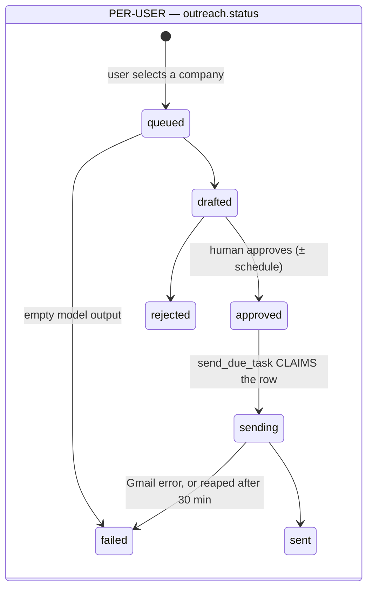

# Stack 4 — Scheduled Sends & Daily Cadence Implementation Plan

> **For agentic workers:** REQUIRED SUB-SKILL: Use superpowers:subagent-driven-development (recommended) or superpowers:executing-plans to implement this plan task-by-task. Steps use checkbox (`- [ ]`) syntax for tracking.

**Goal:** Let a user approve a draft now and have it delivered later — at a datetime they pick, or spread automatically by a daily cadence.

**Architecture:** Most of the schema already exists: `outreach.scheduled_send_at` was created in Stack 1b and `pending_sends` already filters on it. This stack adds `users.send_cadence` (JSONB), the slot arithmetic in `cadence.py`, and a Beat scanner that **claims rows** via a conditional `UPDATE` before dispatching — the guard that stops Celery's at-least-once task delivery from becoming at-least-once *email*.

**Tech Stack:** Python 3.12, PostgreSQL 16, Celery 5.3 + Beat, `zoneinfo`, FastAPI, pytest, Next.js 15

**Spec:** [`docs/superpowers/specs/2026-08-14-stack-4-scheduling-design.md`](../specs/2026-08-14-stack-4-scheduling-design.md)

**Branch:** `feat/scheduling` off `feat/pool-and-drafting`. Open the PR with `gh pr create --base feat/pool-and-drafting`.

## Global Constraints

- **All timestamps are stored and compared in UTC.** The cadence carries an IANA timezone *name*, used only to answer "which local day is this, and is it inside the window."
- Store a **zone name, never a fixed offset**. `-05:00` is wrong for half the year.
- The scanner must use `datetime.now(timezone.utc)` **explicitly**. `celery_app.py` sets `timezone="America/Toronto"`, which governs Beat's cron interpretation, not the scanner's comparisons — inheriting a process default here is how a scheduler ends up five hours off in production and correct on a laptop.
- Slots are **evenly spaced across the window**, never all at `window_start`. Ten emails at exactly 09:00:00 is the burst cadence exists to prevent.
- `next_slot` raises `CadenceUnsatisfiable` past a **90-day horizon**. Silently scheduling a send for 2028 is worse than failing.
- `sending` is a new `outreach.status`. The scanner claims rows with a single `UPDATE ... WHERE status='approved' RETURNING id` and dispatches **only the returned ids**.
- A row stuck in `sending` for >30 minutes is **dead-lettered, never auto-retried**. Retrying a send whose outcome is unknown is exactly how a double-send happens.
- `POST /unschedule` returns a row to `drafted`, **not** `queued` — the draft already exists, and re-running the LLM would spend quota and produce copy the user never reviewed.
- Cadence validation: `1 <= max_per_day <= 50`; `days` a non-empty subset of 0–6; `window_end > window_start`; `timezone` resolvable by `zoneinfo`.
- An unresolvable timezone must **422**. Accepting it makes `next_slot` raise inside a Celery worker, turning a form typo into a background failure the user cannot connect to their action.
- A past `scheduled_send_at` is **accepted** and sends on the next tick. Rejecting a timestamp that went stale while the user read the draft would be hostile.
- Run `uv run pytest` before every commit.

---

## File Structure

| File | Responsibility |
|---|---|
| `migrations/009_send_cadence.sql` | `users.send_cadence`, partial due index, `sending` status |
| `cold_email/cadence.py` | `next_slot`, `validate_cadence` — pure, no I/O |
| `cold_email/workers/logistics/logistics.py` | `send_due_task` (claim + dispatch), stale reaper |
| `cold_email/api/routes/outreach.py` | Approve with schedule, bulk-approve, unschedule |
| `cold_email/api/routes/cadence.py` | Cadence CRUD |
| `cold_email/celery_app.py` | 5-minute scanner |
| `frontend/components/ScheduleDialog.tsx` | Datetime picker |
| `frontend/components/CadenceSettings.tsx` | Cadence editor with a slot preview |
| `frontend/components/ScheduledQueue.tsx` | Upcoming sends |

---

### Task 1: Migration and the `sending` status

**Files:**
- Create: `migrations/009_send_cadence.sql`
- Modify: `cold_email/database.py`
- Test: `tests/test_scheduling_model.py`

**Interfaces:**
- Consumes: `users`, `outreach`
- Produces: `users.send_cadence` (JSONB), `outreach_due_idx`, `OUTREACH_SENDING = "sending"`

- [ ] **Step 1: Write the failing test**

Create `tests/test_scheduling_model.py`:

```python
import pytest

from cold_email.database import OUTREACH_SENDING


def test_sending_status_exists():
    """Celery guarantees at-least-once task delivery, so a scanner over rows
    that only leave on success will eventually dispatch one twice. 'approved'
    cannot express 'already handed to a worker'."""
    assert OUTREACH_SENDING == "sending"


@pytest.mark.asyncio
async def test_send_cadence_defaults_to_null(async_session, admin_user):
    """NULL means send immediately on approve — no cadence configured."""
    assert admin_user.send_cadence is None


@pytest.mark.asyncio
async def test_send_cadence_round_trips_as_jsonb(async_session, admin_user):
    admin_user.send_cadence = {
        "max_per_day": 10,
        "days": [0, 1, 2, 3, 4],
        "window_start": "09:00",
        "window_end": "17:00",
        "timezone": "America/Toronto",
    }
    await async_session.commit()
    await async_session.refresh(admin_user)
    assert admin_user.send_cadence["max_per_day"] == 10
    assert admin_user.send_cadence["days"] == [0, 1, 2, 3, 4]
```

- [ ] **Step 2: Run it to verify it fails**

Run: `uv run pytest tests/test_scheduling_model.py -v`
Expected: FAIL — `ImportError: cannot import name 'OUTREACH_SENDING'`

- [ ] **Step 3: Write the migration**

Create `migrations/009_send_cadence.sql`:

```sql
-- 009_send_cadence.sql
--
-- Per-user send cadence, plus the index the due-send scanner reads.
--
-- outreach.scheduled_send_at already exists (migration 006) and pending_sends
-- already filters on it, so nothing about the outreach table changes here.

-- JSONB, not five columns: the object is always read and written whole, never
-- queried into, and it will grow (min_gap_minutes, per-day overrides) without a
-- migration each time. NULL means "send immediately on approve".
ALTER TABLE users ADD COLUMN IF NOT EXISTS send_cadence JSONB;

-- PARTIAL index. The scanner runs every 5 minutes forever, and 'sent' rows will
-- eventually dominate the table. Indexing all statuses would grow an index
-- without bound while only a sliver is ever read.
CREATE INDEX IF NOT EXISTS outreach_due_idx ON outreach (scheduled_send_at)
    WHERE status = 'approved';

-- Rows the scanner claimed but whose outcome is unknown (worker crashed
-- mid-flight). Reaped into the DLQ after 30 minutes, never auto-retried.
CREATE INDEX IF NOT EXISTS outreach_sending_idx ON outreach (updated_at)
    WHERE status = 'sending';
```

- [ ] **Step 4: Update the models**

In `cold_email/database.py`, add the status constant next to the others:

```python
# 'sending' is a claim marker, not a derived state. The scanner sets it in the
# same UPDATE that selects the row, so two overlapping scanner runs cannot both
# dispatch the same send. Without it, Celery's at-least-once task delivery
# becomes at-least-once EMAIL — and a cold email sent twice cannot be undone.
OUTREACH_SENDING = "sending"
```

Add the column to `User`:

```python
    # NULL = send immediately on approve. See cold_email/cadence.py.
    send_cadence = Column(JSONB)
```

- [ ] **Step 5: Run it to verify it passes**

Run: `uv run pytest tests/test_scheduling_model.py -v`
Expected: PASS (3 tests)

- [ ] **Step 6: Commit**

```bash
git add migrations/009_send_cadence.sql cold_email/database.py tests/test_scheduling_model.py
git commit -m "feat(scheduling): add send_cadence, the due index, and the sending status"
```

---

### Task 2: Slot arithmetic

**Files:**
- Create: `cold_email/cadence.py`
- Test: `tests/test_cadence.py`

**Interfaces:**
- Consumes: `zoneinfo`
- Produces: `CadenceUnsatisfiable`, `CadenceInvalid`, `HORIZON_DAYS = 90`, `MAX_PER_DAY_CEILING = 50`, `validate_cadence(cadence) -> dict`, `next_slot(cadence, scheduled, now) -> datetime`

- [ ] **Step 1: Write the failing test**

Create `tests/test_cadence.py`:

```python
"""Cadence slot arithmetic — pure functions, the highest-value tests in the stack.

DST is the reason these exist. America/Toronto has a day with no 02:30 and a day
with two, so any local-time reasoning is wrong twice a year.
"""

from datetime import UTC, datetime, timedelta
from zoneinfo import ZoneInfo

import pytest

from cold_email.cadence import (
    CadenceInvalid,
    CadenceUnsatisfiable,
    next_slot,
    validate_cadence,
)

TORONTO = ZoneInfo("America/Toronto")

WEEKDAYS_9_TO_5 = {
    "max_per_day": 4,
    "days": [0, 1, 2, 3, 4],
    "window_start": "09:00",
    "window_end": "17:00",
    "timezone": "America/Toronto",
}


def _local(slot: datetime) -> datetime:
    return slot.astimezone(TORONTO)


# ------------------------------------------------------------------ basic slots

def test_first_slot_opens_the_window():
    # Friday 2026-08-14, 06:00 local — before the window.
    now = datetime(2026, 8, 14, 6, 0, tzinfo=TORONTO).astimezone(UTC)
    slot = _local(next_slot(WEEKDAYS_9_TO_5, [], now))
    assert (slot.hour, slot.minute) == (9, 0)
    assert slot.date() == datetime(2026, 8, 14).date()


def test_returns_utc():
    now = datetime(2026, 8, 14, 6, 0, tzinfo=TORONTO).astimezone(UTC)
    assert next_slot(WEEKDAYS_9_TO_5, [], now).tzinfo is UTC


def test_slots_are_evenly_spaced_across_the_window():
    """Ten emails at exactly 09:00:00 is the burst the cadence exists to
    prevent, so slots spread rather than stacking at window_start."""
    now = datetime(2026, 8, 14, 6, 0, tzinfo=TORONTO).astimezone(UTC)

    scheduled, times = [], []
    for _ in range(4):
        slot = next_slot(WEEKDAYS_9_TO_5, scheduled, now)
        scheduled.append(slot)
        times.append(_local(slot))

    assert [(t.hour, t.minute) for t in times] == [(9, 0), (11, 0), (13, 0), (15, 0)]


def test_day_rolls_over_once_max_per_day_is_reached():
    now = datetime(2026, 8, 14, 6, 0, tzinfo=TORONTO).astimezone(UTC)
    scheduled = [next_slot(WEEKDAYS_9_TO_5, [], now)]
    for _ in range(3):
        scheduled.append(next_slot(WEEKDAYS_9_TO_5, scheduled, now))

    fifth = _local(next_slot(WEEKDAYS_9_TO_5, scheduled, now))
    assert fifth.date() == datetime(2026, 8, 17).date()   # Monday, skipping the weekend
    assert (fifth.hour, fifth.minute) == (9, 0)


def test_non_cadence_days_are_skipped():
    # Saturday 2026-08-15.
    now = datetime(2026, 8, 15, 10, 0, tzinfo=TORONTO).astimezone(UTC)
    slot = _local(next_slot(WEEKDAYS_9_TO_5, [], now))
    assert slot.weekday() == 0                            # Monday
    assert slot.date() == datetime(2026, 8, 17).date()


def test_mid_window_now_does_not_schedule_in_the_past():
    now = datetime(2026, 8, 14, 13, 30, tzinfo=TORONTO).astimezone(UTC)
    assert next_slot(WEEKDAYS_9_TO_5, [], now) >= now


def test_slots_strictly_increase_across_many_days():
    now = datetime(2026, 8, 14, 6, 0, tzinfo=TORONTO).astimezone(UTC)
    scheduled = []
    for _ in range(20):
        scheduled.append(next_slot(WEEKDAYS_9_TO_5, scheduled, now))

    assert scheduled == sorted(scheduled)
    assert len(set(scheduled)) == 20


# ------------------------------------------------------------------------- DST

def test_spring_forward_produces_valid_increasing_instants():
    """2026-03-08: America/Toronto skips 02:00-03:00 local. A window spanning it
    must still yield valid, ordered UTC instants."""
    cadence = {**WEEKDAYS_9_TO_5, "window_start": "01:00", "window_end": "05:00",
               "days": [0, 1, 2, 3, 4, 5, 6], "max_per_day": 4}
    now = datetime(2026, 3, 8, 0, 0, tzinfo=TORONTO).astimezone(UTC)

    scheduled = []
    for _ in range(4):
        scheduled.append(next_slot(cadence, scheduled, now))

    assert scheduled == sorted(scheduled)
    assert len(set(scheduled)) == 4
    for slot in scheduled:
        assert slot.tzinfo is UTC
        _local(slot)   # must not raise


def test_fall_back_produces_no_duplicate_utc_slots():
    """2026-11-01: 01:00-02:00 local happens twice. Two distinct UTC instants
    map to the same local time, so naive local arithmetic would emit duplicates."""
    cadence = {**WEEKDAYS_9_TO_5, "window_start": "00:30", "window_end": "04:00",
               "days": [0, 1, 2, 3, 4, 5, 6], "max_per_day": 4}
    now = datetime(2026, 11, 1, 0, 0, tzinfo=TORONTO).astimezone(UTC)

    scheduled = []
    for _ in range(4):
        scheduled.append(next_slot(cadence, scheduled, now))

    assert len(set(scheduled)) == 4


def test_a_non_utc_cadence_converts_back_to_the_intended_local_time():
    cadence = {**WEEKDAYS_9_TO_5, "timezone": "Asia/Tokyo"}
    tokyo = ZoneInfo("Asia/Tokyo")
    now = datetime(2026, 8, 14, 6, 0, tzinfo=tokyo).astimezone(UTC)

    slot = next_slot(cadence, [], now).astimezone(tokyo)
    assert (slot.hour, slot.minute) == (9, 0)


# --------------------------------------------------------------- unsatisfiable

def test_pathological_cadence_with_a_large_backlog_raises():
    """max_per_day=1 on Sundays only, with 200 approved: failing loudly beats
    silently scheduling a send for 2028."""
    cadence = {"max_per_day": 1, "days": [6], "window_start": "09:00",
               "window_end": "10:00", "timezone": "America/Toronto"}
    now = datetime(2026, 8, 14, 6, 0, tzinfo=TORONTO).astimezone(UTC)

    scheduled = [now + timedelta(days=7 * i) for i in range(200)]
    with pytest.raises(CadenceUnsatisfiable):
        next_slot(cadence, scheduled, now)


# ----------------------------------------------------------------- validation

@pytest.mark.parametrize(
    "override",
    [
        {"max_per_day": 0},
        {"max_per_day": 51},
        {"days": []},
        {"days": [7]},
        {"days": [-1]},
        {"window_start": "17:00", "window_end": "09:00"},
        {"window_start": "09:00", "window_end": "09:00"},
        {"timezone": "Mars/Olympus_Mons"},
        {"timezone": "EST5EDT-nonsense"},
        {"window_start": "9am"},
    ],
)
def test_validation_rejects_bad_fields(override):
    with pytest.raises(CadenceInvalid):
        validate_cadence({**WEEKDAYS_9_TO_5, **override})


def test_validation_accepts_a_good_cadence():
    assert validate_cadence(WEEKDAYS_9_TO_5)["max_per_day"] == 4
```

- [ ] **Step 2: Run it to verify it fails**

Run: `uv run pytest tests/test_cadence.py -v`
Expected: FAIL — `ModuleNotFoundError: cold_email.cadence`

- [ ] **Step 3: Implement it**

Create `cold_email/cadence.py`:

```python
"""Daily send-cadence slot arithmetic.

Cadence is the deliverability feature: forty emails leaving one Gmail account in
ninety seconds is the clearest spam signal a new sender can produce.

TIME HANDLING — the part that is easy to get wrong:

All timestamps are stored and compared in UTC. The cadence carries an IANA
timezone NAME, used only to answer "which local day is this, and is it inside the
user's window."

Storing local times would make DST a correctness bug: America/Toronto has a day
with no 02:30 and a day with two, so a stored local timestamp is either
non-existent or ambiguous twice a year. UTC plus a zone name is unambiguous
always. And the name is stored rather than a fixed offset because -05:00 is wrong
for half the year.
"""

import logging
from datetime import UTC, datetime, time, timedelta
from zoneinfo import ZoneInfo, ZoneInfoNotFoundError

logger = logging.getLogger(__name__)

HORIZON_DAYS = 90
MAX_PER_DAY_CEILING = 50   # deliverability guardrail; consumer Gmail caps ~500/day


class CadenceInvalid(ValueError):
    """The cadence object is malformed."""


class CadenceUnsatisfiable(RuntimeError):
    """No slot exists within the horizon for this cadence and backlog."""


def _parse_hhmm(value: str, field: str) -> time:
    try:
        hour, minute = value.split(":")
        return time(int(hour), int(minute))
    except (ValueError, AttributeError) as exc:
        raise CadenceInvalid(f"{field} must be 'HH:MM', got {value!r}") from exc


def validate_cadence(cadence: dict) -> dict:
    """Validate and normalise a cadence, or raise CadenceInvalid.

    The timezone check matters most: accepting an unresolvable name would make
    next_slot raise inside a Celery worker, turning a form typo into a background
    failure the user cannot connect to their action.
    """
    max_per_day = cadence.get("max_per_day")
    if not isinstance(max_per_day, int) or not (1 <= max_per_day <= MAX_PER_DAY_CEILING):
        raise CadenceInvalid(f"max_per_day must be 1-{MAX_PER_DAY_CEILING}")

    days = cadence.get("days")
    if not isinstance(days, list) or not days or not all(
        isinstance(d, int) and 0 <= d <= 6 for d in days
    ):
        raise CadenceInvalid("days must be a non-empty list of integers 0-6 (Mon-Sun)")

    start = _parse_hhmm(cadence.get("window_start"), "window_start")
    end = _parse_hhmm(cadence.get("window_end"), "window_end")
    if end <= start:
        raise CadenceInvalid("window_end must be after window_start")

    try:
        ZoneInfo(cadence.get("timezone", ""))
    except (ZoneInfoNotFoundError, ValueError, TypeError) as exc:
        raise CadenceInvalid(f"Unknown timezone: {cadence.get('timezone')!r}") from exc

    return {
        "max_per_day": max_per_day,
        "days": sorted(set(days)),
        "window_start": start.strftime("%H:%M"),
        "window_end": end.strftime("%H:%M"),
        "timezone": cadence["timezone"],
    }


def _slot_offsets(start: time, end: time, count: int) -> list[timedelta]:
    """Offsets from window_start for `count` evenly spaced slots.

    Evenly spaced, not all at window_start: N emails at the same instant is the
    burst this exists to prevent. With 09:00-17:00 and max_per_day=10, slots land
    every 48 minutes.
    """
    span = (
        datetime.combine(datetime.min, end) - datetime.combine(datetime.min, start)
    )
    step = span / count
    return [step * index for index in range(count)]


def next_slot(cadence: dict, scheduled: list[datetime], now: datetime) -> datetime:
    """The earliest UTC instant satisfying the cadence, given what is queued.

    Walks forward day by day in the user's timezone, skipping days not in
    `cadence["days"]` and days already at `max_per_day`, then returns the first
    free evenly-spaced slot at or after `now`.
    """
    cadence = validate_cadence(cadence)
    zone = ZoneInfo(cadence["timezone"])
    start = _parse_hhmm(cadence["window_start"], "window_start")
    end = _parse_hhmm(cadence["window_end"], "window_end")
    per_day = cadence["max_per_day"]

    # Group existing sends by LOCAL calendar day — "10 per day" means the user's
    # day, not a UTC day.
    taken: dict[object, set[datetime]] = {}
    for slot in scheduled:
        local = slot.astimezone(zone)
        taken.setdefault(local.date(), set()).add(slot)

    local_now = now.astimezone(zone)
    offsets = _slot_offsets(start, end, per_day)

    for day_index in range(HORIZON_DAYS):
        day = (local_now + timedelta(days=day_index)).date()

        if day.weekday() not in cadence["days"]:
            continue

        already = taken.get(day, set())
        if len(already) >= per_day:
            continue

        for offset in offsets:
            # Build the local wall-clock instant, then convert to UTC. On a
            # spring-forward day a skipped local time normalises to a real
            # instant; on fall-back, distinct offsets still yield distinct UTC
            # instants because the offsets themselves differ.
            candidate_local = datetime.combine(day, start, tzinfo=zone) + offset
            candidate = candidate_local.astimezone(UTC)

            if candidate < now:
                continue
            if candidate in already:
                continue
            return candidate

    raise CadenceUnsatisfiable(
        f"No cadence slot available within {HORIZON_DAYS} days "
        f"({per_day}/day on days {cadence['days']}, {len(scheduled)} already queued)"
    )
```

- [ ] **Step 4: Run it to verify it passes**

Run: `uv run pytest tests/test_cadence.py -v`
Expected: PASS (all cases, including both DST transitions)

- [ ] **Step 5: Commit**

```bash
git add cold_email/cadence.py tests/test_cadence.py
git commit -m "feat(scheduling): add cadence slot arithmetic

UTC storage plus an IANA zone name. Local-time arithmetic would be wrong twice
a year: Toronto has a day with no 02:30 and a day with two."
```

---

### Task 3: The due-send scanner

**Files:**
- Modify: `cold_email/workers/logistics/logistics.py`
- Modify: `cold_email/workers/logistics/constants.py`
- Modify: `cold_email/celery_app.py`
- Test: `tests/test_send_due.py`

**Interfaces:**
- Consumes: `pending_sends`, `fail_outreach`, `resolve_gmail_credentials`
- Produces: `send_due_task() -> dict`, `reap_stuck_sends() -> dict`, `STUCK_SENDING_MINUTES = 30`, `ERR_SEND_STATUS_UNKNOWN`

- [ ] **Step 1: Write the failing test**

Create `tests/test_send_due.py`:

```python
from datetime import UTC, datetime, timedelta

import pytest


@pytest.mark.asyncio
async def test_dispatches_null_and_past_schedules(
    async_session, approved_outreach_factory, sync_session_for, monkeypatch
):
    dispatched = []
    monkeypatch.setattr(
        "cold_email.workers.logistics.logistics.logistics_task",
        type("T", (), {"delay": staticmethod(lambda oid: dispatched.append(oid))}),
    )

    now = datetime.now(UTC)
    await approved_outreach_factory(scheduled_send_at=None)
    await approved_outreach_factory(scheduled_send_at=now - timedelta(minutes=5))
    await approved_outreach_factory(scheduled_send_at=now + timedelta(hours=3))

    from cold_email.workers.logistics.logistics import send_due_task

    result = send_due_task()
    assert result["dispatched"] == 2
    assert len(dispatched) == 2


@pytest.mark.asyncio
async def test_overlapping_scans_dispatch_each_row_exactly_once(
    async_session, approved_outreach_factory, sync_session_for, monkeypatch
):
    """THE test for this stack. Celery guarantees at-least-once task delivery, so
    a scanner over rows that only leave the set on success will eventually
    dispatch the same row twice — and a cold email sent twice to a founder
    cannot be undone.

    The claim UPDATE is what prevents it: the second scan's UPDATE matches
    nothing.
    """
    dispatched = []
    monkeypatch.setattr(
        "cold_email.workers.logistics.logistics.logistics_task",
        type("T", (), {"delay": staticmethod(lambda oid: dispatched.append(oid))}),
    )

    await approved_outreach_factory(scheduled_send_at=None)

    from cold_email.workers.logistics.logistics import send_due_task

    send_due_task()
    send_due_task()

    assert len(dispatched) == 1
    assert len(set(dispatched)) == 1


@pytest.mark.asyncio
async def test_claimed_rows_move_to_sending(
    async_session, approved_outreach_factory, sync_session_for, monkeypatch
):
    monkeypatch.setattr(
        "cold_email.workers.logistics.logistics.logistics_task",
        type("T", (), {"delay": staticmethod(lambda oid: None)}),
    )
    outreach = await approved_outreach_factory(scheduled_send_at=None)

    from cold_email.database import OUTREACH_SENDING
    from cold_email.workers.logistics.logistics import send_due_task

    send_due_task()
    await async_session.refresh(outreach)
    assert outreach.status == OUTREACH_SENDING


@pytest.mark.asyncio
async def test_a_row_already_sending_is_not_redispatched(
    async_session, approved_outreach_factory, sync_session_for, monkeypatch
):
    dispatched = []
    monkeypatch.setattr(
        "cold_email.workers.logistics.logistics.logistics_task",
        type("T", (), {"delay": staticmethod(lambda oid: dispatched.append(oid))}),
    )

    from cold_email.database import OUTREACH_SENDING

    outreach = await approved_outreach_factory(scheduled_send_at=None)
    outreach.status = OUTREACH_SENDING
    await async_session.commit()

    from cold_email.workers.logistics.logistics import send_due_task

    send_due_task()
    assert dispatched == []


@pytest.mark.asyncio
async def test_logistics_task_is_a_noop_when_the_row_is_not_sending(
    async_session, approved_outreach_factory, sync_session_for, monkeypatch
):
    """The second guard: a duplicate Celery delivery must not send again."""
    sent = []
    monkeypatch.setattr(
        "cold_email.workers.logistics.logistics.send_draft",
        lambda creds, draft_id: sent.append(draft_id) or "msg-1",
    )

    from cold_email.database import OUTREACH_SENT

    outreach = await approved_outreach_factory(scheduled_send_at=None)
    outreach.status = OUTREACH_SENT
    await async_session.commit()

    from cold_email.workers.logistics.logistics import logistics_task

    logistics_task(str(outreach.id))
    assert sent == []


@pytest.mark.asyncio
async def test_stuck_sending_rows_are_dead_lettered_not_retried(
    async_session, approved_outreach_factory, sync_session_for
):
    """Automatically retrying a send whose outcome is unknown is precisely how a
    double-send happens."""
    from cold_email.database import OUTREACH_SENDING, DeadLetter

    outreach = await approved_outreach_factory(scheduled_send_at=None)
    outreach.status = OUTREACH_SENDING
    outreach.updated_at = datetime.now(UTC) - timedelta(hours=2)
    await async_session.commit()

    from cold_email.workers.logistics.logistics import reap_stuck_sends

    assert reap_stuck_sends()["reaped"] == 1

    from sqlalchemy import select

    dl = (await async_session.execute(select(DeadLetter))).scalar_one()
    assert dl.stage == "logistics"
    assert "unknown" in dl.error_msg.lower()


@pytest.mark.asyncio
async def test_recently_claimed_rows_are_not_reaped(
    async_session, approved_outreach_factory, sync_session_for
):
    from cold_email.database import OUTREACH_SENDING

    outreach = await approved_outreach_factory(scheduled_send_at=None)
    outreach.status = OUTREACH_SENDING
    await async_session.commit()

    from cold_email.workers.logistics.logistics import reap_stuck_sends

    assert reap_stuck_sends()["reaped"] == 0


@pytest.mark.asyncio
async def test_uses_the_owning_users_credentials(
    async_session, two_users_approved, sync_session_for, monkeypatch
):
    used = []
    monkeypatch.setattr(
        "cold_email.workers.logistics.logistics.send_draft",
        lambda creds, draft_id: used.append(creds.sender_email) or "msg-1",
    )

    from cold_email.workers.logistics.logistics import logistics_task

    logistics_task(str(two_users_approved["outreach_a"].id))
    assert used == ["a@example.com"]


@pytest.mark.asyncio
async def test_a_deleted_gmail_draft_fails_only_that_row(
    async_session, approved_outreach_factory, sync_session_for, monkeypatch
):
    """gmail_draft_id points at a resource the user can delete by hand between
    approving and the scheduled send. It must never abort the scan."""
    from googleapiclient.errors import HttpError

    def boom(creds, draft_id):
        raise HttpError(resp=type("R", (), {"status": 404})(), content=b"not found")

    monkeypatch.setattr("cold_email.workers.logistics.logistics.send_draft", boom)

    from cold_email.database import OUTREACH_FAILED, OUTREACH_SENDING

    outreach = await approved_outreach_factory(scheduled_send_at=None)
    outreach.status = OUTREACH_SENDING
    await async_session.commit()

    from cold_email.workers.logistics.logistics import logistics_task

    logistics_task(str(outreach.id))
    await async_session.refresh(outreach)
    assert outreach.status == OUTREACH_FAILED
```

Add `approved_outreach_factory` (creates a company, eligible contact, `approved`
outreach with a draft carrying a `gmail_draft_id`, and Gmail credentials on the
owner) and `two_users_approved` to `tests/conftest.py`.

- [ ] **Step 2: Run it to verify it fails**

Run: `uv run pytest tests/test_send_due.py -v`
Expected: FAIL — `send_due_task` does not exist.

- [ ] **Step 3: Implement the scanner**

In `cold_email/workers/logistics/logistics.py`:

```python
STUCK_SENDING_MINUTES = 30

# The claim. Selecting and marking in ONE statement is what makes the scanner
# safe: two overlapping runs cannot both claim a row, because the second
# UPDATE's WHERE status='approved' matches nothing.
_CLAIM_DUE = text("""
    UPDATE outreach
    SET status = 'sending', updated_at = now()
    WHERE id IN (SELECT outreach_id FROM pending_sends)
      AND status = 'approved'
    RETURNING id
""")


@shared_task(name="cold_email.workers.logistics.send_due_task")
def send_due_task() -> dict:
    """Dispatch logistics_task for every approved outreach row now due.

    Runs every 5 minutes. pending_sends already carries the
    `scheduled_send_at IS NULL OR <= now()` clause from migration 006, so NULL
    means "send immediately".

    Only the ids the claim UPDATE actually returns are dispatched.
    """
    with get_sync_session() as session:
        claimed = session.execute(_CLAIM_DUE).scalars().all()
        session.commit()

    for outreach_id in claimed:
        logistics_task.delay(str(outreach_id))

    if claimed:
        logger.info(f"Claimed and dispatched {len(claimed)} due sends")
    return {"status": "success", "dispatched": len(claimed)}


@shared_task(name="cold_email.workers.logistics.reap_stuck_sends")
def reap_stuck_sends() -> dict:
    """Dead-letter rows stuck in 'sending' — a worker died mid-flight.

    Surfaced, NOT auto-retried. The row was claimed and may or may not have been
    delivered; retrying a send whose outcome is unknown is precisely how a
    double-send happens. A human verifies the mailbox, then retries via the DLQ.
    """
    with get_sync_session() as session:
        stuck = session.execute(
            text("""
                SELECT id FROM outreach
                WHERE status = 'sending'
                  AND updated_at < now() - make_interval(mins => :mins)
            """),
            {"mins": STUCK_SENDING_MINUTES},
        ).scalars().all()

    for outreach_id in stuck:
        fail_outreach(
            str(outreach_id),
            ERR_SEND_STATUS_UNKNOWN,
            stage=LOGISTICS,
            task_name="cold_email.workers.logistics.send_due_task",
        )

    return {"status": "success", "reaped": len(stuck)}
```

- [ ] **Step 4: Add the second guard to `logistics_task`**

```python
def logistics_task(self, outreach_id: str) -> dict:
    """Send one claimed draft."""
    with get_sync_session() as session:
        outreach = session.get(Outreach, outreach_id)
        if outreach is None:
            return {"status": "skipped", "reason": "not_found"}

        # The second guard. Celery may deliver a task more than once; without
        # this re-check, a duplicate delivery would send the email twice.
        if outreach.status != OUTREACH_SENDING:
            logger.info(
                f"Outreach {outreach_id} is {outreach.status}, not sending; skipping"
            )
            return {"status": "skipped", "reason": "not_claimed"}

        user = session.get(User, outreach.user_id)
        creds = resolve_gmail_credentials(user)
    ...
    try:
        message_id = send_draft(creds, row.gmail_draft_id)
    except HttpError as exc:
        # The user can delete the draft by hand in Gmail between approving and
        # the scheduled send. Terminal for this row, never for the scan.
        fail_outreach(
            outreach_id, f"{ERR_SEND_FAILED}: {exc}",
            stage=LOGISTICS, task_name="cold_email.workers.logistics.logistics_task",
        )
        return {"status": "failed", "error": str(exc)}

    update_outreach_status(outreach_id, OUTREACH_SENT)
    return {"status": "success", "message_id": message_id}
```

Add to `logistics/constants.py`:

```python
ERR_SEND_STATUS_UNKNOWN = (
    "Send status unknown — the worker was claimed but never completed. "
    "Verify the mailbox before retrying."
)
ERR_SEND_FAILED = "Gmail send failed"
```

- [ ] **Step 5: Add the Beat entries**

In `cold_email/celery_app.py`:

```python
    # Scheduled sends. pending_sends treats a NULL scheduled_send_at as due, so
    # an approve with no schedule goes out on the next tick (<= 5 minutes).
    "send-due-sweep": {
        "task": "cold_email.workers.logistics.send_due_task",
        "schedule": crontab(minute="*/5"),
    },
    # Surface sends whose outcome is unknown. Hourly is enough — these are
    # worker crashes, and they are reported rather than retried.
    "reap-stuck-sends": {
        "task": "cold_email.workers.logistics.reap_stuck_sends",
        "schedule": crontab(minute=30),
    },
```

⚠️ Add this comment above the `timezone` setting in the same file:

```python
    # Governs BEAT's cron interpretation only. The due-send scanner compares
    # timestamps with datetime.now(timezone.utc) explicitly — relying on this
    # process default is how a scheduler ends up five hours off in production
    # and correct on a laptop.
    timezone="America/Toronto",
```

- [ ] **Step 6: Run it to verify it passes**

Run: `uv run pytest tests/test_send_due.py -v`
Expected: PASS (9 tests)

- [ ] **Step 7: Commit**

```bash
git add cold_email/workers/logistics/ cold_email/celery_app.py tests/test_send_due.py
git commit -m "feat(scheduling): add the due-send scanner with claim-before-dispatch

Celery's at-least-once task delivery would otherwise become at-least-once
email. Stuck sends are dead-lettered, never auto-retried."
```

---

### Task 4: Approve with a schedule; cadence API

**Files:**
- Create: `cold_email/api/routes/cadence.py`
- Modify: `cold_email/api/routes/outreach.py`
- Modify: `cold_email/api/routes/api.py`
- Test: `tests/test_scheduling_api.py`

**Interfaces:**
- Consumes: `cadence.next_slot`, `cadence.validate_cadence`
- Produces: `POST /api/outreach/{id}/approve` (optional body), `POST /api/outreach/bulk-approve`, `POST /api/outreach/{id}/unschedule`, `GET /api/outreach/scheduled`, `GET/PUT/DELETE /api/cadence`

- [ ] **Step 1: Write the failing test**

Create `tests/test_scheduling_api.py`:

```python
from datetime import UTC, datetime, timedelta

import pytest

CADENCE = {
    "max_per_day": 2,
    "days": [0, 1, 2, 3, 4, 5, 6],
    "window_start": "09:00",
    "window_end": "17:00",
    "timezone": "America/Toronto",
}


@pytest.mark.asyncio
async def test_explicit_datetime_is_stored(user_client, drafted_outreach, async_session):
    when = datetime.now(UTC) + timedelta(days=3)
    response = await user_client.post(
        f"/api/outreach/{drafted_outreach.id}/approve",
        json={"scheduled_send_at": when.isoformat()},
    )
    assert response.status_code == 200

    await async_session.refresh(drafted_outreach)
    assert drafted_outreach.status == "approved"
    assert abs((drafted_outreach.scheduled_send_at - when).total_seconds()) < 1


@pytest.mark.asyncio
async def test_send_now_overrides_the_cadence(
    user_client, drafted_outreach, async_session, with_cadence
):
    await user_client.post(
        f"/api/outreach/{drafted_outreach.id}/approve", json={"send_now": True}
    )
    await async_session.refresh(drafted_outreach)
    assert drafted_outreach.scheduled_send_at is None   # NULL = next tick


@pytest.mark.asyncio
async def test_empty_body_with_a_cadence_computes_a_slot(
    user_client, drafted_outreach, async_session, with_cadence
):
    await user_client.post(f"/api/outreach/{drafted_outreach.id}/approve")
    await async_session.refresh(drafted_outreach)
    assert drafted_outreach.scheduled_send_at is not None


@pytest.mark.asyncio
async def test_empty_body_without_a_cadence_sends_immediately(
    user_client, drafted_outreach, async_session
):
    await user_client.post(f"/api/outreach/{drafted_outreach.id}/approve")
    await async_session.refresh(drafted_outreach)
    assert drafted_outreach.scheduled_send_at is None


@pytest.mark.asyncio
async def test_a_past_timestamp_is_accepted(user_client, drafted_outreach):
    """Rejecting a timestamp that went stale while the user read the draft would
    be hostile; 'send immediately' is a reasonable reading."""
    past = (datetime.now(UTC) - timedelta(hours=1)).isoformat()
    response = await user_client.post(
        f"/api/outreach/{drafted_outreach.id}/approve", json={"scheduled_send_at": past}
    )
    assert response.status_code == 200


@pytest.mark.asyncio
async def test_beyond_the_horizon_is_422(user_client, drafted_outreach):
    far = (datetime.now(UTC) + timedelta(days=120)).isoformat()
    response = await user_client.post(
        f"/api/outreach/{drafted_outreach.id}/approve", json={"scheduled_send_at": far}
    )
    assert response.status_code == 422


@pytest.mark.asyncio
async def test_bulk_approve_spreads_slots_across_the_batch(
    user_client, three_drafted_outreach, async_session, with_cadence
):
    """Without this, approving 30 drafts produces 30 identical slots and cadence
    is unusable at exactly the volume that makes cadence necessary."""
    ids = [str(o.id) for o in three_drafted_outreach]
    response = await user_client.post("/api/outreach/bulk-approve", json={"outreach_ids": ids})
    assert response.status_code == 200

    for outreach in three_drafted_outreach:
        await async_session.refresh(outreach)

    slots = sorted(o.scheduled_send_at for o in three_drafted_outreach)
    assert len(set(slots)) == 3          # all distinct
    assert slots == sorted(slots)


@pytest.mark.asyncio
async def test_bulk_approve_without_a_cadence_leaves_every_slot_null(
    user_client, three_drafted_outreach, async_session
):
    ids = [str(o.id) for o in three_drafted_outreach]
    await user_client.post("/api/outreach/bulk-approve", json={"outreach_ids": ids})

    for outreach in three_drafted_outreach:
        await async_session.refresh(outreach)
        assert outreach.scheduled_send_at is None


@pytest.mark.asyncio
async def test_unsatisfiable_cadence_is_409(
    user_client, drafted_outreach, async_session, admin_user
):
    from sqlalchemy import select

    from cold_email.database import User

    user = (
        await async_session.execute(select(User).where(User.email == "user@example.com"))
    ).scalar_one()
    user.send_cadence = {
        "max_per_day": 1, "days": [6], "window_start": "09:00",
        "window_end": "10:00", "timezone": "America/Toronto",
    }
    await async_session.commit()

    # Fill the horizon so no slot remains.
    ...  # see Step 2

    response = await user_client.post(f"/api/outreach/{drafted_outreach.id}/approve")
    assert response.status_code == 409


@pytest.mark.asyncio
async def test_unschedule_returns_the_row_to_drafted(
    user_client, drafted_outreach, async_session, with_cadence
):
    """drafted, not queued: the draft exists, and re-running the LLM would spend
    quota and produce copy the user never reviewed."""
    await user_client.post(f"/api/outreach/{drafted_outreach.id}/approve")
    await user_client.post(f"/api/outreach/{drafted_outreach.id}/unschedule")

    await async_session.refresh(drafted_outreach)
    assert drafted_outreach.status == "drafted"
    assert drafted_outreach.scheduled_send_at is None


@pytest.mark.asyncio
@pytest.mark.parametrize(
    "override",
    [
        {"max_per_day": 0},
        {"max_per_day": 51},
        {"days": []},
        {"days": [9]},
        {"window_start": "18:00", "window_end": "09:00"},
        {"timezone": "Not/AZone"},
    ],
)
async def test_cadence_validation_rejects_bad_fields(user_client, override):
    response = await user_client.put("/api/cadence", json={**CADENCE, **override})
    assert response.status_code == 422


@pytest.mark.asyncio
async def test_cadence_crud(user_client):
    assert (await user_client.get("/api/cadence")).json()["cadence"] is None

    await user_client.put("/api/cadence", json=CADENCE)
    assert (await user_client.get("/api/cadence")).json()["cadence"]["max_per_day"] == 2

    await user_client.delete("/api/cadence")
    assert (await user_client.get("/api/cadence")).json()["cadence"] is None


@pytest.mark.asyncio
async def test_scheduled_queue_returns_only_the_callers_rows(
    user_client, other_user_scheduled
):
    body = (await user_client.get("/api/outreach/scheduled")).json()
    assert body["items"] == []


@pytest.mark.asyncio
@pytest.mark.parametrize("action", ["approve", "unschedule"])
async def test_another_users_row_is_404(user_client, other_user_outreach, action):
    assert (
        await user_client.post(f"/api/outreach/{other_user_outreach.id}/{action}")
    ).status_code == 404
```

- [ ] **Step 2: Complete the unsatisfiable fixture**

Replace the `...` in `test_unsatisfiable_cadence_is_409` with 200 approved rows
carrying `scheduled_send_at` on consecutive Sundays, created via
`approved_outreach_factory` in a loop — enough to exhaust a 1-per-Sunday cadence
across the 90-day horizon. Add `with_cadence` (sets `CADENCE` on `user_client`'s
user), `drafted_outreach`, `three_drafted_outreach`, and `other_user_scheduled`
fixtures to `tests/conftest.py`.

- [ ] **Step 3: Run it to verify it fails**

Run: `uv run pytest tests/test_scheduling_api.py -v`
Expected: FAIL — the approve route takes no body.

- [ ] **Step 4: Implement approve and bulk-approve**

In `cold_email/api/routes/outreach.py`:

```python
class ApproveRequest(BaseModel):
    scheduled_send_at: datetime | None = None
    send_now: bool = False


async def _resolve_send_time(
    session: AsyncSession, user: User, payload: ApproveRequest | None, count: int = 1
) -> list[datetime | None]:
    """Decide when `count` approvals should go out.

    | body                    | result                            |
    |-------------------------|-----------------------------------|
    | scheduled_send_at given | that instant                      |
    | send_now: true          | NULL → next scanner tick (<=5min) |
    | empty, cadence set      | next free cadence slot(s)         |
    | empty, no cadence       | NULL → next scanner tick          |
    """
    if payload and payload.scheduled_send_at:
        when = payload.scheduled_send_at
        if when > datetime.now(UTC) + timedelta(days=HORIZON_DAYS):
            raise HTTPException(
                status_code=422, detail=f"Cannot schedule more than {HORIZON_DAYS} days ahead"
            )
        # A past timestamp is accepted deliberately — it means "send now".
        return [when] * count

    if payload and payload.send_now:
        return [None] * count

    if not user.send_cadence:
        return [None] * count

    # Existing scheduled sends constrain the walk, so a batch spreads instead of
    # stacking on the same slot.
    existing = list(
        (
            await session.execute(
                select(Outreach.scheduled_send_at).where(
                    Outreach.user_id == user.id,
                    Outreach.status.in_([OUTREACH_APPROVED, OUTREACH_SENDING]),
                    Outreach.scheduled_send_at.isnot(None),
                )
            )
        ).scalars().all()
    )

    slots: list[datetime | None] = []
    now = datetime.now(UTC)
    try:
        for _ in range(count):
            slot = next_slot(user.send_cadence, existing, now)
            slots.append(slot)
            existing.append(slot)   # so the next iteration sees it as taken
    except CadenceUnsatisfiable as exc:
        raise HTTPException(status_code=409, detail=str(exc)) from exc

    return slots


@router.post("/{outreach_id}/approve")
async def approve(
    outreach_id: str,
    payload: ApproveRequest | None = None,
    user: User = Depends(get_current_user),
    session: AsyncSession = Depends(get_async_session),
):
    """Approve a draft, optionally scheduling it.

    Dispatch is left to send_due_task: pending_sends treats a NULL
    scheduled_send_at as due, so an unscheduled approve goes out within 5
    minutes. Dispatching directly here would bypass the claim guard and
    reintroduce the double-send risk.
    """
    outreach = await _own_outreach(session, outreach_id, user)
    [when] = await _resolve_send_time(session, user, payload)

    outreach.status = OUTREACH_APPROVED
    outreach.scheduled_send_at = when
    await session.commit()

    return {
        "success": True,
        "outreach_id": outreach_id,
        "status": OUTREACH_APPROVED,
        "scheduled_send_at": when.isoformat() if when else None,
    }


class BulkApproveRequest(BaseModel):
    outreach_ids: list[str] = Field(min_length=1, max_length=200)
    send_now: bool = False


@router.post("/bulk-approve")
async def bulk_approve(
    payload: BulkApproveRequest,
    user: User = Depends(get_current_user),
    session: AsyncSession = Depends(get_async_session),
):
    """Approve many drafts, spreading them across cadence slots in ONE walk.

    Approving each individually would give every draft the same "next free slot",
    making cadence useless at exactly the volume that makes it necessary.
    """
    rows = (
        await session.execute(
            select(Outreach).where(
                Outreach.id.in_(payload.outreach_ids),
                Outreach.user_id == user.id,
                Outreach.status == OUTREACH_DRAFTED,
            )
        )
    ).scalars().all()

    slots = await _resolve_send_time(
        session,
        user,
        ApproveRequest(send_now=payload.send_now),
        count=len(rows),
    )

    for outreach, when in zip(rows, slots, strict=True):
        outreach.status = OUTREACH_APPROVED
        outreach.scheduled_send_at = when

    await session.commit()

    return {
        "approved": [
            {"outreach_id": str(o.id), "scheduled_send_at": w.isoformat() if w else None}
            for o, w in zip(rows, slots, strict=True)
        ],
        "skipped": len(payload.outreach_ids) - len(rows),
    }


@router.post("/{outreach_id}/unschedule")
async def unschedule(
    outreach_id: str,
    user: User = Depends(get_current_user),
    session: AsyncSession = Depends(get_async_session),
):
    """Pull an approved send back to the review deck.

    Returns to 'drafted', NOT 'queued': the draft already exists, and re-running
    the LLM would spend quota and produce copy the user never reviewed.
    """
    outreach = await _own_outreach(session, outreach_id, user)
    outreach.status = OUTREACH_DRAFTED
    outreach.scheduled_send_at = None
    await session.commit()
    return {"success": True, "status": OUTREACH_DRAFTED}


@router.get("/scheduled")
async def list_scheduled(
    user: User = Depends(get_current_user),
    session: AsyncSession = Depends(get_async_session),
):
    """Upcoming sends for the caller, soonest first."""
    rows = (
        await session.execute(
            select(Outreach, Company.company_name)
            .join(Company, Company.id == Outreach.company_id)
            .where(
                Outreach.user_id == user.id,
                Outreach.status == OUTREACH_APPROVED,
                Outreach.scheduled_send_at.isnot(None),
            )
            .order_by(Outreach.scheduled_send_at)
        )
    ).all()

    return {
        "items": [
            {
                "outreach_id": str(o.id),
                "company_name": name,
                "scheduled_send_at": o.scheduled_send_at.isoformat(),
            }
            for o, name in rows
        ]
    }
```

- [ ] **Step 5: Implement the cadence routes**

Create `cold_email/api/routes/cadence.py`:

```python
"""Per-user send cadence.

Validation happens HERE, not in the worker. An unresolvable timezone accepted at
this boundary would make next_slot raise inside a Celery worker, turning a form
typo into a background failure the user cannot connect to their action.
"""

import logging

from fastapi import APIRouter, Depends, HTTPException
from sqlalchemy.ext.asyncio import AsyncSession

from cold_email.auth.deps import get_current_user
from cold_email.cadence import CadenceInvalid, validate_cadence
from cold_email.database import User, get_async_session

logger = logging.getLogger(__name__)

router = APIRouter(prefix="/cadence", tags=["cadence"])


@router.get("")
async def get_cadence(user: User = Depends(get_current_user)):
    """The caller's cadence, or null (meaning send immediately on approve)."""
    return {"cadence": user.send_cadence}


@router.put("")
async def put_cadence(
    payload: dict,
    user: User = Depends(get_current_user),
    session: AsyncSession = Depends(get_async_session),
):
    """Validate and save a cadence."""
    try:
        normalized = validate_cadence(payload)
    except CadenceInvalid as exc:
        raise HTTPException(status_code=422, detail=str(exc)) from exc

    user.send_cadence = normalized
    await session.commit()
    return {"cadence": normalized}


@router.delete("")
async def delete_cadence(
    user: User = Depends(get_current_user),
    session: AsyncSession = Depends(get_async_session),
):
    """Revert to sending immediately on approve."""
    user.send_cadence = None
    await session.commit()
    return {"cadence": None}
```

Register it in `api.py`.

- [ ] **Step 6: Run it to verify it passes**

Run: `uv run pytest tests/test_scheduling_api.py -v`
Expected: PASS

- [ ] **Step 7: Commit**

```bash
git add cold_email/api/routes/ tests/test_scheduling_api.py tests/conftest.py
git commit -m "feat(scheduling): approve with a schedule, bulk-approve, and cadence CRUD

bulk-approve spreads a batch in one cadence walk — approving each row
separately would give every draft the same next free slot."
```

---

### Task 5: Scheduling UI

**Files:**
- Create: `frontend/components/ScheduleDialog.tsx`
- Create: `frontend/components/CadenceSettings.tsx`
- Create: `frontend/components/ScheduledQueue.tsx`
- Modify: `frontend/components/ReviewDeck.tsx`
- Modify: `frontend/lib/api.ts`

**Interfaces:**
- Consumes: `/api/outreach/{id}/approve`, `/api/outreach/bulk-approve`, `/api/outreach/scheduled`, `/api/cadence`
- Produces: the three components above

- [ ] **Step 1: Add the API functions**

```typescript
export type Cadence = {
  max_per_day: number;
  days: number[];
  window_start: string;
  window_end: string;
  timezone: string;
};

export const approve = (id: string, body?: { scheduled_send_at?: string; send_now?: boolean }) =>
  request<{ scheduled_send_at: string | null }>(`/api/outreach/${id}/approve`, {
    method: 'POST',
    body: JSON.stringify(body ?? {}),
  });

export const bulkApprove = (outreach_ids: string[], send_now = false) =>
  request<{ approved: { outreach_id: string; scheduled_send_at: string | null }[] }>(
    '/api/outreach/bulk-approve',
    { method: 'POST', body: JSON.stringify({ outreach_ids, send_now }) },
  );

export const unschedule = (id: string) =>
  request<{ status: string }>(`/api/outreach/${id}/unschedule`, { method: 'POST' });

export const getScheduled = () =>
  request<{ items: { outreach_id: string; company_name: string; scheduled_send_at: string }[] }>(
    '/api/outreach/scheduled',
  );

export const getCadence = () => request<{ cadence: Cadence | null }>('/api/cadence');
export const putCadence = (c: Cadence) =>
  request<{ cadence: Cadence }>('/api/cadence', { method: 'PUT', body: JSON.stringify(c) });
export const deleteCadence = () => request<{ cadence: null }>('/api/cadence', { method: 'DELETE' });
```

- [ ] **Step 2: Build `ScheduleDialog`**

A `datetime-local` input plus a "Send now instead" button. Convert to UTC before
sending, since the input yields a naive local string:

```tsx
// datetime-local gives a naive local string; the API expects UTC.
const iso = new Date(localValue).toISOString();
```

- [ ] **Step 3: Split the approve control**

In `ReviewDeck.tsx`, replace the single approve button:

```tsx
{/* One click for the common case; scheduling is opt-in per email. */}
<button onClick={() => approve(row.outreach_id)}>Approve</button>
<button onClick={() => setDialogFor(row.outreach_id)}>Approve &amp; schedule…</button>
```

After approving, surface the resulting time so the user knows the cadence acted:

```tsx
{result.scheduled_send_at
  ? `Scheduled for ${formatInCadenceTz(result.scheduled_send_at)}`
  : 'Sending within 5 minutes'}
```

- [ ] **Step 4: Build `CadenceSettings`**

Inputs for `max_per_day` (1–50), day-of-week checkboxes, window start/end, and a
timezone select defaulting to the browser's zone:

```tsx
const browserTz = Intl.DateTimeFormat().resolvedOptions().timeZone;
```

Include the computed preview — a cadence's real behaviour is not obvious from four
fields, and a misconfigured window silently delays a user's whole queue:

```tsx
{/* "next 5 sends: Mon 9:00, Mon 12:00, …" — computed client-side from the
    same even-spacing rule the server uses. */}
<PreviewSlots cadence={draft} count={5} />
```

- [ ] **Step 5: Build `ScheduledQueue`**

A list from `getScheduled()`, ordered ascending, each row showing the company, the
send time in the cadence timezone with a UTC offset alongside, and an Unschedule
button.

- [ ] **Step 6: Verify the build**

```bash
cd frontend && npm run build
```
Expected: succeeds with no type errors.

- [ ] **Step 7: Commit**

```bash
git add frontend/
git commit -m "feat(frontend): add scheduling dialog, cadence settings, and the send queue"
```

---

### Task 6: Documentation

**Files:**
- Modify: `CLAUDE.md`
- Modify: `README.md`
- Modify: `docs/architecture-flow.md`

- [ ] **Step 1: Update `CLAUDE.md`**

- Rewrite the **Logistics** pipeline entry: it is scanner-driven now, not
  approve-driven. Approve sets state; `send_due_task` dispatches.
- Add a **Scheduling & Cadence** section: `scheduled_send_at` semantics (NULL =
  immediately), the cadence JSONB shape, UTC storage with an IANA name, and the
  claim-before-dispatch guard with its reason.
- Add `sending` to **every** place the status vocabulary is listed — the schema
  section, the `/api/pipeline/stats` description, and the endpoint table.
- Add `send_due_task` and `reap_stuck_sends` to the Beat schedule section.
- Add `/api/cadence`, `/api/outreach/bulk-approve`, `/api/outreach/scheduled`,
  `/api/outreach/{id}/unschedule` to the endpoint table.
- Note that `celery_app.timezone` governs Beat only, and the scanner uses
  explicit UTC.

- [ ] **Step 2: Update `README.md`**

Document cadence as a user-facing feature and say why it exists: forty emails
leaving one Gmail account at once is the clearest spam signal a new sender can
produce.

- [ ] **Step 3: Update `docs/architecture-flow.md`**

Extend the lifecycle Mermaid block with the claim transition:



Add a note beneath it: `approved → sending` is a conditional `UPDATE ... WHERE
status='approved' RETURNING id`, so two overlapping scanner runs cannot both
dispatch the same send.

- [ ] **Step 4: Full verification**

```bash
uv run pytest
uv run ruff check .
cd frontend && npm run build
```
Expected: all pass.

- [ ] **Step 5: Commit and open the PR**

```bash
git add CLAUDE.md README.md docs/
git commit -m "docs: document scheduling, cadence, and the send claim guard"
git push -u origin feat/scheduling
gh pr create --base feat/pool-and-drafting --title "Stack 4: scheduled sends and daily cadence" \
  --body "Implements docs/superpowers/specs/2026-08-14-stack-4-scheduling-design.md

Per-email scheduled sends plus a daily cadence, both through one nullable
\`scheduled_send_at\` column. A Beat scanner runs every 5 minutes.

The important part is the claim: the scanner marks rows \`sending\` in the same
UPDATE that selects them, and dispatches only the ids returned. Celery
guarantees at-least-once TASK delivery, which without this would become
at-least-once EMAIL — and a cold email sent twice to a founder cannot be undone.

Rows stuck in \`sending\` are dead-lettered, never auto-retried: retrying a send
whose outcome is unknown is exactly how a double-send happens.

🤖 Generated with [Claude Code](https://claude.com/claude-code)"
```

---

## Self-Review

**Spec coverage.** The data model and JSONB rationale (1); `sending` (1, 3); slot
arithmetic with both DST transitions and the horizon (2); the scanner and both
double-send guards (3); the stale-`sending` reaper (3); approve semantics for all
four body variants (4); `bulk-approve` (4); cadence CRUD and validation (4, 5);
`unschedule` returning to `drafted` (4); the frontend including the slot preview
(5); every row of the spec's error-handling table has a test in 3 or 4;
documentation (6).

**Placeholder scan.** Two spots describe fixtures rather than inlining them —
Task 3 Step 1 (`approved_outreach_factory`, `two_users_approved`) and Task 4
Step 2 (the unsatisfiable-cadence arrangement plus four fixtures), each named with
its exact required contents. Task 5 Steps 4–5 describe form fields rather than
full JSX; the non-obvious parts (UTC conversion, the browser timezone default, the
preview) are given as code. No TBDs.

**Type consistency.** `next_slot(cadence, scheduled, now) -> datetime` and
`validate_cadence(cadence) -> dict` from Task 2 match their calls in Task 4.
`CadenceUnsatisfiable` and `CadenceInvalid` from Task 2 are caught in Task 4.
`OUTREACH_SENDING` from Task 1 is used in Tasks 3 and 4. `HORIZON_DAYS` from
Task 2 is used in Task 4's horizon check. `send_due_task` / `reap_stuck_sends`
from Task 3 match the Beat entries in the same task. The `Cadence` TypeScript type
in Task 5 mirrors the JSONB shape validated in Task 2.
